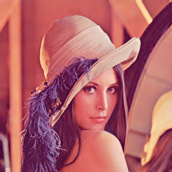
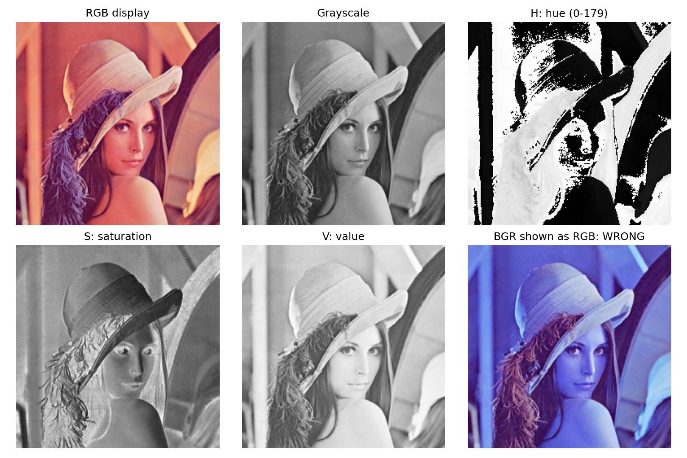

# 1. 색 공간 변환

[[01_색_공간_변환|1. 색 공간 변환]] · [[02_RGB_채널_분리|2. RGB 채널 분리]] · [[03_YCbCr_변환|3. YCbCr 변환]] · [[04_히스토그램|4. 히스토그램]] · [[05_히스토그램_평활화|5. 히스토그램 평활화]]

## 1. 한 문장으로 이해하기

- 색 공간은 **같은 색을 숫자로 설명하는 방식**이다.
- RGB는 빨강·초록·파랑의 양, HSV는 색상·채도·명도를 사용한다.
- 픽셀 위치는 그대로 두고 각 위치를 설명하는 숫자를 바꾼다.

> [!example] 물감 비유
> RGB는 “세 물감을 얼마나 섞을까?”, HSV는 “어떤 색을 얼마나 진하고 밝게 표현할까?”에 가깝다.

## 2. 픽셀부터 확인하기

- Lenna은 가로 250, 세로 250으로 총 62,500개 픽셀이다.
- 컬러 한 픽셀에는 3개 채널값이 있다.
- 자료형 uint8의 각 채널값은 0~255이다.
- 좌표는 (x,y)로 쓰지만 NumPy에서는 image[y,x]로 접근한다.
- 왼쪽 위는 (0,0), 아래 방향으로 y가 증가한다.

$$
N=W\times H=250\times250=62\,500
$$

$$
I_{\mathrm{RGB}}(x,y)=[R(x,y),G(x,y),B(x,y)]
$$

실제 중심 좌표 (125,125)의 RGB값은 [159,50,66]이다.

## 3. 표현 방식 비교

| 표현 | 의미 | 배열 형태 | 용도 |
|---|---|---|---|
| BGR | 파랑·초록·빨강 | (250,250,3) | OpenCV 컬러 입출력 |
| RGB | 빨강·초록·파랑 | (250,250,3) | Matplotlib 표시 |
| Gray | 밝기 한 값 | (250,250) | 명암 분석 |
| HSV | 색상·채도·명도 | (250,250,3) | 색상 조건 분리 |

BGR→RGB는 순서 교환이다. RGB→Gray는 색 정보를 줄이는 변환이므로 Gray를 다시 3채널로 늘려도 원래 색이 복구되지는 않는다.

$$
Y=0.299R+0.587G+0.114B
$$

$$
Y\approx0.299(159)+0.587(50)+0.114(66)=84.415\approx84
$$

> [!warning] HSV 범위
> - OpenCV의 일반적인 8비트 COLOR_BGR2HSV에서 H는 0~179, S와 V는 0~255다. 
> - H값이 높다고 밝다는 뜻은 아니다. 색상은 원형으로 연결되므로 0 부근과 179 부근은 가깝다.

## 4. 실제 결과

- Gray는 위치와 모양은 유지하면서 색 정보를 없앤다.
- H·S·V 패널은 각각의 값을 흑백으로 표시한 것이다.
- 오른쪽 아래는 BGR을 RGB로 잘못 표시한 오류 예시다.
- 중심 픽셀 HSV값은 [176,175,159]이다.

## 5. 소스 코드

- 코드의 중심 좌표를 다른 위치로 바꾸고 RGB와 Gray값을 확인한다.
- 세 채널의 단순 평균과 가중합 Gray가 같은지 비교한다.
- 색 공간 변환은 해상도를 높이는 작업이 아니라 분석 목적에 맞는 표현을 만드는 작업이다.

~~~bash
python -m pip install opencv-python numpy matplotlib
python practice_1.py
~~~

~~~python
from pathlib import Path
import cv2
import numpy as np
import matplotlib
matplotlib.use("Agg")
import matplotlib.pyplot as plt

ROOT = Path(__file__).resolve().parent
ASSETS = ROOT / "assets"
ASSETS.mkdir(exist_ok=True)
# np.fromfile + imdecode는 Windows 한글 경로에서도 사용할 수 있다.
bgr = cv2.imdecode(np.fromfile(ASSETS / "Lenna.png", dtype=np.uint8), cv2.IMREAD_COLOR)
if bgr is None:
    raise FileNotFoundError("assets/Lenna.png를 확인하세요.")
rgb = cv2.cvtColor(bgr, cv2.COLOR_BGR2RGB)
gray = cv2.cvtColor(bgr, cv2.COLOR_BGR2GRAY)

def panels(filename, items, cols=3):
    rows = (len(items) + cols - 1) // cols
    fig, axes = plt.subplots(rows, cols, figsize=(3.6 * cols, 3.6 * rows), squeeze=False)
    for ax, (title, data, limits) in zip(axes.flat, items):
        if data.ndim == 2:
            ax.imshow(data, cmap="gray", vmin=limits[0], vmax=limits[1])
        else:
            ax.imshow(data)
        ax.set_title(title, fontsize=12)
        ax.axis("off")
    for ax in list(axes.flat)[len(items):]:
        ax.axis("off")
    fig.tight_layout()
    fig.savefig(ASSETS / filename, dpi=150)
    plt.close(fig)

hsv = cv2.cvtColor(bgr, cv2.COLOR_BGR2HSV)
h, s, v = cv2.split(hsv)
panels("01_colors.png", [
    ("RGB display", rgb, None), ("Grayscale", gray, (0, 255)),
    ("H: hue (0-179)", h, (0, 179)), ("S: saturation", s, (0, 255)),
    ("V: value", v, (0, 255)), ("BGR shown as RGB: WRONG", bgr, None)
])
print("shape:", bgr.shape, "dtype:", bgr.dtype)
print("pixel (x=125, y=125), RGB:", rgb[125, 125].tolist())
print("gray:", int(gray[125, 125]), "HSV:", hsv[125, 125].tolist())
~~~

## 공식 참고 자료

- [OpenCV 색 공간 변환](https://docs.opencv.org/4.x/de/d25/imgproc_color_conversions.html)
- [OpenCV 히스토그램 평활화](https://docs.opencv.org/4.x/d5/daf/tutorial_py_histogram_equalization.html)
