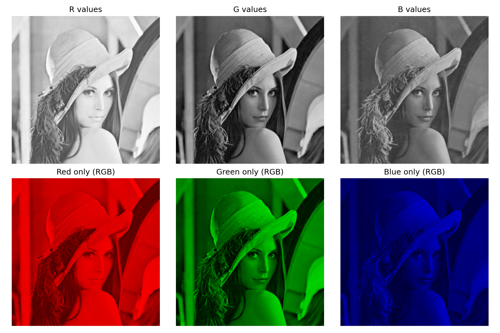

# 2. RGB 채널 분리

[[01_색_공간_변환|1. 색 공간 변환]] · [[02_RGB_채널_분리|2. RGB 채널 분리]] · [[03_YCbCr_변환|3. YCbCr 변환]] · [[04_히스토그램|4. 히스토그램]] · [[05_히스토그램_평활화|5. 히스토그램 평활화]]

## 1. 한 문장으로 이해하기

- RGB 채널 분리는 컬러 영상을 **빨강값 지도, 초록값 지도, 파랑값 지도**로 나누는 작업이다.
- 각 채널은 원본과 같은 너비·높이를 가진다.
- 올바른 순서로 합치면 원본 배열을 복원한다.

> [!example] 세 장의 지도
> 한 장소를 기온·습도·강수량 지도로 나누듯, 같은 픽셀 위치에서 R·G·B의 값을 따로 본다.

## 2. 한 픽셀을 세 값으로 나누기

$$
I_{\mathrm{RGB}}(x,y)=[R(x,y),G(x,y),B(x,y)]
$$

$$
I_R=[R,0,0],\quad I_G=[0,G,0],\quad I_B=[0,0,B]
$$

레나 중심에서 R=159, G=50, B=66이다.

> [!warning] OpenCV 순서
> 기본 컬러 입력은 BGR이다. cv2.split(bgr)의 반환은 b, g, r 순서로 받는다. 변수 이름을 바꾼다고 실제 순서가 바뀌지 않는다.

## 3. 두 가지 표시 방식

| 표시 | 구성 | 의미 |
|---|---|---|
| 흑백 채널 | R, G, B 각각 한 장 | 밝을수록 해당 값이 큼 |
| 색상 채널 | [R,0,0] 등 | 해당 색의 기여를 시각화 |

흑백 R 채널에서 하얀 곳은 “흰 물체”가 아니라 “R값이 높은 곳”이다.

## 4. 실제 결과

- 위쪽은 R·G·B를 같은 0~255 범위로 흑백 표시했다.
- 아래쪽은 각 색만 남긴 RGB 영상이다.
- 따뜻한 색조가 많은 이번 영상에서는 R 평균값이 높다.

| 채널 | 전체 평균 |
|---|---:|
| R | 179.7257 |
| G | 98.5542 |
| B | 104.9122 |

$$
\overline{R}=\frac{1}{WH}\sum_{y=0}^{H-1}\sum_{x=0}^{W-1}R(x,y)
$$

이 값은 이번 레나 이미지의 측정값이며 모든 사진에 적용되는 특징은 아니다.

## 5. 합치기와 검증

- cv2.merge는 전달 순서대로 합치며 RGB/BGR 여부를 자동 판단하지 않는다.
- [b,g,r]로 합치면 OpenCV용 BGR이 복원된다.
- [r,0,0]으로 합치면 Matplotlib용 빨강 영상이 된다.
- 코드의 assert는 재결합 결과가 원본과 같은지 확인한다.

> [!summary] 핵심
> - 채널 분리는 색 공간 변환과 다르다. 
> - 기존 배열의 구성 요소를 꺼내는 과정이다.

## 소스 코드

~~~bash
python -m pip install opencv-python numpy matplotlib
~~~

~~~python
from pathlib import Path
import cv2
import numpy as np
import matplotlib
matplotlib.use("Agg")
import matplotlib.pyplot as plt

ROOT = Path(__file__).resolve().parent
ASSETS = ROOT / "assets"
ASSETS.mkdir(exist_ok=True)
# np.fromfile + imdecode는 Windows 한글 경로에서도 사용할 수 있다.
bgr = cv2.imdecode(np.fromfile(ASSETS / "Lenna.png", dtype=np.uint8), cv2.IMREAD_COLOR)
if bgr is None:
    raise FileNotFoundError("assets/Lenna.png를 확인하세요.")
rgb = cv2.cvtColor(bgr, cv2.COLOR_BGR2RGB)
gray = cv2.cvtColor(bgr, cv2.COLOR_BGR2GRAY)

def panels(filename, items, cols=3):
    rows = (len(items) + cols - 1) // cols
    fig, axes = plt.subplots(rows, cols, figsize=(3.6 * cols, 3.6 * rows), squeeze=False)
    for ax, (title, data, limits) in zip(axes.flat, items):
        if data.ndim == 2:
            ax.imshow(data, cmap="gray", vmin=limits[0], vmax=limits[1])
        else:
            ax.imshow(data)
        ax.set_title(title, fontsize=12)
        ax.axis("off")
    for ax in list(axes.flat)[len(items):]:
        ax.axis("off")
    fig.tight_layout()
    fig.savefig(ASSETS / filename, dpi=150)
    plt.close(fig)

b, g, r = cv2.split(bgr)
zero = np.zeros_like(r)
red_only = cv2.merge([r, zero, zero])  # RGB 배열: Matplotlib 표시용
green_only = cv2.merge([zero, g, zero])
blue_only = cv2.merge([zero, zero, b])
panels("02_channels.png", [
    ("R values", r, (0, 255)), ("G values", g, (0, 255)), ("B values", b, (0, 255)),
    ("Red only (RGB)", red_only, None), ("Green only (RGB)", green_only, None),
    ("Blue only (RGB)", blue_only, None)
])
assert np.array_equal(cv2.merge([b, g, r]), bgr)
print("RGB channel means:", [float(c.mean()) for c in (r, g, b)])
~~~

## 공식 참고 자료

- [OpenCV 색 공간 변환](https://docs.opencv.org/4.x/de/d25/imgproc_color_conversions.html)
- [OpenCV 히스토그램 평활화](https://docs.opencv.org/4.x/d5/daf/tutorial_py_histogram_equalization.html)
