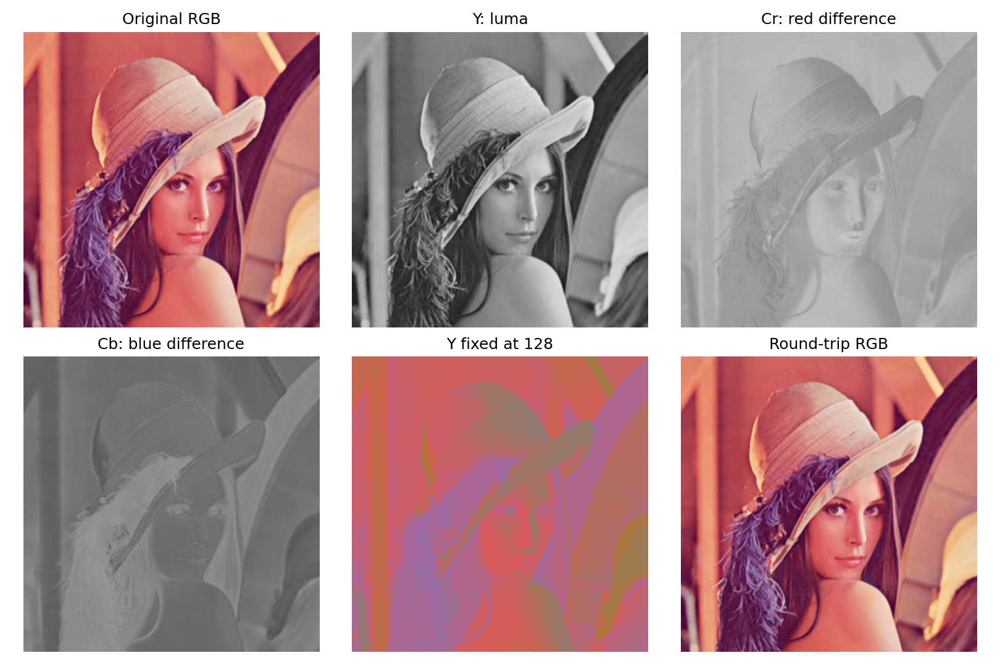

# 3. YCbCr 변환

[[01_색_공간_변환|1. 색 공간 변환]] · [[02_RGB_채널_분리|2. RGB 채널 분리]] · [[03_YCbCr_변환|3. YCbCr 변환]] · [[04_히스토그램|4. 히스토그램]] · [[05_히스토그램_평활화|5. 히스토그램 평활화]]

## 1. 한 문장으로 이해하기

- YCbCr는 **명암 기준과 색 차이 성분을 나누는 표현**이다.
- Y: 명암 기준인 luma
- Cb: 파랑과 Y의 차이
- Cr: 빨강과 Y의 차이

> [!example] 명암과 색
> - 먼저 명암을 그리고 색 정보를 덧붙인다고 생각하면 쉽다. 
> - 다만 실제 수학 연산이 그림 그리는 과정과 동일하다는 뜻은 아니다.

## 2. 이름과 배열 순서를 구분하기

| 인덱스 | OpenCV YCrCb | 의미 |
|---|---|---|
| 0 | Y | 명암 기준 |
| 1 | Cr | 빨강 차이 |
| 2 | Cb | 파랑 차이 |

> [!warning] 순서
> 개념은 YCbCr로 부르지만 COLOR_BGR2YCrCb의 실제 반환 순서는 Y, Cr, Cb이다.

## 3. 변환 수식

다음은 OpenCV의 8비트 full-range JPEG 계열 변환이다. 방송용 limited-range 계수와 혼용하지 않는다.

$$
Y=0.299R+0.587G+0.114B
$$

$$
Cr=0.713(R-Y)+128
$$

$$
Cb=0.564(B-Y)+128
$$

- 128은 음수인 색 차이를 정수 채널에 표현하기 위한 기준값이다.
- Cr>128은 R이 Y보다 큰 방향, Cb>128은 B가 Y보다 큰 방향이다.
- Y는 설명상 밝기라고 부르지만 물리적 빛의 세기와 동일하지 않다.

실제 중심 픽셀은 다음과 같이 변환된다.

$$
[R,G,B]=[159,50,66]\longrightarrow[Y,Cr,Cb]=[84,181,118]
$$

정수 연산과 반올림 때문에 손으로 구한 소수값과 작은 차이가 생길 수 있다.

## 4. 실제 결과

- Y에서 명암 형태를 볼 수 있다.
- Cr·Cb는 색 차이의 수치를 흑백으로 표시했다.
- Y fixed at 128은 명암 성분만 일정하게 만든 설명용 변형이다.
- 마지막 패널은 원래 YCrCb를 RGB 표시용으로 복원한 결과다.

| 변환 후 복원 오차 | 실제 값 |
|---|---:|
| 최대 채널값 차이 | 1 |
| 평균 절대 오차 | 0.377856 |

8비트 반올림 때문에 완전한 무손실 복원이 아닐 수 있다.

## 5. 어디에 쓰는가?

- 명암 성분만 조절하고 색 차이 성분을 유지하는 데 활용한다.
- 5번 노트에서는 Y만 평활화한다.
- 최종 RGB 범위 잘림 때문에 색이 절대 변하지 않는다고 보장할 수는 없다.

> [!summary] 핵심
> YCbCr 변환은 색을 없애는 것이 아니라 명암과 색 차이를 따로 다루는 것이다.

## 소스 코드

~~~bash
python -m pip install opencv-python numpy matplotlib
~~~

~~~python
from pathlib import Path
import cv2
import numpy as np
import matplotlib
matplotlib.use("Agg")
import matplotlib.pyplot as plt

ROOT = Path(__file__).resolve().parent
ASSETS = ROOT / "assets"
ASSETS.mkdir(exist_ok=True)
# np.fromfile + imdecode는 Windows 한글 경로에서도 사용할 수 있다.
bgr = cv2.imdecode(np.fromfile(ASSETS / "Lenna.png", dtype=np.uint8), cv2.IMREAD_COLOR)
if bgr is None:
    raise FileNotFoundError("assets/Lenna.png를 확인하세요.")
rgb = cv2.cvtColor(bgr, cv2.COLOR_BGR2RGB)
gray = cv2.cvtColor(bgr, cv2.COLOR_BGR2GRAY)

def panels(filename, items, cols=3):
    rows = (len(items) + cols - 1) // cols
    fig, axes = plt.subplots(rows, cols, figsize=(3.6 * cols, 3.6 * rows), squeeze=False)
    for ax, (title, data, limits) in zip(axes.flat, items):
        if data.ndim == 2:
            ax.imshow(data, cmap="gray", vmin=limits[0], vmax=limits[1])
        else:
            ax.imshow(data)
        ax.set_title(title, fontsize=12)
        ax.axis("off")
    for ax in list(axes.flat)[len(items):]:
        ax.axis("off")
    fig.tight_layout()
    fig.savefig(ASSETS / filename, dpi=150)
    plt.close(fig)

ycrcb = cv2.cvtColor(bgr, cv2.COLOR_BGR2YCrCb)
y, cr, cb = cv2.split(ycrcb)  # 주의: Y, Cr, Cb 순서
restored = cv2.cvtColor(ycrcb, cv2.COLOR_YCrCb2BGR)
neutral_y = np.full_like(y, 128)
chroma_display = cv2.cvtColor(cv2.merge([neutral_y, cr, cb]), cv2.COLOR_YCrCb2RGB)
panels("03_ycrcb.png", [
    ("Original RGB", rgb, None), ("Y: luma", y, (0, 255)),
    ("Cr: red difference", cr, (0, 255)), ("Cb: blue difference", cb, (0, 255)),
    ("Y fixed at 128", chroma_display, None),
    ("Round-trip RGB", cv2.cvtColor(restored, cv2.COLOR_BGR2RGB), None)
])
error = np.abs(restored.astype(np.int16) - bgr.astype(np.int16))
print("Y, Cr, Cb at (125,125):", ycrcb[125, 125].tolist())
print("round-trip max error:", int(error.max()), "MAE:", float(error.mean()))
~~~

## 공식 참고 자료

- [OpenCV 색 공간 변환](https://docs.opencv.org/4.x/de/d25/imgproc_color_conversions.html)
- [OpenCV 히스토그램 평활화](https://docs.opencv.org/4.x/d5/daf/tutorial_py_histogram_equalization.html)
