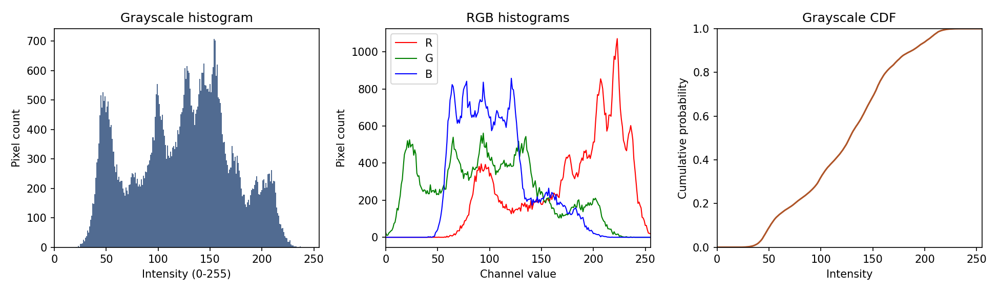
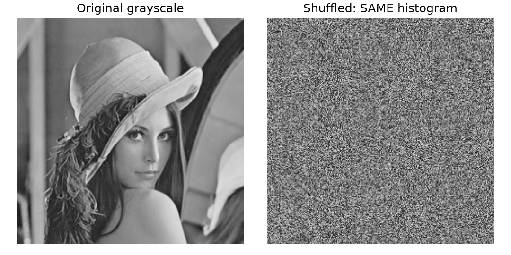

# 4. 히스토그램

[[01_색_공간_변환|1. 색 공간 변환]] · [[02_RGB_채널_분리|2. RGB 채널 분리]] · [[03_YCbCr_변환|3. YCbCr 변환]] · [[04_히스토그램|4. 히스토그램]] · [[05_히스토그램_평활화|5. 히스토그램 평활화]]

## 1. 한 문장으로 이해하기

- 히스토그램은 **밝기값별 픽셀 개수를 세는 그래프**이다.
- 가로축: 밝기 0~255
- 세로축: 픽셀 개수
- 왼쪽은 어두운 값, 오른쪽은 밝은 값이다.

> [!example] 키 분포 비유
> - 학생을 키별로 세듯이 픽셀을 밝기별로 센다. 
> - 키 분포로 학생의 자리까지 알 수는 없다.

## 2. 작은 배열부터 세기

아래는 이해를 위한 배열이며 레나에서 추출한 값이 아니다.

$$
I=\begin{bmatrix}0&0&1&1\\1&2&3&3\end{bmatrix}
$$

| 밝기 k | 개수 h(k) | 비율 p(k) | 누적 F(k) |
|---|---:|---:|---:|
| 0 | 2 | 0.250 | 0.250 |
| 1 | 3 | 0.375 | 0.625 |
| 2 | 1 | 0.125 | 0.750 |
| 3 | 2 | 0.250 | 1.000 |

$$
h(k)=\sum_{y=0}^{H-1}\sum_{x=0}^{W-1}\mathbf{1}[I(x,y)=k]
$$

조건이 맞으면 1, 아니면 0을 더한다.

$$
p(k)=\frac{h(k)}{N},\qquad F(k)=\sum_{j=0}^{k}p(j)
$$

## 3. 실제 레나 분포

- 왼쪽: Gray 히스토그램
- 가운데: RGB 각 채널의 히스토그램
- 오른쪽: Gray 누적 분포 CDF
- 각 채널은 각각 62,500개 픽셀을 가진다.

$$
\sum_{k=0}^{255}h(k)=62\,500,\qquad F(255)=1
$$

이번 Gray의 평균 밝기는 123.550496이다.

> [!warning] 상한은 제외
> - cv2.calcHist에서 [0,256]은 0부터 255까지를 세는 범위다. 마
> - 지막 256은 포함하지 않는다.

## 4. 가장 중요한 한계: 위치는 모른다

- 오른쪽은 픽셀 위치만 무작위로 섞은 설명용 실험이다.
- 두 영상의 히스토그램은 완전히 동일하다.
- 하지만 오른쪽에서는 얼굴을 알아보기 어렵다.
- 즉, 히스토그램만으로 물체 모양이나 위치를 알 수 없다.

## 5. 해석 기준

| 분포 | 가능한 해석 | 주의 |
|---|---|---|
| 왼쪽에 집중 | 어두운 값이 많음 | 야간 장면에서는 자연스러움 |
| 오른쪽에 집중 | 밝은 값이 많음 | 좋은 영상이라는 뜻은 아님 |
| 좁은 범위에 집중 | 낮은 전역 대비 가능성 | 실제 장면과 함께 판단 |
| 0·255에 집중 | 값이 잘렸을 가능성 | 검정·흰 물체일 수도 있음 |

> [!summary] 핵심
> - 히스토그램 계산만으로 원본은 바뀌지 않는다. 
> - 다음 노트에서 이 분포를 이용해 픽셀값을 바꾼다.

## 소스 코드

~~~bash
python -m pip install opencv-python numpy matplotlib
~~~

~~~python
from pathlib import Path
import cv2
import numpy as np
import matplotlib
matplotlib.use("Agg")
import matplotlib.pyplot as plt

ROOT = Path(__file__).resolve().parent
ASSETS = ROOT / "assets"
ASSETS.mkdir(exist_ok=True)
# np.fromfile + imdecode는 Windows 한글 경로에서도 사용할 수 있다.
bgr = cv2.imdecode(np.fromfile(ASSETS / "Lenna.png", dtype=np.uint8), cv2.IMREAD_COLOR)
if bgr is None:
    raise FileNotFoundError("assets/Lenna.png를 확인하세요.")
rgb = cv2.cvtColor(bgr, cv2.COLOR_BGR2RGB)
gray = cv2.cvtColor(bgr, cv2.COLOR_BGR2GRAY)

def panels(filename, items, cols=3):
    rows = (len(items) + cols - 1) // cols
    fig, axes = plt.subplots(rows, cols, figsize=(3.6 * cols, 3.6 * rows), squeeze=False)
    for ax, (title, data, limits) in zip(axes.flat, items):
        if data.ndim == 2:
            ax.imshow(data, cmap="gray", vmin=limits[0], vmax=limits[1])
        else:
            ax.imshow(data)
        ax.set_title(title, fontsize=12)
        ax.axis("off")
    for ax in list(axes.flat)[len(items):]:
        ax.axis("off")
    fig.tight_layout()
    fig.savefig(ASSETS / filename, dpi=150)
    plt.close(fig)

hist = cv2.calcHist([gray], [0], None, [256], [0, 256]).ravel()
prob = hist / gray.size
cdf = np.cumsum(prob)
assert int(hist.sum()) == gray.size
fig, axes = plt.subplots(1, 3, figsize=(13, 3.8))
axes[0].bar(np.arange(256), hist, width=1, color="#516b91")
axes[0].set(title="Grayscale histogram", xlabel="Intensity (0-255)", ylabel="Pixel count", xlim=(0, 255))
for channel, color, name in [(0, "red", "R"), (1, "green", "G"), (2, "blue", "B")]:
    counts = np.bincount(rgb[:, :, channel].ravel(), minlength=256)
    axes[1].plot(counts, color=color, label=name, linewidth=1)
axes[1].set(title="RGB histograms", xlabel="Channel value", ylabel="Pixel count", xlim=(0,255))
axes[1].legend()
axes[2].plot(cdf, color="#ae5427")
axes[2].set(title="Grayscale CDF", xlabel="Intensity", ylabel="Cumulative probability", xlim=(0,255), ylim=(0,1))
fig.tight_layout()
fig.savefig(ASSETS / "04_histograms.png", dpi=150)
plt.close(fig)
rng = np.random.default_rng(42)
shuffled = rng.permutation(gray.ravel()).reshape(gray.shape)
assert np.array_equal(np.bincount(gray.ravel(), minlength=256), np.bincount(shuffled.ravel(), minlength=256))
panels("04_same_hist.png", [("Original grayscale", gray, (0,255)), ("Shuffled: SAME histogram", shuffled, (0,255))], cols=2)
print("pixels:", gray.size, "hist sum:", int(hist.sum()), "mean:", float(gray.mean()))
~~~

## 공식 참고 자료

- [OpenCV 색 공간 변환](https://docs.opencv.org/4.x/de/d25/imgproc_color_conversions.html)
- [OpenCV 히스토그램 평활화](https://docs.opencv.org/4.x/d5/daf/tutorial_py_histogram_equalization.html)
