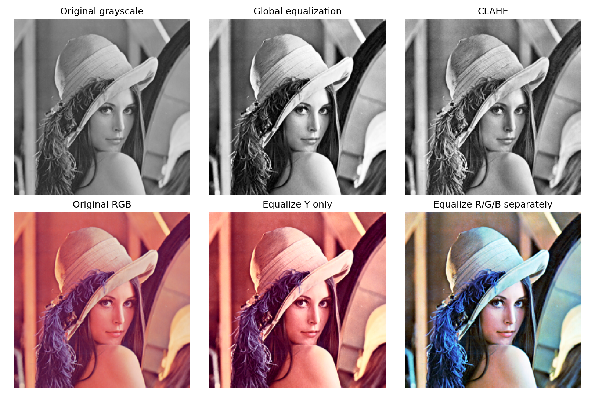
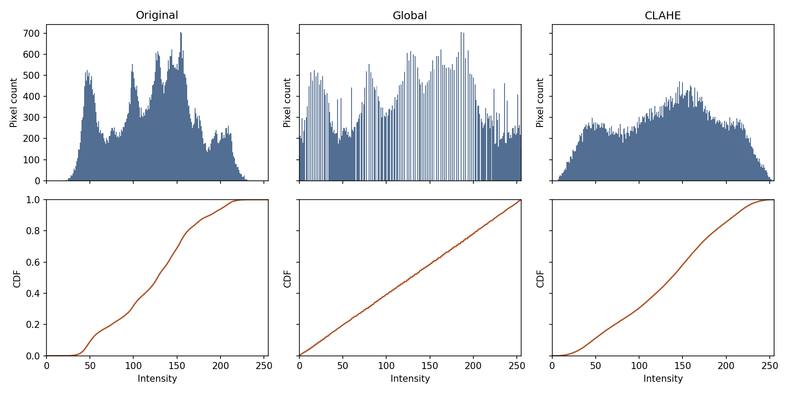

# 5. 히스토그램 평활화

[[01_색_공간_변환|1. 색 공간 변환]] · [[02_RGB_채널_분리|2. RGB 채널 분리]] · [[03_YCbCr_변환|3. YCbCr 변환]] · [[04_히스토그램|4. 히스토그램]] · [[05_히스토그램_평활화|5. 히스토그램 평활화]]

## 1. 한 문장으로 이해하기

- 히스토그램 평활화는 **누적 밝기 분포를 이용하여 픽셀 밝기를 재배치하는 방법**이다.
- 좁은 밝기 구간을 더 넓게 사용하도록 만들어 대비를 바꾼다.
- 히스토그램 계산은 “세기”, 평활화는 “바꾸기”이다.

> [!note] 픽셀 처리의 범위
> - 전역 평활화의 변환표는 영상 전체 통계에서 구한다. 
> - CLAHE는 지역 통계를 사용한다. 
> - 단순한 고정 픽셀 수식만으로 처리하는 방식과 구별한다.

## 2. 변환 수식

기본적인 CDF 변환은 다음과 같이 설명한다.

$$
s(k)=\operatorname{round}((L-1)F(k))
$$

OpenCV equalizeHist를 이해할 때는 첫 번째 0이 아닌 누적 개수를 빼는 형태를 사용한다.

$$
C(k)=\sum_{j=0}^{k}h(j)
$$

$$
s(k)=\operatorname{round}\left(
\frac{C(k)-C_{\min}}{N-C_{\min}}(L-1)
\right)
$$

- L=256: 가능한 밝기 개수
- N: 전체 픽셀 수
- C_min: 첫 번째 0이 아닌 누적 개수
- 실제 나타나는 밝기값에 적용한다.
- 모든 픽셀이 같으면 분모가 0이므로 예외 처리한다. OpenCV는 일정한 영상을 그대로 유지한다.
- 구현의 반올림에 따라 수동 계산과 작은 차이가 날 수 있다.

앞 노트의 4단계 교육용 예시에 적용하면 다음과 같다.

$$
h=[2,3,1,2],\quad C=[2,5,6,8],\quad C_{\min}=2
$$

$$
s(0)=0,\quad s(1)=2,\quad s(2)=2,\quad s(3)=3
$$

서로 다른 밝기가 같은 출력값에 대응할 수 있다. 막대 높이가 모두 같아지는 것은 아니다.

## 3. 실제 전후 비교

- 위: 원본 Gray → 전역 평활화 → CLAHE
- 아래: 원본 RGB → Y만 평활화 → R·G·B 각각 평활화
- Gray는 모두 동일한 0~255 표시 범위를 사용했다.

| 방법 | 최소 | 최대 | 평균 | 표준편차 |
|---|---:|---:|---:|---:|
| 원본 Gray | 21 | 237 | 123.5505 | 47.6237 |
| 전역 평활화 | 0 | 255 | 128.3176 | 73.6238 |
| CLAHE | 6 | 254 | 132.5302 | 58.3654 |

전역 평활화에서 밝기 분포가 넓어졌다. 이는 객체 인식 정확도가 향상되었다는 결과는 아니다.

## 4. 분포까지 함께 비교하기

- 위는 히스토그램, 아래는 CDF이다.
- 각 행은 같은 세로축 범위를 사용한다.
- 전역 평활화 후에도 빈 밝기 구간과 높은 막대가 남는다.
- 정수값으로 표현하는 영상에서는 완벽히 균일한 분포를 보장하지 않는다.

## 5. 컬러에서는 Y만 조절하기

$$
(Y,Cr,Cb)\longrightarrow(\operatorname{equalize}(Y),Cr,Cb)
$$

- RGB를 각각 평활화하면 채널 간 비율이 달라져 색조가 변할 수 있다.
- Y만 바꾸면 색 차이 성분을 유지하면서 명암을 조절한다.
- RGB 복원 과정의 반올림과 범위 잘림 때문에 완벽한 색 보존은 보장하지 않는다.

## 6. CLAHE를 추가로 비교하는 이유

- 화면을 작은 구역으로 나눠 지역 대비를 조절한다.
- 지나치게 몰린 히스토그램 높이를 제한하여 과도한 대비 증가를 줄인다.
- 구역 경계는 보간하여 완화한다.
- 이번 설정은 clipLimit=2.0, tileGridSize=(8,8)이다.
- (8,8)은 8×8픽셀 크기가 아니라 가로·세로 타일 개수다.
- clipLimit은 단순한 픽셀 개수 상한이 아닌 정규화된 설정값이다.

> [!summary] 핵심
> 평활화는 해상도를 높이거나 사라진 정보를 복구하지 않는다. 기존 밝기 분포를 바꾸는 대비 조정이다.

## 소스 코드

~~~bash
python -m pip install opencv-python numpy matplotlib
~~~

~~~python
from pathlib import Path
import cv2
import numpy as np
import matplotlib
matplotlib.use("Agg")
import matplotlib.pyplot as plt

ROOT = Path(__file__).resolve().parent
ASSETS = ROOT / "assets"
ASSETS.mkdir(exist_ok=True)
# np.fromfile + imdecode는 Windows 한글 경로에서도 사용할 수 있다.
bgr = cv2.imdecode(np.fromfile(ASSETS / "Lenna.png", dtype=np.uint8), cv2.IMREAD_COLOR)
if bgr is None:
    raise FileNotFoundError("assets/Lenna.png를 확인하세요.")
rgb = cv2.cvtColor(bgr, cv2.COLOR_BGR2RGB)
gray = cv2.cvtColor(bgr, cv2.COLOR_BGR2GRAY)

def panels(filename, items, cols=3):
    rows = (len(items) + cols - 1) // cols
    fig, axes = plt.subplots(rows, cols, figsize=(3.6 * cols, 3.6 * rows), squeeze=False)
    for ax, (title, data, limits) in zip(axes.flat, items):
        if data.ndim == 2:
            ax.imshow(data, cmap="gray", vmin=limits[0], vmax=limits[1])
        else:
            ax.imshow(data)
        ax.set_title(title, fontsize=12)
        ax.axis("off")
    for ax in list(axes.flat)[len(items):]:
        ax.axis("off")
    fig.tight_layout()
    fig.savefig(ASSETS / filename, dpi=150)
    plt.close(fig)

equalized = cv2.equalizeHist(gray)
clahe = cv2.createCLAHE(clipLimit=2.0, tileGridSize=(8, 8))
local = clahe.apply(gray)
ycrcb = cv2.cvtColor(bgr, cv2.COLOR_BGR2YCrCb)
y, cr, cb = cv2.split(ycrcb)
color_y = cv2.cvtColor(cv2.merge([cv2.equalizeHist(y), cr, cb]), cv2.COLOR_YCrCb2RGB)
wrong_color = cv2.cvtColor(cv2.merge([cv2.equalizeHist(c) for c in cv2.split(bgr)]), cv2.COLOR_BGR2RGB)
panels("05_equalization.png", [
    ("Original grayscale", gray, (0,255)), ("Global equalization", equalized, (0,255)),
    ("CLAHE", local, (0,255)), ("Original RGB", rgb, None),
    ("Equalize Y only", color_y, None), ("Equalize R/G/B separately", wrong_color, None)
])
fig, axes = plt.subplots(2, 3, figsize=(12, 6), sharex=True, sharey="row")
for axcol, (title, im) in zip(axes.T, [("Original",gray), ("Global",equalized), ("CLAHE",local)]):
    counts = np.bincount(im.ravel(), minlength=256)
    axcol[0].bar(np.arange(256), counts, width=1, color="#526e92")
    axcol[0].set(title=title, ylabel="Pixel count", xlim=(0,255))
    axcol[1].plot(np.cumsum(counts) / im.size, color="#ae5427")
    axcol[1].set(xlabel="Intensity", ylabel="CDF", ylim=(0,1))
fig.tight_layout()
fig.savefig(ASSETS / "05_distributions.png", dpi=150)
plt.close(fig)
for title, im in [("Original",gray), ("Global",equalized), ("CLAHE",local)]:
    print(title, "min/max/mean/std:", int(im.min()), int(im.max()), float(im.mean()), float(im.std()))
~~~

## 공식 참고 자료

- [OpenCV 색 공간 변환](https://docs.opencv.org/4.x/de/d25/imgproc_color_conversions.html)
- [OpenCV 히스토그램 평활화](https://docs.opencv.org/4.x/d5/daf/tutorial_py_histogram_equalization.html)
