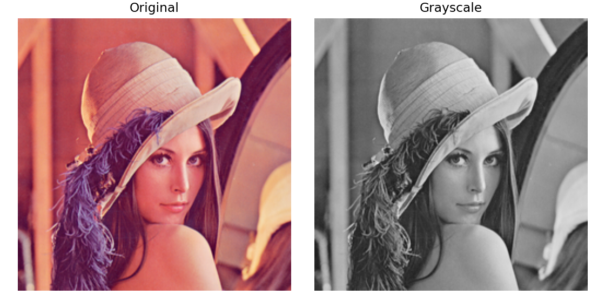
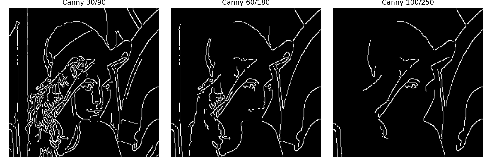
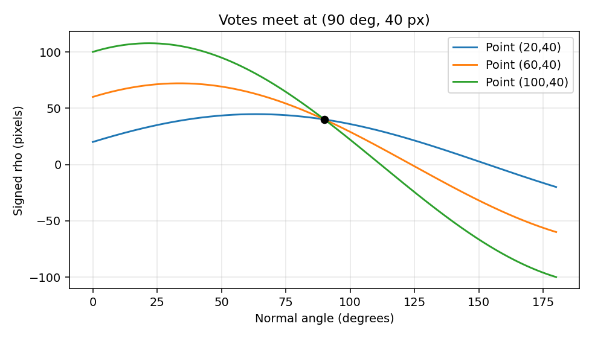
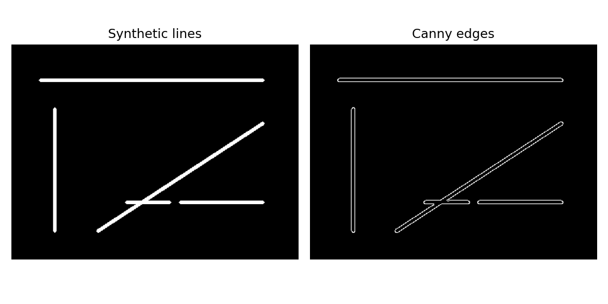
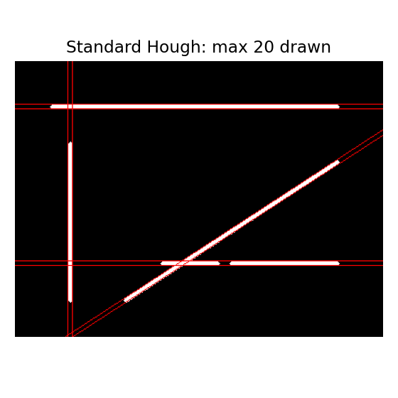
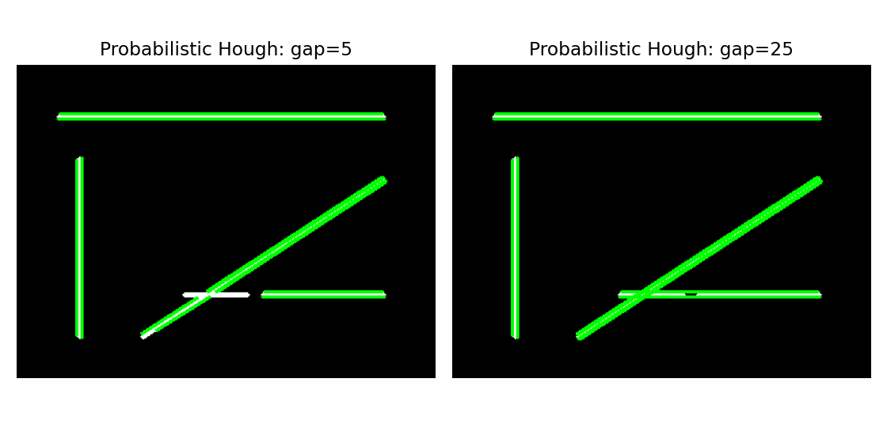
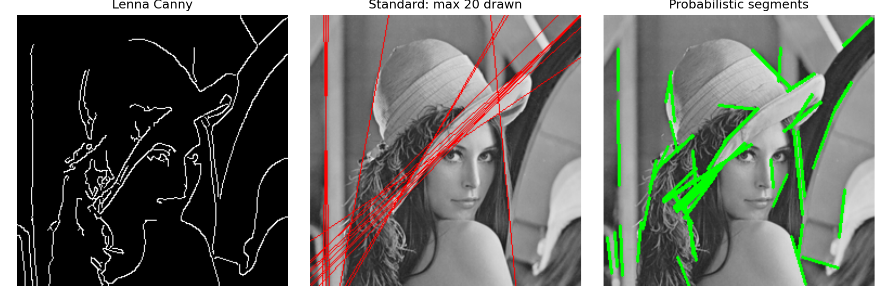

# 6. 에지 및 직선 검출

## 6.1 에지의 개념

- 에지는 주변에 비해 밝기가 급격하게 달라지는 부분이다.
- 검정 종이 위에 흰 종이를 올리면 둘이 만나는 곳에서 밝기가 크게 변한다.
- 물체 경계뿐 아니라 그림자·무늬·반사·잡음도 에지가 될 수 있다.
- 에지는 픽셀 집합이다. 직선 검출은 그중 일직선으로 놓인 점들을 찾는 다음 단계다.
- 에지 검출만으로 물체의 의미나 종류를 알 수는 없다.

$$
G=\sqrt{G_x^2+G_y^2},\qquad \phi=\operatorname{atan2}(G_y,G_x)
$$

- $G_x,G_y$는 가로·세로 밝기 변화, $G$는 변화의 크기다. 
- 변화 방향은 국소 에지의 접선 방향과 수직이다.

### 1. 준비와 원본 로딩

```python
from pathlib import Path
import json
import cv2
import numpy as np
import matplotlib.pyplot as plt

ROOT = Path.cwd() 
ASSETS = ROOT / 'assets'
assert (ASSETS/'Lenna.png').is_file(), 'ROOT를 확인하세요.'
bgr = cv2.imdecode(np.fromfile(ASSETS/'Lenna.png',np.uint8),cv2.IMREAD_COLOR)
assert bgr is not None
gray = cv2.cvtColor(bgr,cv2.COLOR_BGR2GRAY)

def show_panels(items, filename, cols=3):
    fig, axes = plt.subplots((len(items)+cols-1)//cols,cols,figsize=(4*cols,4*((len(items)+cols-1)//cols)),squeeze=False)
    for ax,(title,a) in zip(axes.flat,items):
        if a.ndim==2: ax.imshow(a,cmap='gray',vmin=0,vmax=255)
        else: ax.imshow(cv2.cvtColor(a,cv2.COLOR_BGR2RGB))
        ax.set_title(title);ax.axis('off')
    for ax in list(axes.flat)[len(items):]:ax.axis('off')
    fig.tight_layout();fig.savefig(ASSETS/filename,dpi=140)
    plt.show();plt.close(fig)

print('OpenCV:',cv2.__version__,'영상:',gray.shape)
show_panels([('Original',bgr),('Grayscale',gray)],'input.png',2)
```




## 6.2 Canny 에지 검출

### 처리 흐름

1. 가우시안으로 작은 잡음의 영향을 줄인다.
2. 밝기 변화의 크기와 방향을 계산한다.
3. 비최대 억제로 변화 방향의 주변보다 약한 반응을 줄여 얇게 만든다.
4. 두 임계값과 연결 관계로 최종 에지를 고른다.

| 후보 | 처리 |
|---|---|
| 높은 임계값보다 강함 | 강한 에지로 사용 |
| 낮은 임계값보다 약함 | 제거 |
| 두 임계값 사이 | 강한 에지와 약한 후보의 연결 사슬로 이어지면 유지 |

- 임계값은 원래 픽셀 밝기가 아니라 **미분 응답의 크기**에 적용한다.
- 낮은 임계값을 쓰면 세부와 잡음이 더 남을 수 있다.
- 높은 임계값을 쓰면 약한 경계가 사라질 수 있다.
- `L2gradient=True`이면 위 수식의 제곱합 제곱근을 사용한다. 기본 False는 $|G_x|+|G_y|$다.
- 두 설정의 임계값을 같은 의미로 비교하지 않는다.
- 이번 코드에서는 `GaussianBlur()`를 명시한다. `Canny()`가 자동으로 원하는 가우시안 전처리를 한다고 가정하지 않는다.

### 2. 세 임계값 비교

```python
blur = cv2.GaussianBlur(gray,(5,5),1.2,borderType=cv2.BORDER_REFLECT_101)
thresholds = [(30,90),(60,180),(100,250)]
edge_maps = []
for low,high in thresholds:
    edges = cv2.Canny(blur,low,high,apertureSize=3,L2gradient=True)
    assert edges.shape==gray.shape
    assert set(np.unique(edges)).issubset({0,255})
    edge_maps.append(edges)
    print((low,high),'에지 픽셀:',np.count_nonzero(edges))
show_panels([(f'Canny {lo}/{hi}',e) for (lo,hi),e in zip(thresholds,edge_maps)],'canny.png')
```

```text
(30, 90) 에지 픽셀: 5742
(60, 180) 에지 픽셀: 3308
(100, 250) 에지 픽셀: 1934
```



## 6.3 허프 변환을 이용한 직선 검출

### 점들이 같은 직선에 투표한다

- 한 에지 점을 지나는 직선은 여러 개다.
- 각 점이 자신을 지나는 직선 후보에 투표한다.
- 같은 직선 위에 점들이 많이 있으면 그 후보의 표가 모인다.

$$
\rho=x\cos\theta+y\sin\theta
$$

- $\rho$: 원점에서 직선까지의 **부호 있는 법선 거리**, 단위는 픽셀
- $\theta$: 직선의 방향이 아니라 **법선 방향의 각도**, 단위는 라디안
- 영상의 원점은 왼쪽 위이며 y는 아래로 증가한다.
- 세로선 $x=c$는 $\theta=0$, 가로선 $y=c$는 $\theta=\pi/2$로 표현된다.

### 3. 교육용 투표 곡선

- $y=40$인 세 점이 같은 $(\rho,\theta)=(40,90^\circ)$에 투표하는 모습을 본다. 
- 아래는 개념용 곡선이며 OpenCV 내부 누적 배열을 추출한 그림은 아니다.

```python
theta = np.linspace(0,np.pi,361)
fig,ax = plt.subplots(figsize=(7,4))
for x in [20,60,100]:
    rho = x*np.cos(theta)+40*np.sin(theta)
    ax.plot(np.rad2deg(theta),rho,label=f'Point ({x},40)')
ax.scatter([90],[40],color='black',zorder=5)
ax.set(xlabel='Normal angle (degrees)',ylabel='Signed rho (pixels)',title='Votes meet at (90 deg, 40 px)')
ax.legend();ax.grid(alpha=.3);fig.tight_layout()
fig.savefig(ASSETS/'votes.png',dpi=140);plt.show();plt.close(fig)
```



### 4. 직선 예제 만들기

- 레나에는 곡선과 질감이 많으므로 허프 변환을 이해하기 위해 별도의 도형을 만든다. 
- 수평·수직·대각선과 일부 끊어진 선을 그린다. 
- 선에 두께가 있으므로 Canny가 양쪽 경계를 찾고, 하나의 그려진 선에서 여러 직선 후보가 나올 수 있다.

```python
scene = np.zeros((300,400),np.uint8)
cv2.line(scene,(40,50),(350,50),255,3)
cv2.line(scene,(60,90),(60,260),255,3)
cv2.line(scene,(120,260),(350,110),255,3)
cv2.line(scene,(160,220),(220,220),255,3)
cv2.line(scene,(235,220),(350,220),255,3)
scene_edges = cv2.Canny(scene,50,150,L2gradient=True)
show_panels([('Synthetic lines',scene),('Canny edges',scene_edges)],'scene.png',2)
```



### 표준 허프 변환: HoughLines

- 결과는 `(rho, theta)`로 표현한 직선이다. 선분의 실제 끝점을 반환하지 않는다.
- 그릴 때 긴 두 끝점을 계산하지만 이는 시각화용이며 검출된 물체의 길이가 아니다.

| 인수 | 뜻 |
|---|---|
| rho=1 | 거리 누적 구간 해상도, 1픽셀 |
| theta=π/180 | 각도 누적 구간 해상도, 1도 |
| threshold=100 | 후보 선택을 위한 투표 기준 |

- 투표 기준은 검출 확률이나 정확한 최소 선분 길이가 아니다. 
- 해상도를 너무 세밀하게 잡으면 투표가 여러 칸으로 분산될 수 있다.

### 5. 표준 허프 검출과 표시

```python
def draw_standard(source, lines, max_draw=20):
    out = cv2.cvtColor(source,cv2.COLOR_GRAY2BGR)
    length = int(np.hypot(*source.shape)*2)
    if lines is not None:
        for rho,theta in lines[:max_draw,0]:
            a,b = np.cos(theta),np.sin(theta)
            x0,y0 = a*rho,b*rho
            p1=(int(round(x0-length*b)),int(round(y0+length*a)))
            p2=(int(round(x0+length*b)),int(round(y0-length*a)))
            cv2.line(out,p1,p2,(0,0,255),1)
    return out

standard = cv2.HoughLines(scene_edges.copy(),1,np.pi/180,threshold=100)
print('표준 허프 후보 수:',0 if standard is None else len(standard))
if standard is not None:
    print('앞 5개 (rho, theta 라디안):',standard[:5,0])
show_panels([('Standard Hough: max 20 drawn',draw_standard(scene,standard))],'standard.png',1)
```

```text
표준 허프 후보 수: 8
앞 5개 (rho, theta 라디안): [[ 52.           1.5707964 ]
 [ 47.           1.5707964 ]
 [286.           0.99483764]
 [281.           0.99483764]
 [ 62.           0.        ]]
```



### 확률적 허프 변환: HoughLinesP

- 전체 점의 모든 조합을 그대로 조사하는 대신 샘플링 등의 전략으로 선분을 찾는다.
- 결과는 두 끝점 `(x1, y1, x2, y2)`다.
- `minLineLength`는 받아들일 최소 선분 길이, `maxLineGap`은 같은 선분으로 연결할 점 사이의 최대 간격이다.
- 간격을 크게 허용하면 서로 다른 구조가 연결될 수 있다.
- 확률적이라는 이름이 검출 확률을 반환한다는 뜻은 아니다.

### 6. 선분 검출과 간격 설정 비교

```python
def draw_segments(source, lines):
    out=cv2.cvtColor(source,cv2.COLOR_GRAY2BGR)
    if lines is not None:
        for x1,y1,x2,y2 in np.asarray(lines).reshape(-1,4):
            cv2.line(out,(int(x1),int(y1)),(int(x2),int(y2)),(0,255,0),2)
    return out

segment_results={}
for gap in [5,25]:
    cv2.setRNGSeed(42)
    seg=cv2.HoughLinesP(scene_edges.copy(),1,np.pi/180,threshold=40,
                       minLineLength=40,maxLineGap=gap)
    segment_results[gap]=seg
    print('maxLineGap:',gap,'선분 수:',0 if seg is None else len(seg))
show_panels([(f'Probabilistic Hough: gap={gap}',draw_segments(scene,seg))
             for gap,seg in segment_results.items()],'segments.png',2)
```

```text
maxLineGap: 5 선분 수: 13
maxLineGap: 25 선분 수: 10
```



### 두 방법 비교

| 구분 | 표준 허프 | 확률적 허프 |
|---|---|---|
| OpenCV 함수 | HoughLines | HoughLinesP |
| 기본 출력 | rho, theta | x1, y1, x2, y2 |
| 표현 | 끝없이 연장되는 직선 | 시작점과 끝점이 있는 선분 |
| 길이·틈 설정 | 별도 minLineLength 없음 | minLineLength, maxLineGap |
| 주의점 | 연장선이 물체 밖까지 그려짐 | 한 선이 여러 선분으로 나올 수 있음 |

- 둘 다 후보 수가 실제 선의 개수와 같다고 보장하지 않는다. 
- 결과가 없으면 `None`을 반환할 수 있으므로 조건문으로 처리한다.

### 7. 레나에 적용

이 예제의 목적은 레나에서 직선처럼 보이는 에지 조각을 찾는 것이다. 얼굴이나 모자를 인식하는 결과가 아니다. 두 방법은 서로 다른 투표 임계값을 사용하므로 검출 개수로 성능 순위를 매기지 않는다.

```python
lenna_edges=edge_maps[1]
ls=cv2.HoughLines(lenna_edges.copy(),1,np.pi/180,threshold=60)
cv2.setRNGSeed(42)
lp=cv2.HoughLinesP(lenna_edges.copy(),1,np.pi/180,threshold=25,
                  minLineLength=25,maxLineGap=8)
show_panels([('Lenna Canny',lenna_edges),
             ('Standard: max 20 drawn',draw_standard(gray,ls)),
             ('Probabilistic segments',draw_segments(gray,lp))],'lenna_lines.png')
summary={'opencv':cv2.__version__,
         'canny_counts':{f'{lo}/{hi}':int(np.count_nonzero(e)) for (lo,hi),e in zip(thresholds,edge_maps)},
         'synthetic_standard_count':0 if standard is None else len(standard),
         'synthetic_segment_counts':{str(g):0 if s is None else len(s) for g,s in segment_results.items()},
         'lenna_standard_count':0 if ls is None else len(ls),
         'lenna_segment_count':0 if lp is None else len(lp)}
(ROOT/'results.json').write_text(json.dumps(summary,indent=2),encoding='utf-8')
print(json.dumps(summary,indent=2))
```

```text
{
  "opencv": "5.0.0",
  "canny_counts": {
    "30/90": 5742,
    "60/180": 3308,
    "100/250": 1934
  },
  "synthetic_standard_count": 8,
  "synthetic_segment_counts": {
    "5": 13,
    "25": 10
  },
  "lenna_standard_count": 16,
  "lenna_segment_count": 46
}
```



### 8. 위치를 아는 직선으로 검증

- 시각화용 두꺼운 선과 별개로, 한 줄짜리 이진 입력을 직접 사용한다. 
- 이 검사는 허프 좌표 해석을 확인하며 전체 영상에 대한 정확도 평가가 아니다.

```python
test=np.zeros((120,160),np.uint8)
test[40,20:140]=255
known=cv2.HoughLines(test,1,np.pi/180,threshold=90)
assert known is not None
assert any(abs(float(rho)-40)<=1 and abs(float(theta)-np.pi/2)<np.deg2rad(1.1)
           for rho,theta in known[:,0])
blank=np.zeros_like(test)
assert cv2.HoughLines(blank,1,np.pi/180,30) is None
assert cv2.HoughLinesP(blank,1,np.pi/180,30,minLineLength=20,maxLineGap=3) is None
print('수평선 rho=40, theta=90도 검증 및 빈 입력 처리 통과')
```

```text
수평선 rho=40, theta=90도 검증 및 빈 입력 처리 통과
```

## 참고 문서

- [OpenCV — Canny Edge Detection](https://docs.opencv.org/4.x/da/d22/tutorial_py_canny.html)
- [OpenCV — Hough Line Transform](https://docs.opencv.org/4.x/d6/d10/tutorial_py_houghlines.html)


