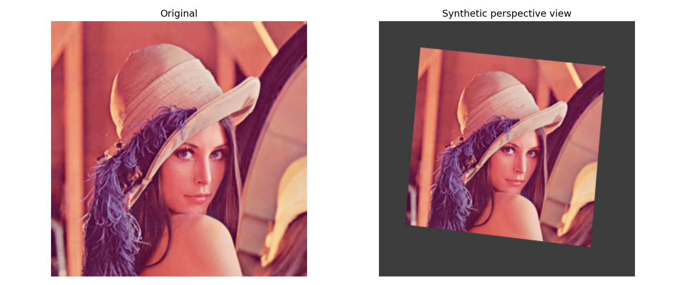
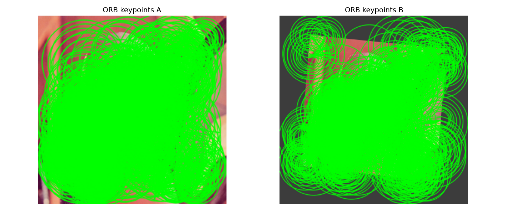
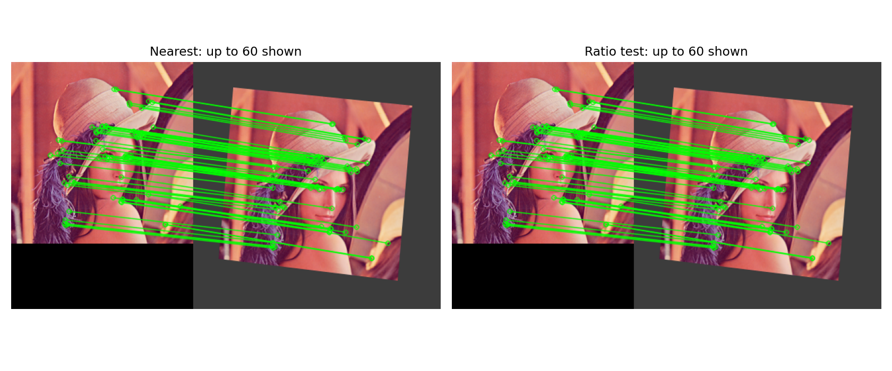
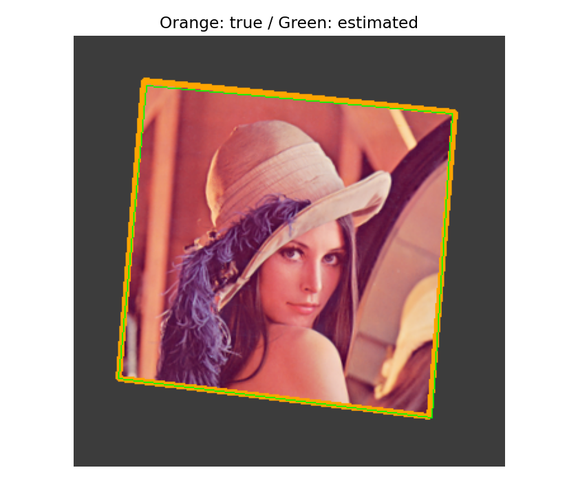

# 7. 특징점 검출 및 매칭

## 7.1 특징점과 특징 기술자

- **특징점(keypoint)**: 다른 사진에서도 다시 찾기 쉬운 위치다. 모서리나 독특한 무늬가 예
- **특징 기술자(descriptor)**: 그 점 주변의 생김새를 숫자나 비트로 표현
- 위치만 알아서는 다른 사진의 어느 점인지 비교하기 어려움
- 기술자를 비교해 대응 후보를 찾음
- 특징점에는 위치뿐 아니라 크기·방향·응답 강도 같은 정보도 포함될 수 있음
- 평평한 벽처럼 무늬가 없거나 같은 무늬가 반복되면 대응을 찾기 어려움

| 개념  | 비유                 | OpenCV 예   |
| --- | ------------------ | ---------- |
| 특징점 | 지도에서 눈에 띄는 장소      | `kp[i].pt` |
| 기술자 | 그 장소의 생김새 설명       | `des[i]`   |
| 매칭  | 두 지도에서 같은 장소 후보 연결 | `DMatch`   |

- 템플릿 매칭은 작은 영상 전체를 위치별로 비교
- 특징점 매칭은 여러 국소 특징의 대응을 찾으므로 회전·크기 변화에 대응할 여지가 있지만 모든 변화에 강한 것은 아니다.

### 1. 준비

```python
from pathlib import Path
import json
import cv2
import numpy as np
import matplotlib.pyplot as plt

ROOT = Path.cwd()
ASSETS = ROOT/'assets'
assert (ASSETS/'Lenna.png').is_file(),

a = cv2.imdecode(np.fromfile(ASSETS / 'Lenna.png',np.uint8),cv2.IMREAD_COLOR)
assert a is not None

def show(items,name):
    fig, axs = plt.subplots(1,len(items), figsize = (6*len(items),5), squeeze=False)
    for ax, (title,img) in zip(axs.flat, items):
        ax.imshow(cv2.cvtColor(img,cv2.COLOR_BGR2RGB))
        ax.set_title(title);ax.axis('off')
        
    fig.tight_layout()
    fig.savefig(ASSETS / name,dpi=140)
    plt.show()
    plt.close(fig)
```

### 2. 기하 변환을 아는 두 번째 영상 만들기

- 레나 전체를 알려진 호모그래피로 변환
- 실제로 다른 카메라로 촬영한 영상이 아닌 **통제된 합성 실험**
- 실제 입체 장면에서는 깊이에 따른 시차로 하나의 호모그래피가 맞지 않을 수 있음
- 정답 변환은 검증에만 사용하고 추정에는 제공하지 않음

```python
height,width = a.shape[:2]
src_corners = np.float32([[0,0],[width-1,0],[width-1,height-1],[0,height-1]])
dst_corners = np.float32([[55,35],[300,60],[280,300],[35,270]])

H_true = cv2.getPerspectiveTransform(src_corners,dst_corners)
b = cv2.warpPerspective(a,H_true,(340,340),borderValue=(60,60,60))

gray_a = cv2.cvtColor(a,cv2.COLOR_BGR2GRAY)
gray_b = cv2.cvtColor(b,cv2.COLOR_BGR2GRAY)
show([('Original',a),('Synthetic perspective view',b)],'pair.png')
```



## 7.2 특징점 검출 및 기술자 계산

### ORB와 SIFT

| 항목      | ORB                        | SIFT                    |
| ------- | -------------------------- | ----------------------- |
| 기본 아이디어 | FAST 계열 검출·방향·BRIEF 계열 기술자 | 스케일 공간 검출·방향·기울기 분포 기술자 |
| 기본 기술자  | 256비트, 32바이트               | 128차원 실수 벡터             |
| 대표 거리   | 해밍 거리                      | L2 거리                   |
| 활용 관점   | 비교적 가벼운 처리                 | 다양한 스케일·회전 변화의 대응       |

- 속도·정확도는 이미지와 설정에 따라 달라진다. 
- ORB의 `nfeatures`는 원하는 최대 보유 특징 수에 관한 설정이며 반드시 그만큼 검출되는 것은 아니다.


이번에는 `WTA_K=2`인 ORB를 사용한다. ORB의 `WTA_K=3` 또는 4라면 `NORM_HAMMING2`가 필요하다.
### 3. ORB 검출과 기술자 확인

```python
orb = cv2.ORB_create(nfeatures=1500,
			scaleFactor=1.2,
			nlevels=8,
			edgeThreshold=15,
			fastThreshold=10,
			WTA_K=2
			)
			
kp_a,des_a = orb.detectAndCompute(gray_a,None)
kp_b,des_b = orb.detectAndCompute(gray_b,None)

if des_a is None or des_b is None or len(des_b)<2:
    raise RuntimeError('매칭할 기술자가 부족합니다. 입력의 무늬와 검출 설정을 확인하세요.')
assert len(kp_a)==len(des_a) and len(kp_b)==len(des_b)

print('특징점:',len(kp_a),len(kp_b))
print('기술자:',des_a.shape,des_a.dtype,des_b.shape,des_b.dtype)

ka = cv2.drawKeypoints(a,kp_a, None, color = (0,255,0), flags = cv2.DRAW_MATCHES_FLAGS_DRAW_RICH_KEYPOINTS)
kb = cv2.drawKeypoints(b,kp_b, None, color = (0,255,0), flags = cv2.DRAW_MATCHES_FLAGS_DRAW_RICH_KEYPOINTS)

show([('ORB keypoints A',ka),('ORB keypoints B',kb)],'keypoints.png')
```

```text
특징점: 1472 1500
기술자: (1472, 32) uint8 (1500, 32) uint8
```



## 7.3 특징점 매칭

### 기술자 거리로 후보 찾기

ORB의 해밍 거리는 두 비트열에서 서로 다른 비트 수다.

$$
d_H(p,q)=\sum_i\mathbf{1}[p_i\ne q_i]
$$

SIFT의 대표 거리인 L2는 다음과 같다.

$$
d_2(p,q)=\sqrt{\sum_i(p_i-q_i)^2}
$$

거리가 작을수록 기술자가 비슷하지만, 실제 같은 장소라는 보장은 아니다.

### 최근접 두 후보 비교: 비율 검사

$$
d_1<\tau d_2,\qquad d_1\le d_2
$$

- 1등이 2등보다 충분히 가까우면 남긴다.
- 두 후보의 거리가 비슷하면 모호한 대응으로 본다.
- $\tau=0.75$는 실습 설정이지 정답 확률이나 보편적인 최적값이 아니다.
- 더 작은 값은 일반적으로 더 엄격하게 걸러낸다.
- 비율 검사와 상호 최근접 검사(crossCheck)는 다른 조건이다. 
- 이번에는 `crossCheck=False`와 k=2를 사용한다.

### 4. KNN과 비율 검사

```python
matcher = cv2.BFMatcher(cv2.NORM_HAMMING,crossCheck = False)
pairs = matcher.knnMatch(des_a,des_b,k = 2)
nearest = [p[0] for p in pairs if len(p) > 0]
good = []

for pair in pairs:
    if len(pair) < 2: continue
    m,n = pair
    if m.distance < 0.75 * n.distance:good.append(m)
		print('최근접 후보:',len(nearest),'비율 검사 통과:', len(good))
		
# 표시만 상위 60개로 제한하며 RANSAC에는 통과한 전체 대응을 사용한다.
def draw_matches(matches):
    return cv2.drawMatches(a, kp_a, b, kp_b, 
    sorted(matches, key = lambda m:m.distance)[:60],None,
    matchColor = (0, 255, 0),
    flags = cv2.DrawMatchesFlags_NOT_DRAW_SINGLE_POINTS)
    
show([('Nearest: up to 60 shown', draw_matches(nearest)),
      ('Ratio test: up to 60 shown', draw_matches(good))], 'matches.png')
```

```text
최근접 후보: 1472 비율 검사 통과: 827
```



## 7.4 잘못된 대응 제거

### RANSAC을 이용한 기하 모델 추정

- 기술자가 비슷한 후보들 가운데 같은 기하 변환으로 설명되는 대응을 찾는다.
- 작은 표본으로 모델을 가정하고, 그 모델에 동의하는 대응을 센다.
- 반복해서 지지가 큰 모델을 찾는다. 여기서는 호모그래피를 추정한다.
- **인라이어**는 현재 모델과 임계값에 맞는 대응이지, 절대적으로 참이라고 인증된 대응이 아니다.
- 가짜 대응이 일관된 패턴을 만들거나 올바른 대응이 너무 적으면 실패할 수 있다.

$$
\begin{bmatrix}u'\\v'\\w'\end{bmatrix}
=H\begin{bmatrix}x\\y\\1\end{bmatrix},\qquad
\hat x'=u'/w',\quad \hat y'=v'/w'
$$

$$
e_i=\sqrt{(x'_i-\hat x'_i)^2+(y'_i-\hat y'_i)^2}
$$

- 이번 재투영 임계값은 목적 영상 기준 3픽셀이다. 
- 임계값을 크게 하면 부정확한 대응도 포함될 수 있다.

호모그래피에는 일반 위치의 대응점이 최소 4쌍 필요하다. 

점이 한 직선에 몰리는 등 퇴화된 배치는 안 되며, 4개가 있다고 신뢰할 수 있는 추정이 보장되지는 않는다.

### 5. 호모그래피와 인라이어 추정

```python
if len(good) < 4:
    raise RuntimeError('호모그래피 추정에 필요한 대응이 부족합니다.')
    
points_a = np.float32([kp_a[m.queryIdx].pt for m in good]).reshape(-1,1,2)
points_b = np.float32([kp_b[m.trainIdx].pt for m in good]).reshape(-1,1,2)

cv2.setRNGSeed(42)
H_est,mask = cv2.findHomography(points_a,points_b,cv2.RANSAC, 3.0,
		maxIters=5000,
		confidence=0.995
		)
		
if H_est is None or mask is None or not np.isfinite(H_est).all():
    raise RuntimeError('기하 모델 추정에 실패했습니다.')
    
inlier_mask = mask.ravel().astype(bool)

if inlier_mask.sum() < 4:
	raise RuntimeError('유효 인라이어가 부족합니다.')
	
inliers = [m for m, keep in zip(good,inlier_mask) if keep]
outliers = [m for m, keep in zip(good,inlier_mask) if not keep]

print('인라이어:',len(inliers),'아웃라이어:',len(outliers))

show([('RANSAC inliers: up to 60',draw_matches(inliers)),
      ('Rejected: up to 60',draw_matches(outliers))],
      'ransac.png')
```

```text
인라이어: 771 아웃라이어: 56
```


### 6. 알려진 변환으로 추정 결과 검증

- 인라이어의 재투영 오차는 모델 적합도를 보여준다. 
- 정답 변환과 추정 변환이 영상 내부의 격자점을 어디로 보내는지 비교한다. 
- 이 합성 예제의 성공이 실제 모든 사진에 대한 성능을 뜻하지는 않는다.

주황색은 정답 경계, 초록색은 추정 경계다. 두 선이 겹칠수록 추정 위치가 비슷하다.

```python
pred = cv2.perspectiveTransform(points_a, H_est)
errors = np.linalg.norm(pred - points_b,axis = 2).ravel()
xx, yy = np.meshgrid(np.linspace(20, width-21, 8), np.linspace(20, height-21, 8))

grid = np.stack([xx.ravel(),yy.ravel()],axis = 1).astype(np.float32).reshape(-1, 1, 2)
true_grid = cv2.perspectiveTransform(grid, H_true)
est_grid = cv2.perspectiveTransform(grid, H_est)
grid_error = np.linalg.norm(true_grid-est_grid,axis = 2).ravel()

outline = cv2.perspectiveTransform(src_corners.reshape(-1, 1, 2), H_est)
marked = b.copy()

cv2.polylines(marked, [np.rint(dst_corners).astype(np.int32)], True, (0, 165, 255), 3)
cv2.polylines(marked, [np.rint(outline).astype(np.int32)], True, (0, 255, 0), 1)
show([('Orange: true / Green: estimated',marked)], 'homography.png')

summary = {'opencv': cv2.__version__, 'keypoints': [len(kp_a), len(kp_b)], 
		 'ratio_matches': len(good),
         'inliers': len(inliers), 'outliers': len(outliers),
         'inlier_median_reprojection_px': float(np.median(errors[inlier_mask])),
         'grid_median_error_px': float(np.median(grid_error)),
         'grid_max_error_px': float(grid_error.max())}
         
print(json.dumps(summary,indent = 2))
assert np.median(grid_error) < 5, '이 합성 예제에서 추정 오차가 큽니다.'

(ROOT / 'results.json').write_text(json.dumps(summary,indent = 2),encoding = 'utf-8')
np.savez(ROOT/'homography_results.npz', 
		H_true = H_true, 
		H_est = H_est, 
		inlier_mask = inlier_mask, 
		points_a = points_a, 
		points_b = points_b
		)
```

```text
{
  "opencv": "5.0.0",
  "keypoints": [
    1472,
    1500
  ],
  "ratio_matches": 827,
  "inliers": 771,
  "outliers": 56,
  "inlier_median_reprojection_px": 0.8571128845214844,
  "grid_median_error_px": 0.646217942237854,
  "grid_max_error_px": 3.446655750274658
}

```



### 7. 단색 입력과 SIFT 기술자 확인

- 단색에서 특징점이 없을 때를 확인한다. 
- SIFT는 검출·기술자 모양만 비교하며, 앞의 ORB 결과로 SIFT의 정확도를 평가하지 않는다. 
- SIFT로 매칭을 바꿀 때는 기술자뿐 아니라 거리도 L2로 바꿔야 한다.

```python
blank = np.full((100,100),128,np.uint8)
blank_kp, blank_des = orb.detectAndCompute(blank,None)
assert len(blank_kp) == 0 and blank_des is None
print('단색 입력의 기술자 없음 처리 확인')

if hasattr(cv2, 'SIFT_create'):
    sift = cv2.SIFT_create(nfeatures = 1000)
    skp, sdes = ift.detectAndCompute(gray_a, None)
    print('SIFT 특징점:',len(skp), '기술자:',None if sdes is None else (sdes.shape, str(sdes.dtype)))
    # SIFT 매칭에서는 cv2.BFMatcher(cv2.NORM_L2)를 사용한다.
else:
    print('현재 빌드에 SIFT가 없습니다. ORB 실습 결과는 그대로 확인 가능합니다.')
```

```text
단색 입력의 기술자 없음 처리 확인
SIFT 특징점: 283 기술자: ((283, 128), 'float32')
```

## 실패를 해석하는 방법

| 증상 | 확인할 것 |
|---|---|
| 특징점이 거의 없음 | 텍스처·해상도·흐림·검출 임계값 |
| 비율 검사 후 대응이 부족 | 겹치는 영역·반복 무늬·변환 크기 |
| 인라이어가 적음 | 잘못된 대응·기하 모델의 적합성 |
| 인라이어는 많지만 경계가 이상함 | 점의 공간 분포·퇴화 배치·반복 패턴 |
| 실제 입체 장면에서 오차가 큼 | 깊이 차이와 시차, 다른 기하 모델 필요 여부 |

- 호모그래피는 평면 또는 적절한 카메라 회전 상황 등에 알맞다. 
- 일반적인 입체 장면에서는 기본행렬·필수행렬 등 다른 모델을 고려한다. 
- RANSAC이 모델 선택의 잘못까지 자동 해결하지는 않는다.

## 참고 문서

- [OpenCV — Feature Matching](https://docs.opencv.org/4.x/dc/dc3/tutorial_py_matcher.html)
- [OpenCV — Feature Matching and Homography](https://docs.opencv.org/4.x/d1/de0/tutorial_py_feature_homography.html)