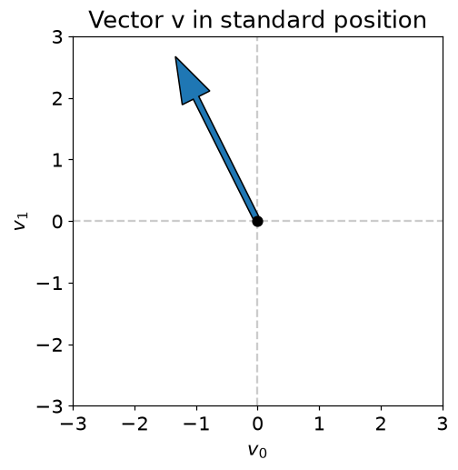
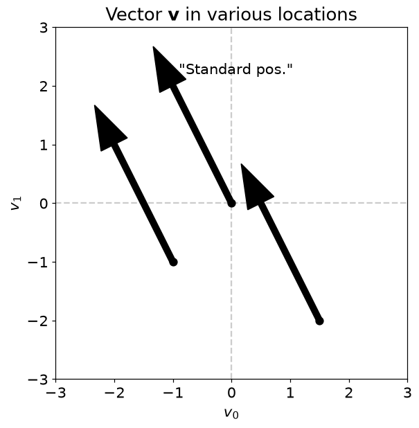
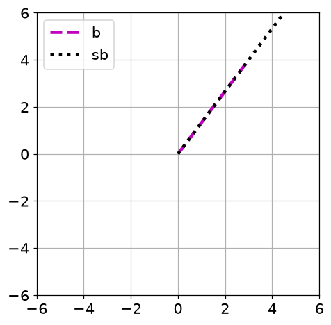
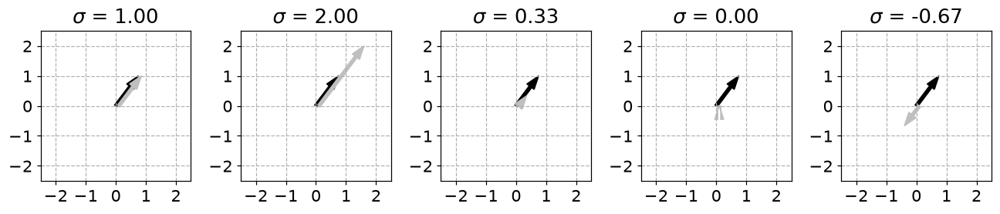
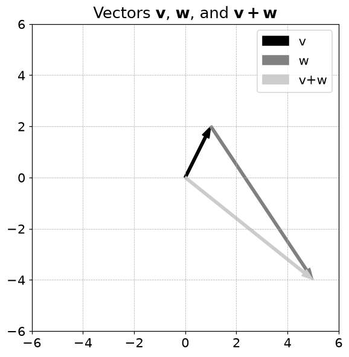
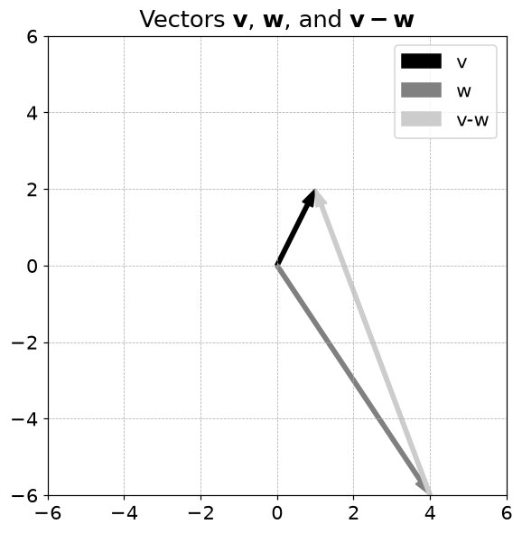
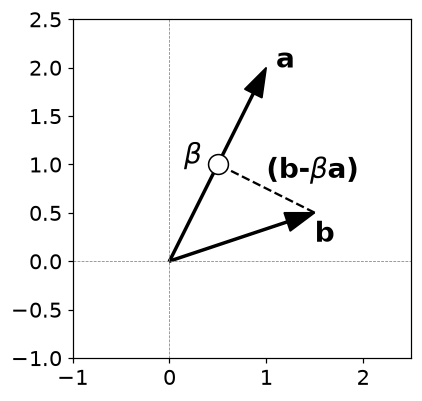
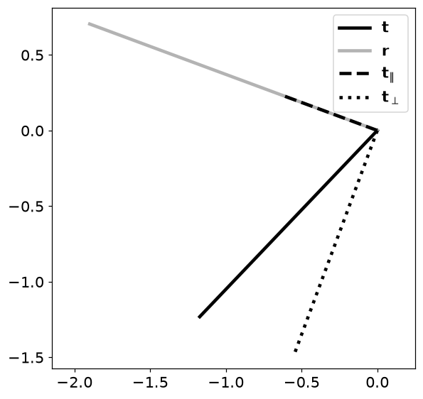

# 1. 벡터와 벡터의 기본 연산

## 1.1 벡터는 숫자 목록이면서 방향이다

- 위치·속도처럼 여러 숫자로 표현되는 대상을 하나로 묶은 것이 벡터입니다. $\mathbf v=(3,4)$는 오른쪽 3, 위쪽 4만큼 움직이는 화살표로 볼 수 있습니다.
- 같은 방향과 길이의 화살표는 시작 위치가 달라도 같은 자유벡터입니다.
- NumPy의 `(3,)`은 1차원 배열입니다. `(1,3)`인 행벡터, `(3,1)`인 열벡터와 구분해야 합니다. `(3,)`에 `.T`를 붙여도 모양은 바뀌지 않습니다.

| 표현 | 의미 | NumPy |
| --- | --- | --- |
| 1차원 배열 | 방향이 지정되지 않은 성분 목록 | `np.array([1, 2, 3])` |
| 행벡터 | 한 행에 성분을 배치 | `np.array([[1, 2, 3]])` |
| 열벡터 | 한 열에 성분을 배치 | `np.array([[1], [2], [3]])` |
| 내적 | 두 벡터의 방향 관계를 스칼라로 계산 | `v @ w` |

## 1.2 덧셈·길이·내적

$$
\mathbf v+\mathbf w=(v_1+w_1,\ldots,v_n+w_n),\qquad
\|\mathbf v\|_2=\sqrt{\sum_{i=1}^n v_i^2}
$$

- 덧셈은 이동을 이어 붙이는 일입니다. $(1,2)+(4,-6)=(5,-4)$입니다.
- 스칼라 곱 $a\mathbf v$는 길이를 $|a|$배로 바꿉니다. $a<0$이면 방향도 반대로 바뀝니다.
- $(3,4)$의 길이는 $\sqrt{9+16}=5$입니다. 단위벡터는 $(0.6,0.8)$입니다.

$$
\mathbf v^T\mathbf w=\sum_i v_iw_i
=\|\mathbf v\|\|\mathbf w\|\cos\theta
$$

- 내적은 두 벡터가 같은 방향을 얼마나 향하는지 측정합니다. 두 벡터가 모두 0이 아닐 때 내적 0은 직교를 뜻합니다.
- 원소별 곱 `v*w`는 벡터를, `v@w`는 1차원 벡터끼리일 때 내적 스칼라를 만듭니다.

## 1.3 정사영: 한 방향의 성분만 남기기

$$
\mathbf t_{\parallel}=\frac{\mathbf r^T\mathbf t}{\mathbf r^T\mathbf r}\mathbf r,
\qquad \mathbf t_{\perp}=\mathbf t-\mathbf t_{\parallel}
$$

- 기준 방향 $\mathbf r$은 영벡터가 아니어야 합니다. 분모는 목표 벡터가 아니라 **기준 벡터의 길이 제곱**입니다.
- $\mathbf a=(1,2),\mathbf b=(1.5,0.5)$이면 계수는 $2.5/5=0.5$, 투영은 $(0.5,1)$, 잔차는 $(1,-0.5)$입니다.
- 잔차와 기준 방향의 내적은 $1-1=0$입니다. 이 직교 조건이 최소제곱법의 출발점입니다.
- **주의**: 영벡터를 길이로 나누면 0으로 나누게 됩니다. `nan`은 새로운 방향이 생겼다는 뜻이 아니라 정규화가 정의되지 않는다는 표시입니다.

## 1.4 파이썬으로 확인하기

- 코드는 위에서부터 순서대로 실행한다. 앞에서 만든 변수와 함수를 다음 예제에서도 사용한다.
- 아래 숫자와 그림은 고정된 난수 시드로 실행한 결과다. 환경에 따라 마지막 소수 자릿수와 실행 시간은 달라질 수 있다.

### 1. 준비

```python
from pathlib import Path
import numpy as np
import matplotlib
import matplotlib.pyplot as plt
from IPython.display import display
ROOT = Path.cwd()
if not (ROOT / 'data').exists():
    ROOT = ROOT / 'blog_linear_algebra'
DATA = ROOT / 'data'
ASSET = ROOT / 'assets' / 'ch01'
ASSET.mkdir(parents=True, exist_ok=True)
np.random.seed(20260926)
np.set_printoptions(precision=6, suppress=True, threshold=120)
plt.rcParams.update({'figure.dpi': 100, 'savefig.dpi': 140, 'font.size': 12})
print('재현용 난수 시드:', 20260926)

import numpy as np
import matplotlib.pyplot as plt

import matplotlib_inline.backend_inline
matplotlib_inline.backend_inline.set_matplotlib_formats('png')
plt.rcParams.update({'font.size':14})
```

```text
재현용 난수 시드: 20260926
```

### 2. 벡터의 모양과 차원

```python
asList = [1,2,3]

asArray = np.array([1,2,3])

rowVec = np.array([ [1,2,3] ])
colVec = np.array([ [1],[2],[3] ])

print(f'asList:  {np.shape(asList)}')
print(f'asArray: {asArray.shape}')
print(f'rowVec:  {rowVec.shape}')
print(f'colVec:  {colVec.shape}')
```

```text
asList:  (3,)
asArray: (3,)
rowVec:  (1, 3)
colVec:  (3, 1)
```

### 3. 화살표로 보는 벡터

```python
v = np.array([-1,2])

plt.arrow(0,0,v[0],v[1],head_width=.5,width=.1)
plt.plot(0,0,'ko',markerfacecolor='k',markersize=7)

plt.plot([-3,3],[0,0],'--',color=[.8,.8,.8],zorder=-1)
plt.plot([0,0],[-3,3],'--',color=[.8,.8,.8],zorder=-1)

plt.axis('square')
plt.axis([-3,3,-3,3])
plt.xlabel('$v_0$')
plt.ylabel('$v_1$')
plt.title('Vector v in standard position')
plt.show()
```



```python
startPos = [
            [0,0],
            [-1,-1],
            [1.5,-2]
            ]

fig = plt.figure(figsize=(6,6))

for s in startPos:

  plt.arrow(s[0],s[1],v[0],v[1],head_width=.5,width=.1,color='black')
  plt.plot(s[0],s[1],'ko',markerfacecolor='k',markersize=7)

  if s==[0,0]:
    plt.text(v[0]+.1,v[1]+.2,'"Standard pos."')

plt.plot([-3,3],[0,0],'--',color=[.8,.8,.8],zorder=-1)
plt.plot([0,0],[-3,3],'--',color=[.8,.8,.8],zorder=-1)

plt.axis('square')
plt.axis([-3,3,-3,3])
plt.xlabel('$v_0$')
plt.ylabel('$v_1$')
plt.title('Vector $\mathbf{v}$ in various locations')
plt.savefig(ASSET / 'Figure_01_01.png',dpi=140)
plt.show()
```



### 4. 벡터 덧셈

```python
v = np.array([1,2])
w = np.array([4,-6])
vPlusW = v+w

print(v)
print(w)
print(vPlusW)
```

```text
[1 2]
[ 4 -6]
[ 5 -4]
```

### 5. 벡터 뺄셈

```python
vMinusW = v-w

print(v)
print(w)
print(vMinusW)
```

```text
[1 2]
[ 4 -6]
[-3  8]
```

### 6. 스칼라 곱과 방향

```python
s = -1/2

b = np.array([3,4])

print(b*s)
```

```text
[-1.5 -2. ]
```

```python
s = 3.5

print(v)
print(s+v)
```

```text
[1 2]
[4.5 5.5]
```

```python
plt.plot([0,b[0]],[0,b[1]],'m--',linewidth=3,label='b')
plt.plot([0,s*b[0]],[0,s*b[1]],'k:',linewidth=3,label='sb')

plt.grid()
plt.axis('square')
plt.axis([-6,6,-6,6])
plt.legend()
plt.show()
```



```python
scalars = [ 1, 2, 1/3, 0, -2/3 ]

baseVector = np.array([ .75,1 ])

fig,axs = plt.subplots(1,len(scalars),figsize=(12,3))
i = 0

for s in scalars:

  v = s*baseVector

  axs[i].arrow(0,0,baseVector[0],baseVector[1],head_width=.3,width=.1,color='k',length_includes_head=True)
  axs[i].arrow(.1,0,v[0],v[1],head_width=.3,width=.1,color=[.75,.75,.75],length_includes_head=True)
  axs[i].grid(linestyle='--')
  axs[i].axis('square')
  axs[i].axis([-2.5,2.5,-2.5,2.5])
  axs[i].set(xticks=np.arange(-2,3), yticks=np.arange(-2,3))
  axs[i].set_title(f'$\sigma$ = {s:.2f}')
  i+=1

plt.tight_layout()
plt.savefig(ASSET / 'Figure_01_03.png',dpi=140)
plt.show()
```



### 7. 행·열과 전치

```python
r = np.array([ [1,2,3] ])

l = np.array([1,2,3])

print(r), print(' ')

print(r.T), print(' ')

print(r.T.T)
```

```text
[[1 2 3]]
 
[[1]
 [2]
 [3]]
 
[[1 2 3]]
```

```python
print(l), print(' ')
print(l.T), print(' ')
print(l.T.T)
```

```text
[1 2 3]
 
[1 2 3]
 
[1 2 3]
```

### 8. 내적의 분배법칙

```python
v = np.array([ 0,1,2 ])
w = np.array([ 3,5,8 ])
u = np.array([ 13,21,34 ])

res1 = np.dot( v, w+u )
res2 = np.dot( v,w ) + np.dot( v,u )

res1,res2
```

```text
(np.int64(110), np.int64(110))
```

## 1.5 연습문제

### 연습문제 1. 덧셈과 뺄셈을 화살표로 확인하기

- $(1,2)$와 $(4,-6)$의 합·차를 좌표와 그림으로 연결합니다.
- 성분끼리 더해 $(5,-4)$, 빼서 $(-3,8)$을 구합니다.
- 두 번째 화살표를 첫 번째 끝으로 평행이동해 이어 붙입니다.

```python
v = np.array([1,2])
w = np.array([4,-6])
vPlusW = v+w

plt.figure(figsize=(6,6))

a1 = plt.arrow(0,0,v[0],v[1],head_width=.3,width=.1,color='k',length_includes_head=True)
a2 = plt.arrow(v[0],v[1],w[0],w[1],head_width=.3,width=.1,color=[.5,.5,.5],length_includes_head=True)
a3 = plt.arrow(0,0,vPlusW[0],vPlusW[1],head_width=.3,width=.1,color=[.8,.8,.8],length_includes_head=True)

plt.grid(linestyle='--',linewidth=.5)
plt.axis('square')
plt.axis([-6,6,-6,6])
plt.legend([a1,a2,a3],['v','w','v+w'])
plt.title('Vectors $\mathbf{v}$, $\mathbf{w}$, and $\mathbf{v+w}$')
plt.savefig(ASSET / 'Figure_01_02a.png',dpi=140)
plt.show()
```



```python
vMinusW = v-w

plt.figure(figsize=(6,6))

a1 = plt.arrow(0,0,v[0],v[1],head_width=.3,width=.1,color='k',length_includes_head=True)
a2 = plt.arrow(0,0,w[0],w[1],head_width=.3,width=.1,color=[.5,.5,.5],length_includes_head=True)
a3 = plt.arrow(w[0],w[1],vMinusW[0],vMinusW[1],head_width=.3,width=.1,color=[.8,.8,.8],length_includes_head=True)

plt.grid(linestyle='--',linewidth=.5)
plt.axis('square')
plt.axis([-6,6,-6,6])
plt.legend([a1,a2,a3],['v','w','v-w'])
plt.title('Vectors $\mathbf{v}$, $\mathbf{w}$, and $\mathbf{v-w}$')
plt.savefig(ASSET / 'Figure_01_02b.png',dpi=140)
plt.show()
```



- **결과 해석**: 합은 이동을 합친 결과입니다. 뺄셈은 $-w$를 더하는 것이므로 두 번째 화살표의 방향이 반대가 됩니다.

### 연습문제 2. 노름 함수 직접 만들기

- 벡터 길이를 라이브러리 없이 계산합니다.
- 각 성분을 제곱하고 합한 뒤 제곱근을 취합니다.
- 단위벡터와 $(1,2,3)$으로 만든 함수를 `np.linalg.norm`과 비교합니다.

```python
def normOfVect(v):
  return np.sqrt(np.sum(v**2))

w = np.array([0,0,1])
print( normOfVect(w) )

w = np.array([1,2,3])
print( normOfVect(w),np.linalg.norm(w) )
```

```text
1.0
3.7416573867739413 3.7416573867739413
```

- **결과 해석**: 단위벡터는 1, $(1,2,3)$은 $\sqrt{14}\approx3.741657$입니다. 원본 함수는 실수 벡터를 가정합니다. 복소수는 절댓값 제곱이 필요합니다.

### 연습문제 3. 단위벡터와 영벡터

- 방향을 유지하며 길이만 1로 맞춥니다.
- 벡터를 원래 노름으로 나누고 새 노름을 확인합니다.
- 마지막에는 영벡터를 넣어 분모가 0인 상황을 관찰합니다.

```python
def createUnitVector(v):

  mu = np.linalg.norm(v)

  return v / mu

w = np.array([0,1,0])
print( createUnitVector(w) )

w = np.array([0,3,0])
print( createUnitVector(w) )

w = np.array([13,-5,7])
uw = createUnitVector(w)
print( uw ), print(' ')

print( np.linalg.norm(w),np.linalg.norm(uw) )

print('\n\n\n')
createUnitVector( np.zeros((4,1)) )
```

```text
[0. 1. 0.]
[0. 1. 0.]
[ 0.83395 -0.32075  0.44905]
 
15.588457268119896 0.9999999999999999

array([[nan],
       [nan],
       [nan],
       [nan]])
```

```text
<ipython-input-22-57a0ea52dbd0>:6: RuntimeWarning: invalid value encountered in divide
  return v / mu
```

- **결과 해석**: 정상 입력은 새 노름이 1입니다. 영벡터 결과 `nan`과 경고는 정규화가 정의되지 않음을 보여 줍니다. 실제 함수는 노름 0을 검사해 예외를 내야 합니다.

### 연습문제 4. 원하는 길이로 바꾸기

- 벡터 방향을 유지하면서 목표 길이 mag를 부여합니다.
- 먼저 $v/\|v\|$로 정규화한 뒤 mag를 곱합니다.
- $(1,0,0)$과 임의 벡터를 사용해 전후 길이를 비교합니다.

```python
def createMagVector(v,mag):

  mu = np.linalg.norm(v)

  return mag * v / mu

w = np.array([1,0,0])
mw = createMagVector(w,4)
print( mw )

print( np.linalg.norm(w),np.linalg.norm(mw) )
```

```text
[4. 0. 0.]
1.0 4.0
```

- **결과 해석**: mag가 양수이면 길이는 mag입니다. 음수라면 실제 길이는 $|mag|$이고 방향도 뒤집힙니다. 영벡터는 별도 처리가 필요합니다.

### 연습문제 5. 전치 구현하기

- 행벡터의 성분을 열벡터로 옮기는 규칙을 이해합니다.
- `(1,3)` 배열과 `(3,1)` 영배열을 만들고 `vt[i,0]=v[0,i]`로 복사합니다.
- `.T` 결과와 비교합니다.

```python
v = np.array([[1,2,3]])

vt = np.zeros((3,1))

for i in range(v.shape[1]):
  vt[i,0] = v[0,i]

print(v), print(' ')
print(vt)
```

```text
[[1 2 3]]
 
[[1.]
 [2.]
 [3.]]
```

- **결과 해석**: 숫자는 같고 모양만 바뀝니다. `zeros` 기본 dtype 때문에 정수가 실수로 표시될 수 있습니다. 값의 일치와 dtype 일치는 구분합니다.

### 연습문제 6. 자기 내적과 길이 제곱

- $v^Tv=\|v\|^2$를 확인합니다.
- 난수 벡터의 자기 내적과 직접 만든 노름 함수의 제곱을 각각 구합니다.

```python
c = np.random.randn(5)

sqrNrm1 = np.dot(c,c)

sqrNrm2 = normOfVect(c)**2

print( sqrNrm1 )
print( sqrNrm2 )
```

```text
4.235835462331126
4.235835462331127
```

- **결과 해석**: 두 수는 반올림 오차 범위에서 같습니다. 제곱근을 취하기 전 합과 내적이 같은 연산이기 때문입니다.

### 연습문제 7. 실수 내적의 교환법칙

- $a^Tb=b^Ta$를 수치로 검증합니다.
- 열벡터 두 개를 만들고 원소별 곱의 합을 양쪽 순서로 계산합니다.
- 두 결과의 차이를 출력합니다.

```python
n = 11

a = np.random.randn(n,1)
b = np.random.randn(n,1)

atb = np.sum(a*b)
bta = np.sum(b*a)

atb - bta
```

```text
np.float64(0.0)
```

- **결과 해석**: 차이는 0입니다. `(n,1)` 배열끼리 `np.dot(a,b)`는 차원이 맞지 않습니다. `a.T@b` 또는 펼친 벡터를 사용해야 합니다.

### 연습문제 8. 투영 계수 구하기

- b에서 a방향 성분과 수직 성분을 분리합니다.
- $\beta=(a^Tb)/(a^Ta)$를 구하고 $\beta a$를 그립니다.
- 나머지 $b-\beta a$를 계산합니다.

```python
a = np.array([1,2])
b = np.array([1.5,.5])

beta = np.dot(a,b) / np.dot(a,a)

projvect = b - beta*a

plt.figure(figsize=(4,4))

plt.arrow(0,0,a[0],a[1],head_width=.2,width=.02,color='k',length_includes_head=True)
plt.arrow(0,0,b[0],b[1],head_width=.2,width=.02,color='k',length_includes_head=True)

plt.plot([b[0],beta*a[0]],[b[1],beta*a[1]],'k--')

plt.plot(beta*a[0],beta*a[1],'ko',markerfacecolor='w',markersize=13)

plt.plot([-1,2.5],[0,0],'--',color='gray',linewidth=.5)
plt.plot([0,0],[-1,2.5],'--',color='gray',linewidth=.5)

plt.text(a[0]+.1,a[1],'a',fontweight='bold',fontsize=18)
plt.text(b[0],b[1]-.3,'b',fontweight='bold',fontsize=18)
plt.text(beta*a[0]-.35,beta*a[1],r'$\beta$',fontweight='bold',fontsize=18)
plt.text((b[0]+beta*a[0])/2,(b[1]+beta*a[1])/2+.1,r'(b-$\beta$a)',fontweight='bold',fontsize=18)

plt.axis('square')
plt.axis([-1,2.5,-1,2.5])
plt.show()
```



- **결과 해석**: 이 예제의 계수는 0.5, 평행 성분은 $(0.5,1)$입니다. 원본 변수 `projvect`는 이름과 달리 수직 잔차를 담고 있으므로 혼동하지 마세요.

### 연습문제 9. 직교 분해 검증하기

- 평행 성분과 수직 성분이 목표 벡터를 복원하는지 확인합니다.
- 기준 r로 t를 투영하고 잔차를 구합니다.
- 두 성분의 합과 목표의 차이, 두 성분의 내적을 확인한 뒤 함께 그립니다.

```python
t = np.random.randn(2)
r = np.random.randn(2)

t_para = r * (np.dot(t,r) / np.dot(r,r))
t_perp = t - t_para

print(t)
print( t_para+t_perp )

print( np.dot(t_para,t_perp) )

plt.figure(figsize=(6,6))

plt.plot([0,t[0]],[0,t[1]],color='k',linewidth=3,label=r'$\mathbf{t}$')
plt.plot([0,r[0]],[0,r[1]],color=[.7,.7,.7],linewidth=3,label=r'$\mathbf{r}$')

plt.plot([0,t_para[0]],[0,t_para[1]],'k--',linewidth=3,label=r'$\mathbf{t}_{\|}$')
plt.plot([0,t_perp[0]],[0,t_perp[1]],'k:',linewidth=3,label=r'$\mathbf{t}_{\perp}$')

plt.axis('equal')
plt.legend()
plt.savefig(ASSET / 'Figure_01_08.png',dpi=140)
plt.show()
```

```text
[-1.17273  -1.231792]
[-1.17273  -1.231792]
0.0
```



- **결과 해석**: 합의 오차와 내적이 0 근처이면 분해가 맞습니다. 그림에서 직각처럼 보이는 것보다 이 수치 검증이 확실합니다.

### 연습문제 10. 잘못된 분모의 영향

- 투영 공식의 분모가 왜 기준 벡터의 제곱 노름인지 설명합니다.
- 분모를 $t^Tt$로 바꾼 뒤 잔차를 다시 계산하고 r과의 내적을 비교합니다.
- 원본 한 줄 뒤에 추가 검증을 제공합니다.

```python
t_para = r * (np.dot(t,r) / np.dot(t,t))

# 추가 검증: 합은 맞아도 직교가 깨질 수 있다.
t_perp_wrong = t - t_para
t_para_correct = r * (t @ r) / (r @ r)
print('잘못된 분모의 직교 잔차:', r @ t_perp_wrong)
print('올바른 분모의 직교 잔차:', r @ (t-t_para_correct))
assert np.allclose(r @ (t-t_para_correct), 0)
```

```text
잘못된 분모의 직교 잔차: -0.5698074110429017
올바른 분모의 직교 잔차: 0.0
```

- **결과 해석**: 합은 정의상 여전히 t가 되지만 직교는 일반적으로 깨집니다. ‘합이 맞음’만으로 정사영을 검증할 수 없다는 예제입니다.

## 1.6 핵심 관계 확인

- 작은 입력으로 핵심 공식을 다시 확인한다. `assert`가 통과하면 지정한 허용오차 안에서 관계가 성립한다.

```python
_v=np.array([3.,4.]); _a=np.array([1.,2.]); _b=np.array([1.5,.5])
_p=_a*(_a@_b)/(_a@_a); _e=_b-_p
print('길이:',np.linalg.norm(_v),'단위벡터:',_v/np.linalg.norm(_v))
print('투영:',_p,'잔차:',_e,'직교 내적:',_a@_e)
assert np.allclose(_p,[.5,1]) and np.allclose(_a@_e,0)
```

```text
길이: 5.0 단위벡터: [0.6 0.8]
투영: [0.5 1. ] 잔차: [ 1.  -0.5] 직교 내적: 0.0
```

## 실습에서 확인할 점

| 항목 | 확인할 점 |
| --- | --- |
| 작은 잔차 | `1e-14` 수준의 값은 부동소수점 오차일 수 있음 |
| 셀 실행 순서 | 앞에서 준비한 변수·데이터를 다음 코드에서 사용 |
| 문제 범위 | 제공된 코드의 학습 목표를 재구성한 풀이이며 책의 문제 원문은 아님 |

## 참고 자료

- 제공된 `선형대수학.zip`의 `LA4DS_ch01.py`
- Mike X Cohen, *Practical Linear Algebra for Data Science* / 한국어판 *개발자를 위한 실전 선형대수학*
- 한국어 개념 설명과 연습문제 해설은 선형대수학 코드에 맞춰 작성했다. 코드 보완 내역은 기존 자료의 `CHANGES.md`에서 확인할 수 있다.
