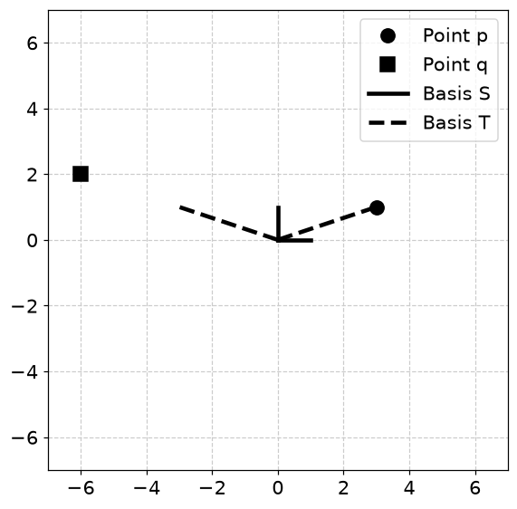
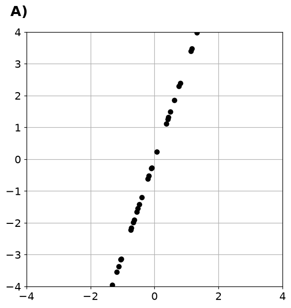
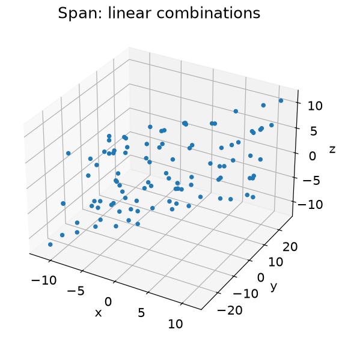

# 2. 벡터의 확장 개념

## 2.1 선형결합으로 만들 수 있는 공간

- 선형결합은 벡터마다 가중치를 곱한 뒤 더하는 것입니다. 재료 벡터와 가중치가 각각 방향과 사용량을 담당합니다.

$$
\mathbf y=\alpha_1\mathbf v_1+\cdots+\alpha_k\mathbf v_k
=V\boldsymbol\alpha
$$

- 코드의 $\mathbf v_1=(4,5,1)$, $\mathbf v_2=(-4,0,-4)$, $\mathbf v_3=(1,3,2)$에 가중치 $(1,2,-3)$을 적용하면 $(-7,-4,-13)$입니다.
- `zip(scalars, vectors)`는 같은 위치의 가중치와 벡터를 묶습니다. 두 목록의 길이가 다르면 짧은 쪽까지만 진행합니다.

| 개념 | 핵심 질문 | 확인 방법 |
| --- | --- | --- |
| 선형결합 | 어떤 가중치로 벡터를 합치는가? | `V @ weights` |
| 생성공간 | 가중치를 바꿔 어디까지 만들 수 있는가? | 선형결합의 점들을 시각화 |
| 선형독립 | 중복되는 방향이 있는가? | `np.linalg.matrix_rank(V)` |
| 기저 좌표 | 이 기저에서 몇 배씩 써야 하는가? | `np.linalg.solve(B, p)` |

## 2.2 직선, 평면, 그리고 선형독립

$$
\operatorname{span}(\mathbf v_1,\ldots,\mathbf v_k)
=\left\{\sum_i\alpha_i\mathbf v_i:\alpha_i\in\mathbb R\right\}
$$

- 영벡터가 아닌 벡터 하나의 배수들은 원점을 지나는 직선을 만듭니다.
- 3차원에서 서로 배수가 아닌 벡터 두 개는 원점을 지나는 평면을 만듭니다. 두 번째 벡터가 첫 번째의 배수라면 여전히 직선입니다.
- 난수 가중치로 찍은 점들은 생성공간의 일부만 보여 줍니다. 유한한 산점도 자체가 무한한 공간 전체는 아닙니다.
- $\sum_i\alpha_i\mathbf v_i=0$의 해가 모든 $\alpha_i=0$뿐이면 선형독립입니다. 중복 방향이 없다는 뜻입니다.

## 2.3 기저가 달라지면 좌표도 달라진다

$$
\mathbf p=B[\mathbf p]_B,\qquad [\mathbf p]_B=B^{-1}\mathbf p
$$

- 기저는 해당 공간을 생성하는 선형독립 벡터의 집합입니다.
- $B=\begin{bmatrix}3&-3\\1&1\end{bmatrix}$라면 점 $(3,1)$의 새 좌표는 $(1,0)$입니다. 점 $(-6,2)$의 새 좌표는 $(0,2)$입니다.
- 점의 실제 위치는 같고, 위치를 설명하는 기준 자만 바뀝니다.
- **주의**: 선형결합과 단순한 좌표 나열을 구분하세요. 가중치의 개수는 사용하는 기저벡터의 개수와 맞아야 합니다.

## 2.4 파이썬으로 확인하기

- 코드는 위에서부터 순서대로 실행한다. 앞에서 만든 변수와 함수를 다음 예제에서도 사용한다.
- 아래 숫자와 그림은 고정된 난수 시드로 실행한 결과다. 환경에 따라 마지막 소수 자릿수와 실행 시간은 달라질 수 있다.

### 1. 준비

```python
from pathlib import Path
import numpy as np
import matplotlib
import matplotlib.pyplot as plt
from IPython.display import display
ROOT = Path.cwd()
if not (ROOT / 'data').exists():
    ROOT = ROOT / 'blog_linear_algebra'
DATA = ROOT / 'data'
ASSET = ROOT / 'assets' / 'ch02'
ASSET.mkdir(parents=True, exist_ok=True)
np.random.seed(20260927)
np.set_printoptions(precision=6, suppress=True, threshold=120)
plt.rcParams.update({'figure.dpi': 100, 'savefig.dpi': 140, 'font.size': 12})
print('재현용 난수 시드:', 20260927)

import numpy as np
import matplotlib.pyplot as plt

import matplotlib_inline.backend_inline
matplotlib_inline.backend_inline.set_matplotlib_formats('png')
plt.rcParams.update({'font.size':14})
```

```text
재현용 난수 시드: 20260927
```

### 2. 선형결합

```python
l1 = 1
l2 = 2
l3 = -3

v1 = np.array([4,5,1])
v2 = np.array([-4,0,-4])
v3 = np.array([1,3,2])

l1*v1 + l2*v2 + l3*v3
```

```text
array([ -7,  -4, -13])
```

### 3. 기저와 좌표

```python
p = (3,1)
q = (-6,2)

plt.figure(figsize=(6,6))

plt.plot(p[0],p[1],'ko',markerfacecolor='k',markersize=10,label='Point p')
plt.plot(q[0],q[1],'ks',markerfacecolor='k',markersize=10,label='Point q')

plt.plot([0,0],[0,1],'k',linewidth=3,label='Basis S')
plt.plot([0,1],[0,0],'k',linewidth=3)

plt.plot([0,3],[0,1],'k--',linewidth=3,label='Basis T')
plt.plot([0,-3],[0,1],'k--',linewidth=3)

plt.axis('square')
plt.grid(linestyle='--',color=[.8,.8,.8])
plt.xlim([-7,7])
plt.ylim([-7,7])
plt.legend()
plt.savefig(ASSET / 'Figure_02_04.png',dpi=140)
plt.show()
```



## 2.5 연습문제

### 연습문제 1. 반복문으로 선형결합

- 벡터 가중합을 반복문과 직접 식으로 계산합니다.
- 0벡터에서 시작해 `zip`으로 묶인 가중치와 벡터의 곱을 누적합니다.

```python
scalars = [ l1,l2,l3 ]
vectors = [ v1,v2,v3 ]

linCombo = np.zeros(len(v1))

for s,v in zip(scalars,vectors):
  linCombo += s*v

linCombo
```

```text
array([ -7.,  -4., -13.])
```

- **결과 해석**: 결과는 $(-7,-4,-13)$입니다. 초기 배열이 float라 소수점이 붙어도 같은 값입니다.

### 연습문제 2. 목록 길이가 다른 경우

- 암묵적 절단과 명시적 인덱스 오류를 비교합니다.
- 가중치를 4개, 벡터를 3개로 두고 가중치 길이만큼 인덱싱합니다.
- 네 번째 벡터에서 오류를 확인합니다.

```python
try:

    scalars = [ l1,l2,l3,5 ]
    vectors = [ v1,v2,v3 ]

    linCombo = np.zeros(len(v1))

    for i in range(len(scalars)):
      linCombo += scalars[i]*vectors[i]
except IndexError as exc:
    print("학습용 예상 오류:", type(exc).__name__, str(exc))
```

```text
학습용 예상 오류: IndexError list index out of range
```

- **결과 해석**: `IndexError`가 예상 결과입니다. zip은 조용히 마지막 가중치를 무시하므로 계산 전에 두 길이가 같은지 검증하는 편이 안전합니다.

### 연습문제 3. 직선과 평면 생성하기

- 벡터의 독립성이 생성공간 차원을 결정함을 봅니다.
- 벡터 하나에 난수 스칼라를 곱해 직선을 그립니다.
- 다음으로 3차원 벡터 두 개의 난수 선형결합을 그립니다.
- 두 번째 벡터를 첫 번째의 절반으로 바꾸어 비교할 수 있습니다.

```python
A  = np.array([ 1,3 ])

xlim = [-4,4]

scalars = np.random.uniform(low=xlim[0],high=xlim[1],size=100)

plt.figure(figsize=(6,6))

for s in scalars:

  p = A*s

  plt.plot(p[0],p[1],'ko')

plt.xlim(xlim)
plt.ylim(xlim)
plt.grid()
plt.text(-4.5,4.5,'A)',fontweight='bold',fontsize=18)
plt.savefig(ASSET / 'Figure_02_07a.png',dpi=140)
plt.show()
```



```python
import plotly.graph_objects as go

v1 = np.array([ 3,5,1 ])
v2 = np.array([ 0,2,2 ])

# v1 = np.array([ 3.0,5.0,1.0 ])
# v2 = np.array([ 1.5,2.5,0.5 ])

scalars = np.random.uniform(low=xlim[0],high=xlim[1],size=(100,2))

points = np.zeros((100,3))
for i in range(len(scalars)):

  points[i,:] = v1*scalars[i,0] + v2*scalars[i,1]

fig = go.Figure( data=[go.Scatter3d(x=points[:,0], y=points[:,1], z=points[:,2], 
                                    mode='markers', marker=dict(size=6,color='black') )])

fig.update_layout(margin=dict(l=0,r=0,b=0,t=0))
plt.savefig(ASSET / 'Figure_02_07b.png',dpi=140)
fig.write_html(str(ASSET / 'interactive_3d.html'), include_plotlyjs=True)
ax = plt.figure(figsize=(7, 6)).add_subplot(projection='3d')
ax.scatter(points[:,0], points[:,1], points[:,2], s=15)
ax.set(xlabel='x', ylabel='y', zlabel='z', title='Span: linear combinations')
plt.show()
```



- **결과 해석**: 독립인 두 벡터는 평면, 서로 배수이면 직선입니다. 점의 개수가 많아져도 차원은 독립 방향의 개수로 결정됩니다.

## 2.6 핵심 관계 확인

- 작은 입력으로 핵심 공식을 다시 확인한다. `assert`가 통과하면 지정한 허용오차 안에서 관계가 성립한다.

```python
_B=np.array([[3.,-3.],[1.,1.]])
for _p in [np.array([3.,1.]),np.array([-6.,2.])]:
    _coord=np.linalg.solve(_B,_p)
    print('점:',_p,'새 좌표:',_coord)
    assert np.allclose(_B@_coord,_p)
print('기저 행렬의 랭크:',np.linalg.matrix_rank(_B))
```

```text
점: [3. 1.] 새 좌표: [1. 0.]
점: [-6.  2.] 새 좌표: [0. 2.]
기저 행렬의 랭크: 2
```

## 실습에서 확인할 점

| 항목 | 확인할 점 |
| --- | --- |
| 작은 잔차 | `1e-14` 수준의 값은 부동소수점 오차일 수 있음 |
| 셀 실행 순서 | 앞에서 준비한 변수·데이터를 다음 코드에서 사용 |
| 문제 범위 | 제공된 코드의 학습 목표를 재구성한 풀이이며 책의 문제 원문은 아님 |
| 예상 오류 | 차원·인덱스·역행렬 조건을 어기는 예제는 오류 메시지로 원인을 확인 |

- [3차원 생성공간 살펴보기](assets/ch02/interactive_3d.html): 브라우저에서 회전·확대 가능

## 참고 자료

- 제공된 `선형대수학.zip`의 `LA4DS_ch02.py`
- Mike X Cohen, *Practical Linear Algebra for Data Science* / 한국어판 *개발자를 위한 실전 선형대수학*
- 한국어 개념 설명과 연습문제 해설은 선형대수학 코드에 맞춰 작성했다. 코드 보완 내역은 기존 자료의 `CHANGES.md`에서 확인할 수 있다.
