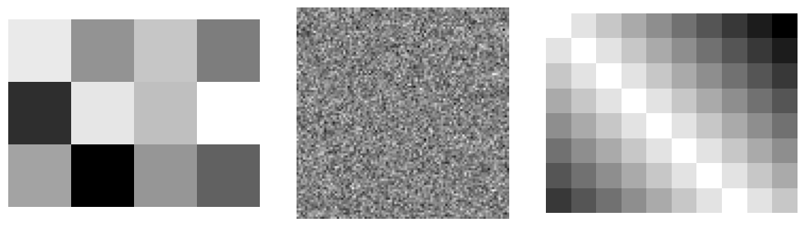
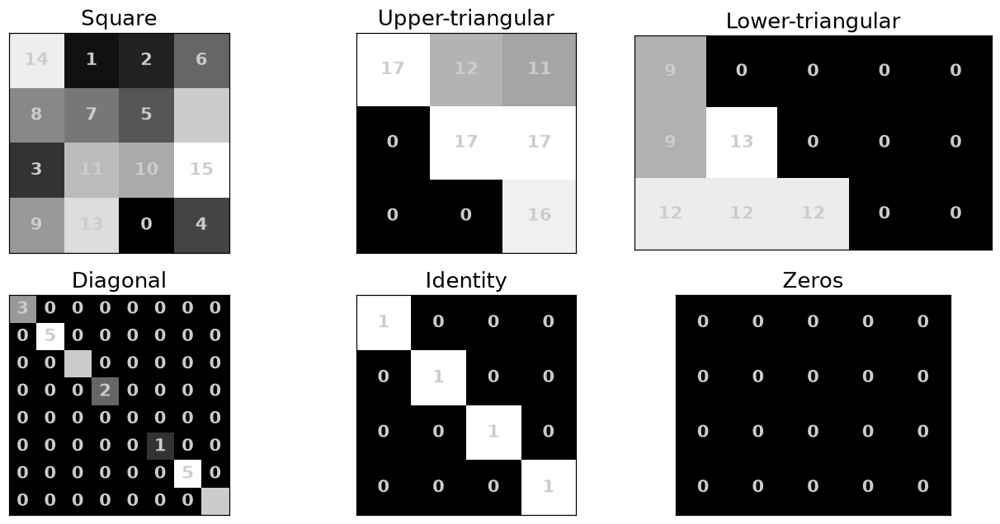
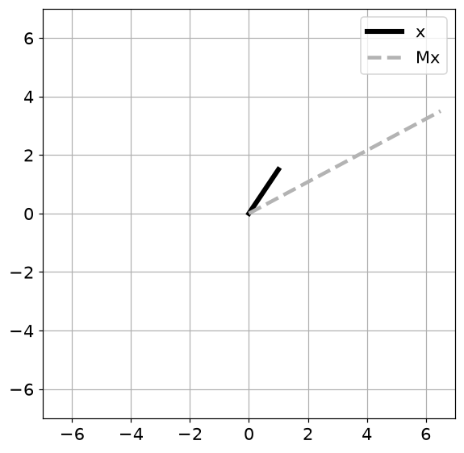
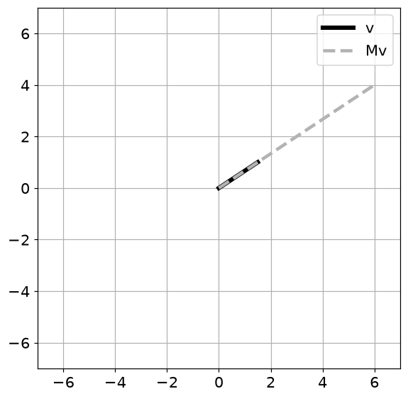
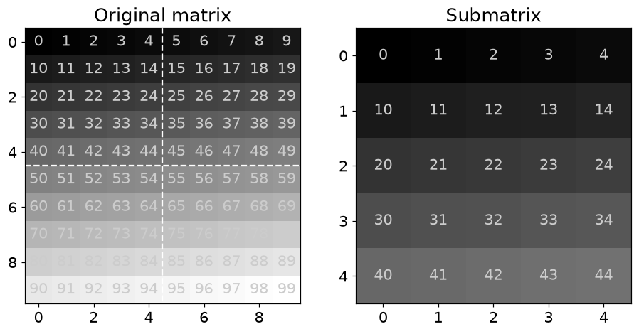
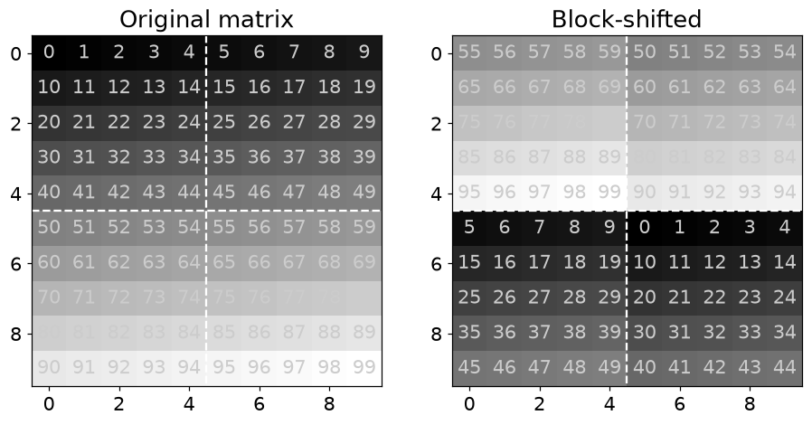
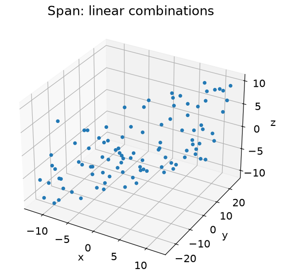

# 4. 행렬과 행렬의 기본 연산

## 4.1 행렬은 표이면서 선형변환이다

- $m\times n$ 행렬은 행이 $m$개, 열이 $n$개인 숫자 배열입니다. NumPy의 `shape`도 `(행, 열)` 순서입니다.
- `A[1,3]`은 두 번째 행·네 번째 열입니다. `A[:5,:5]`는 처음 5행·5열을 선택하며 끝 인덱스는 포함하지 않습니다.

| 연산 | 수학 표기 | Python |
| --- | --- | --- |
| 원소별 곱 | $A\odot B$ | `A * B` |
| 행렬 곱 | $AB$ | `A @ B` |
| 전치 | $A^T$ | `A.T` |
| 대각 이동 | $A+\lambda I$ | `A + lam * np.eye(n)` |

## 4.2 같은 모양의 연산과 안쪽 차원이 맞는 연산

$$
(A+B)_{ij}=a_{ij}+b_{ij},\quad
(A\odot B)_{ij}=a_{ij}b_{ij},\quad
(AB)_{ij}=\sum_{k=1}^{n}a_{ik}b_{kj}
$$

- `A*B`는 원소별 곱입니다. `A@B`는 행렬 곱입니다.
- $A\in\mathbb R^{m\times n}$, $B\in\mathbb R^{n\times p}$이면 $AB\in\mathbb R^{m\times p}$입니다.
- $A=\begin{bmatrix}1&2\\3&4\end{bmatrix}$, $B=\begin{bmatrix}2&0\\1&2\end{bmatrix}$이면 $AB=\begin{bmatrix}4&4\\10&8\end{bmatrix}$입니다. 첫 원소 4는 $1\cdot2+2\cdot1$입니다.
- $A\mathbf x$는 A의 열들을 $\mathbf x$의 성분으로 가중합한 것입니다. 각 열은 좌표축의 단위벡터가 이동한 결과이기도 합니다.

## 4.3 자주 만나는 행렬과 전치

$$
AI=IA=A,\qquad (AB)^T=B^TA^T,\qquad S=S^T
$$

- 항등행렬 $I$는 변환을 하지 않습니다. 영행렬은 모든 벡터를 0으로 보냅니다.
- 대각행렬을 왼쪽에 곱하면 행을, 오른쪽에 곱하면 열을 각각 확대·축소합니다.
- $A+\lambda I$는 대각 원소만 바꿉니다. `A+lambda`는 모든 원소에 더하는 브로드캐스팅이므로 다릅니다.
- 전치는 행과 열을 바꾸며 곱의 순서도 뒤집습니다. 변환의 합성 순서를 거꾸로 추적하기 때문입니다.
- $(A+A^T)/2$는 대칭행렬이고 $A^TA$는 대칭 양의 준정부호 행렬입니다. 두 생성법의 성질이 완전히 같지는 않습니다.
- **주의**: NumPy 브로드캐스팅으로 계산이 성공해도 원하는 수학 연산이라는 보장은 없습니다. 먼저 `shape`를 확인하세요.

## 4.4 파이썬으로 확인하기

- 코드는 위에서부터 순서대로 실행한다. 앞에서 만든 변수와 함수를 다음 예제에서도 사용한다.
- 아래 숫자와 그림은 고정된 난수 시드로 실행한 결과다. 환경에 따라 마지막 소수 자릿수와 실행 시간은 달라질 수 있다.

### 1. 준비

```python
from pathlib import Path
import numpy as np
import matplotlib
import matplotlib.pyplot as plt
from IPython.display import display
ROOT = Path.cwd()
if not (ROOT / 'data').exists():
    ROOT = ROOT / 'blog_linear_algebra'
DATA = ROOT / 'data'
ASSET = ROOT / 'assets' / 'ch04'
ASSET.mkdir(parents=True, exist_ok=True)
np.random.seed(20260929)
np.set_printoptions(precision=6, suppress=True, threshold=120)
plt.rcParams.update({'figure.dpi': 100, 'savefig.dpi': 140, 'font.size': 12})
print('재현용 난수 시드:', 20260929)

import numpy as np
import matplotlib.pyplot as plt

import scipy.linalg

from scipy.linalg import toeplitz

import matplotlib_inline.backend_inline
matplotlib_inline.backend_inline.set_matplotlib_formats('png')
plt.rcParams.update({'font.size':14})

v = np.array([[1,2,3]]).T
w = np.array([[10,20]])
v + w
```

```text
재현용 난수 시드: 20260929
```

```text
array([[11, 21],
       [12, 22],
       [13, 23]])
```

### 2. 행렬을 색상으로 읽기

```python
A = np.random.randn(3,4)
B = np.random.randn(100,100)
C = -toeplitz(np.arange(8),np.arange(10))

fig,axs = plt.subplots(1,3,figsize=(10,3))

axs[0].imshow(A,cmap='gray')
axs[1].imshow(B,cmap='gray')
axs[2].imshow(C,cmap='gray')

for i in range(3): axs[i].axis('off')
plt.tight_layout()
plt.savefig(ASSET / 'Figure_04_01.png',dpi=140)
plt.show()
```



### 3. 행·열 슬라이싱

```python
A = np.reshape(np.arange(1,10),(3,3))
print(A)
```

```text
[[1 2 3]
 [4 5 6]
 [7 8 9]]
```

```python
print( A[1,:] )

print( A[1] )
```

```text
[4 5 6]
[4 5 6]
```

```python
print( A[:,1] )
```

```text
[2 5 8]
```

```python
A[0:2,:]
```

```text
array([[1, 2, 3],
       [4, 5, 6]])
```

```python
A[:,1:]
```

```text
array([[2, 3],
       [5, 6],
       [8, 9]])
```

```python
print( A[0:2,1:2] )
print(' ')

print( A[0:2:1,0:2:1] )
```

```text
[[2]
 [5]]
 
[[1 2]
 [4 5]]
```

```python
A = np.arange(60).reshape(6,10)

sub = A[1:4:1,0:5:1]

print('Original matrix:\n')
print(A)

print('\n\nSubmatrix:\n')
print(sub)
```

```text
Original matrix:

[[ 0  1  2  3  4  5  6  7  8  9]
 [10 11 12 13 14 15 16 17 18 19]
 [20 21 22 23 24 25 26 27 28 29]
 [30 31 32 33 34 35 36 37 38 39]
 [40 41 42 43 44 45 46 47 48 49]
 [50 51 52 53 54 55 56 57 58 59]]

Submatrix:

[[10 11 12 13 14]
 [20 21 22 23 24]
 [30 31 32 33 34]]
```

### 4. 특수 행렬

```python
M1 = np.random.permutation(16).reshape(4,4)

M2 = np.triu(np.random.randint(10,20,(3,3)))

M3 = np.tril(np.random.randint(8,16,(3,5)))

M4 = np.diag( np.random.randint(0,6,size=8) )

M5 = np.eye(4,dtype=int)

M6 = np.zeros((4,5),dtype=int)

matrices  = [ M1,M2,M3,M4,M5,M6 ]
matLabels = [ 'Square','Upper-triangular','Lower-triangular','Diagonal','Identity','Zeros'  ]

_,axs = plt.subplots(2,3,figsize=(12,6))
axs = axs.flatten()

for mi,M in enumerate(matrices):
  axs[mi].imshow(M,cmap='gray',origin='upper',
                 vmin=np.min(M),vmax=np.max(M))
  axs[mi].set(xticks=[],yticks=[])
  axs[mi].set_title(matLabels[mi])

  for (j,i),num in np.ndenumerate(M):
    axs[mi].text(i,j,num,color=[.8,.8,.8],ha='center',va='center',fontweight='bold')

plt.savefig(ASSET / 'Figure_04_02.png',dpi=140)
plt.tight_layout()
plt.show()
```



### 5. 특수 행렬의 성질

```python
Mrows = 4
Ncols = 6

A = np.random.randn(Mrows,Ncols)

np.round(A,3)
```

```text
array([[-1.832,  0.646, -0.334, -0.112,  0.151,  0.537],
       [ 0.746,  1.18 ,  1.114,  0.166, -0.139, -1.523],
       [-0.285, -0.803,  0.481,  0.461,  1.154, -1.412],
       [-0.44 ,  0.534, -0.722,  0.766,  0.092,  0.478]])
```

```python
M = 4
N = 6
A = np.random.randn(M,N)

print('Upper triangular:\n')
print(np.triu(A))

print('\n\nLower triangular:\n')
print(np.tril(A))
```

```text
Upper triangular:

[[ 1.126046  0.725251  0.954782 -1.230372 -0.395382  0.663184]
 [ 0.        1.31446  -0.051953  1.685747  2.614493 -0.294304]
 [ 0.        0.        0.438054 -1.196189 -0.708118 -0.443579]
 [ 0.        0.        0.       -1.432085 -0.299351  0.073085]]

Lower triangular:

[[ 1.126046  0.        0.        0.        0.        0.      ]
 [ 1.990318  1.31446   0.        0.        0.        0.      ]
 [-0.257956  0.823851  0.438054  0.        0.        0.      ]
 [-1.031888  0.720566 -0.51555  -1.432085  0.        0.      ]]
```

```python
A = np.random.randn(5,5)
d = np.diag(A)
print('Input a matrix:\n',d)

v = np.arange(1,6)
D = np.diag(v)
print('\n\nInput a vector:\n',D)
```

```text
Input a matrix:
 [ 0.67268   0.403035  0.390651  0.848237 -1.526648]

Input a vector:
 [[1 0 0 0 0]
 [0 2 0 0 0]
 [0 0 3 0 0]
 [0 0 0 4 0]
 [0 0 0 0 5]]
```

```python
n = 4
I = np.eye(n)
print(f'The {n}x{n} identity matrix:\n',I)
```

```text
The 4x4 identity matrix:
 [[1. 0. 0. 0.]
 [0. 1. 0. 0.]
 [0. 0. 1. 0.]
 [0. 0. 0. 1.]]
```

```python
n = 4
m = 5
I = np.zeros((n,m))
print(f'The {n}x{m} zeros matrix:\n',I)
```

```text
The 4x5 zeros matrix:
 [[0. 0. 0. 0. 0.]
 [0. 0. 0. 0. 0.]
 [0. 0. 0. 0. 0.]
 [0. 0. 0. 0. 0.]]
```

### 6. 행렬 덧셈

```python
A = np.array([  [2,3,4],
                [1,2,4] ])

B = np.array([  [ 0, 3,1],
                [-1,-4,2] ])

print(A+B)
```

```text
[[ 2  6  5]
 [ 0 -2  6]]
```

### 7. 대각 이동

```python
3 + np.eye(2)
```

```text
array([[4., 3.],
       [3., 4.]])
```

```python
A = np.array([ [4,5, 1],
               [0,1,11],
               [4,9, 7]  ])

s = 6

print('Original matrix:')
print(A), print(' ')

print('Broadcasting addition:')
print(A + s), print(' ')

print('Shifting:')
print( A + s*np.eye(len(A)) )
```

```text
Original matrix:
[[ 4  5  1]
 [ 0  1 11]
 [ 4  9  7]]
 
Broadcasting addition:
[[10 11  7]
 [ 6  7 17]
 [10 15 13]]
 
Shifting:
[[10.  5.  1.]
 [ 0.  7. 11.]
 [ 4.  9. 13.]]
```

### 8. 스칼라 곱

```python
print(A), print(' ')
print(s*A)
```

```text
[[ 4  5  1]
 [ 0  1 11]
 [ 4  9  7]]
 
[[24 30  6]
 [ 0  6 66]
 [24 54 42]]
```

### 9. 원소별 곱

```python
try:

    A = np.random.randn(3,4)
    B = np.random.randn(3,4)

    A*B 

    np.multiply(A,B)

    A@B
except ValueError as exc:
    print("학습용 예상 오류:", type(exc).__name__, str(exc))
```

```text
학습용 예상 오류: ValueError matmul: Input operand 1 has a mismatch in its core dimension 0, with gufunc signature (n?,k),(k,m?)->(n?,m?) (size 3 is different from 4)
```

### 10. 행렬 곱

```python
try:

    A = np.random.randn(3,6)
    B = np.random.randn(6,4)
    C = np.random.randn(6,4)

    print( (A@B).shape )
    print( np.dot(A,B).shape )
    print( (B@C).shape )
    print( (A@C).shape )
except ValueError as exc:
    print("학습용 예상 오류:", type(exc).__name__, str(exc))
```

```text
(3, 4)
(3, 4)
학습용 예상 오류: ValueError matmul: Input operand 1 has a mismatch in its core dimension 0, with gufunc signature (n?,k),(k,m?)->(n?,m?) (size 6 is different from 4)
```

```python
print( np.multiply(B,C) ), print(' ')

print( np.dot(B,C.T) )

# np.dot(B,C.T)-B@C.T
```

```text
[[-0.511784 -0.185465 -0.249684  0.774567]
 [ 0.043821  0.071776  1.317631 -0.031281]
 [-0.671383 -0.195949 -0.068835 -3.361441]
 [ 0.543132 -2.003759  0.067227  0.465437]
 [-0.001327 -0.0217    0.41298  -0.139949]
 [-0.503992 -0.236322  0.905995  0.197311]]
 
[[-0.172366 -1.457415 -4.506759  0.07571   2.897355  0.963426]
 [-3.075569  1.401947  1.17886  -2.085599 -2.845638  4.269313]
 [ 1.442424 -0.369157 -4.297608  2.433638 -0.341242  5.720964]
 [ 1.129669  1.760009  3.60205  -0.927963 -3.902241 -1.314809]
 [ 1.100649 -0.324448 -1.777118  0.991079  0.250003  1.102871]
 [ 0.484024  1.446786  3.027356 -0.114887 -3.207619  0.362992]]
```

### 11. 행렬이 벡터를 움직이는 방법

```python
M  = np.array([ [2,3],[2,1] ])
x  = np.array([ [1,1.5] ]).T
Mx = M@x

plt.figure(figsize=(6,6))

plt.plot([0,x[0,0]],[0,x[1,0]],'k',linewidth=4,label='x')
plt.plot([0,Mx[0,0]],[0,Mx[1,0]],'--',linewidth=3,color=[.7,.7,.7],label='Mx')
plt.xlim([-7,7])
plt.ylim([-7,7])
plt.legend()
plt.grid()
plt.savefig(ASSET / 'Figure_04_05a.png',dpi=140)
plt.show()
```



```python
M  = np.array([ [2,3],[2,1] ])
v  = np.array([ [1.5,1] ]).T
Mv = M@v

plt.figure(figsize=(6,6))

plt.plot([0,v[0,0]],[0,v[1,0]],'k',linewidth=4,label='v')
plt.plot([0,Mv[0,0]],[0,Mv[1,0]],'--',linewidth=3,color=[.7,.7,.7],label='Mv')
plt.xlim([-7,7])
plt.ylim([-7,7])
plt.legend()
plt.grid()
plt.savefig(ASSET / 'Figure_04_05b.png',dpi=140)
plt.show()
```



### 12. 전치

```python
A = np.array([ [3,4,5],[1,2,3] ])

A_T1 = A.T
A_T2 = np.transpose(A)

A_TT = A_T1.T 

print( A_T1 ), print(' ')
print( A_T2 ), print(' ')
print( A_TT )
```

```text
[[3 1]
 [4 2]
 [5 3]]
 
[[3 1]
 [4 2]
 [5 3]]
 
[[3 4 5]
 [1 2 3]]
```

## 4.5 연습문제

### 연습문제 1. 행렬 원소 찾기

- 수학의 1부터 세는 번호와 Python 인덱스를 구분합니다.
- 0부터 11까지 3×4로 배치하고 두 번째 행·네 번째 열을 `[1,3]`으로 조회합니다.

```python
A = np.arange(12).reshape(3,4)
print(A)

ri = 1
ci = 3

print(f'The matrix element at index ({ri+1},{ci+1}) is {A[ri,ci]}')
```

```text
[[ 0  1  2  3]
 [ 4  5  6  7]
 [ 8  9 10 11]]
The matrix element at index (2,4) is 7
```

- **결과 해석**: 값은 7입니다. 행을 먼저, 열을 다음에 쓰는 순서를 확인합니다.

### 연습문제 2. 부분행렬 자르기

- 슬라이싱의 시작·끝·간격을 해석합니다.
- 0부터 99까지 10×10 행렬을 만들고 `[0:5:1,0:5:1]`을 선택합니다.

```python
C = np.arange(100).reshape((10,10))

C_1 = C[0:5:1,0:5:1]

print(C), print(' ')
print(C_1)

_,axs = plt.subplots(1,2,figsize=(10,5))

axs[0].imshow(C,cmap='gray',origin='upper',vmin=0,vmax=np.max(C))
axs[0].plot([4.5,4.5],[-.5,9.5],'w--')
axs[0].plot([-.5,9.5],[4.5,4.5],'w--')
axs[0].set_title('Original matrix')

for (j,i),num in np.ndenumerate(C):
  axs[0].text(i,j,num,color=[.8,.8,.8],ha='center',va='center')

axs[1].imshow(C_1,cmap='gray',origin='upper',vmin=0,vmax=np.max(C))
axs[1].set_title('Submatrix')

for (j,i),num in np.ndenumerate(C_1):
  axs[1].text(i,j,num,color=[.8,.8,.8],ha='center',va='center')

plt.savefig(ASSET / 'Figure_04_06.png',dpi=140)
plt.show()
```

```text
[[ 0  1  2  3  4  5  6  7  8  9]
 [10 11 12 13 14 15 16 17 18 19]
 [20 21 22 23 24 25 26 27 28 29]
 [30 31 32 33 34 35 36 37 38 39]
 [40 41 42 43 44 45 46 47 48 49]
 [50 51 52 53 54 55 56 57 58 59]
 [60 61 62 63 64 65 66 67 68 69]
 [70 71 72 73 74 75 76 77 78 79]
 [80 81 82 83 84 85 86 87 88 89]
 [90 91 92 93 94 95 96 97 98 99]]
 
[[ 0  1  2  3  4]
 [10 11 12 13 14]
 [20 21 22 23 24]
 [30 31 32 33 34]
 [40 41 42 43 44]]
```



- **결과 해석**: 왼쪽 위 5×5가 선택됩니다. 각 행 끝은 4,14,24,34,44입니다. 끝 인덱스 5는 포함되지 않습니다.

### 연습문제 3. 블록 재배치

- 작은 행렬을 조립해 큰 행렬을 구성합니다.
- 10×10을 네 개의 5×5 블록으로 나눈 후 hstack으로 가로 연결, vstack으로 세로 연결합니다.

```python
C_1 = C[0:5:1,0:5:1]
C_2 = C[0:5:1,5:10:1]
C_3 = C[5:10:1,0:5:1]
C_4 = C[5:10:1,5:10:1]

newMatrix = np.vstack( (np.hstack((C_4,C_3)),
                        np.hstack((C_2,C_1))) )

_,axs = plt.subplots(1,2,figsize=(10,5))

axs[0].imshow(C,cmap='gray',origin='upper',vmin=0,vmax=np.max(C))
axs[0].plot([4.5,4.5],[-.5,9.5],'w--')
axs[0].plot([-.5,9.5],[4.5,4.5],'w--')
axs[0].set_title('Original matrix')

for (j,i),num in np.ndenumerate(C):
  axs[0].text(i,j,num,color=[.8,.8,.8],ha='center',va='center')

axs[1].imshow(newMatrix,cmap='gray',origin='upper',vmin=0,vmax=np.max(C))
axs[1].plot([4.5,4.5],[-.5,9.5],'w--')
axs[1].plot([-.5,9.5],[4.5,4.5],'w--')
axs[1].set_title('Block-shifted')

for (j,i),num in np.ndenumerate(newMatrix):
  axs[1].text(i,j,num,color=[.8,.8,.8],ha='center',va='center')

plt.savefig(ASSET / 'Figure_04_07.png',dpi=140)
plt.show()
```



- **결과 해석**: 블록 위치는 바뀌지만 각 블록 내부 순서는 그대로입니다. 전체 원소를 뒤집는 연산과 다릅니다.

### 연습문제 4. 덧셈 함수 구현

- 행렬 덧셈의 모양 조건과 이중 반복문을 확인합니다.
- 두 shape가 같은지 검사하고 각 위치의 값을 더합니다.
- 영행렬과 1행렬로 테스트합니다.

```python
def addMatrices(A,B):

  if A.shape != B.shape:
    raise ValueError('Matrices must be the same size!')

  C = np.zeros(A.shape)

  for i in range(A.shape[0]):
    for j in range(A.shape[1]):
      C[i,j] = A[i,j] + B[i,j]
  
  return C

M1 = np.zeros((6,4))
M2 = np.ones((6,4))

addMatrices(M1,M2)
```

```text
array([[1., 1., 1., 1.],
       [1., 1., 1., 1.],
       [1., 1., 1., 1.],
       [1., 1., 1., 1.],
       [1., 1., 1., 1.],
       [1., 1., 1., 1.]])
```

- **결과 해석**: 결과는 같은 모양의 1행렬입니다. 모양 불일치는 문자열을 raise할 수 없으므로 ValueError로 고쳤습니다.

### 연습문제 5. 스칼라 분배법칙

- $s(A+B)=sA+sB$를 검증합니다.
- 세 표현을 계산한 뒤 원본처럼 $2E_1-E_2-E_3$을 출력합니다.

```python
A = np.random.randn(3,4)
B = np.random.randn(3,4)
s = np.random.randn()

expr1 = s*(A+B)
expr2 = s*A + s*B
expr3 = A*s + B*s

print(np.round(2*expr1 - expr2 - expr3,8))
```

```text
[[ 0.  0.  0. -0.]
 [ 0. -0.  0. -0.]
 [ 0.  0.  0.  0.]]
```

- **결과 해석**: 0 근처 행렬이 나옵니다. 이 조합 검사는 오차 상쇄가 가능하므로 더 엄밀한 검증은 각 쌍에 allclose를 적용하는 것입니다.

### 연습문제 6. 행렬 곱 구현

- 출력 원소 하나가 행과 열의 내적임을 이해합니다.
- 4×6 A와 6×4 B를 만들고 각 행·열 내적을 4×4 C에 저장합니다.
- `A@B`와 isclose로 비교합니다.

```python
m = 4
n = 6
A = np.random.randn(m,n);
B = np.random.randn(n,m)

C1 = np.zeros((m,m))
for rowi in range(m):
  for coli in range(m):
    C1[rowi,coli] = np.dot( A[rowi,:],B[:,coli] )

C2 = A@B

np.isclose( C1,C2 )
```

```text
array([[ True,  True,  True,  True],
       [ True,  True,  True,  True],
       [ True,  True,  True,  True],
       [ True,  True,  True,  True]])
```

- **결과 해석**: 모든 항이 True이면 구현이 맞습니다. 안쪽 차원 6이 합의 범위이고 바깥 차원 4×4가 결과 크기입니다.

### 연습문제 7. 여러 곱의 전치

- 전치할 때 곱셈 순서가 뒤집힘을 확인합니다.
- 2×6, 6×3, 3×5, 5×2 행렬을 곱해 전치한 결과와 역순 전치 곱을 비교합니다.

```python
L = np.random.randn(2,6)
I = np.random.randn(6,3)
V = np.random.randn(3,5)
E = np.random.randn(5,2)

res1 = ( L@I@V@E ).T
# res2 = L.T @ I.T @ V.T @ E.T
res3 = E.T @ V.T @ I.T @ L.T

print(res1-res3)
```

```text
[[-0. -0.]
 [ 0.  0.]]
```

- **결과 해석**: 차이는 반올림 오차 정도입니다. 같은 순서로 전치한 곱은 차원부터 맞지 않을 수 있습니다.

### 연습문제 8. 대칭 판정 함수

- $S-S^T$의 오차로 대칭성을 판단합니다.
- 차이 원소의 제곱합이 작은지 검사합니다.
- 임의 정사각행렬과 $A^TA$를 대조합니다.

```python
def isMatrixSymmetric(S):

  D = S-S.T

  sse = np.sum(D**2)

  return sse<10**-15

A = np.random.randn(4,4)
AtA = A.T@A

print(isMatrixSymmetric(A))
print(isMatrixSymmetric(AtA))
```

```text
False
True
```

- **결과 해석**: 보통 False와 True가 나옵니다. 고정 임계값은 행렬 크기·스케일에 민감하므로 실무에서는 상대 허용오차도 고려합니다.

### 연습문제 9. 덧셈으로 대칭 만들기

- $(A+A^T)/2$가 대칭임을 증명합니다.
- 임의 A와 전치를 평균낸 뒤 앞의 판정 함수를 적용합니다.

```python
A = np.random.randn(4,4)
AtA = (A + A.T) / 2

print(isMatrixSymmetric(A))
print(isMatrixSymmetric(AtA))
```

```text
False
True
```

- **결과 해석**: 대칭 판정은 True입니다. $A^TA$와 달리 음의 고윳값을 가질 수 있으므로 양의 준정부호까지 보장하지 않습니다.

### 연습문제 10. 행렬 곱으로 span 그리기

- 열의 선형결합을 하나의 행렬 곱으로 표현합니다.
- 3×2 행렬의 두 열에 난수 가중치를 적용해 3차원 점들을 생성합니다.
- 정적 그림과 회전 가능한 HTML을 제공합니다.

```python
import plotly.graph_objects as go

A = np.array( [ [3,0],
                [5,2],
                [1,2] ] )

# A = np.array( [ [3,1.5],

xlim = [-4,4]
scalars = np.random.uniform(low=xlim[0],high=xlim[1],size=(100,2))

points = np.zeros((100,3))
for i in range(len(scalars)):
  points[i,:] = A@scalars[i]

fig = go.Figure( data=[go.Scatter3d(x=points[:,0], y=points[:,1], z=points[:,2], mode='markers')])
fig.write_html(str(ASSET / 'interactive_3d.html'), include_plotlyjs=True)
ax = plt.figure(figsize=(7, 6)).add_subplot(projection='3d')
ax.scatter(points[:,0], points[:,1], points[:,2], s=15)
ax.set(xlabel='x', ylabel='y', zlabel='z', title='Span: linear combinations')
plt.show()
```



- **결과 해석**: 두 독립 열이면 평면을 이룹니다. 한 열을 다른 열의 배수로 바꾸면 랭크 1의 직선으로 줄어듭니다.

### 연습문제 11. 대각행렬의 왼쪽·오른쪽 곱

- 행 스케일링과 열 스케일링을 구분합니다.
- 1행렬 O에 대각 D를 앞·뒤에서 곱합니다.
- 또 $S=\sqrt D$로 SOS를 계산합니다.

```python
n = 4

O = np.ones((n,n))
D = np.diag(np.arange(1,n+1)**2)
S = np.sqrt(D)

pre = D@O
pst = O@D

both = S@O@S

print('Ones matrix:')
print(O), print(' ')

print('Diagonal matrix:')
print(D), print(' ')

print('Sqrt-diagonal matrix:')
print(S), print(' ')

print('Pre-multiply by diagonal:')
print(pre), print(' ')

print('Post-multiply by diagonal:')
print(pst), print(' ')

print('Pre- and post-multiply by sqrt-diagonal:')
print(both)
```

```text
Ones matrix:
[[1. 1. 1. 1.]
 [1. 1. 1. 1.]
 [1. 1. 1. 1.]
 [1. 1. 1. 1.]]
 
Diagonal matrix:
[[ 1  0  0  0]
 [ 0  4  0  0]
 [ 0  0  9  0]
 [ 0  0  0 16]]
 
Sqrt-diagonal matrix:
[[1. 0. 0. 0.]
 [0. 2. 0. 0.]
 [0. 0. 3. 0.]
 [0. 0. 0. 4.]]
 
Pre-multiply by diagonal:
[[ 1.  1.  1.  1.]
 [ 4.  4.  4.  4.]
 [ 9.  9.  9.  9.]
 [16. 16. 16. 16.]]
 
Post-multiply by diagonal:
[[ 1.  4.  9. 16.]
 [ 1.  4.  9. 16.]
 [ 1.  4.  9. 16.]
 [ 1.  4.  9. 16.]]
 
Pre- and post-multiply by sqrt-diagonal:
[[ 1.  2.  3.  4.]
 [ 2.  4.  6.  8.]
 [ 3.  6.  9. 12.]
 [ 4.  8. 12. 16.]]
```

- **결과 해석**: DO는 행별 배율, OD는 열별 배율입니다. SOS의 (i,j)원소는 $\sqrt{d_i d_j}$가 됩니다.

### 연습문제 12. 대각행렬의 두 곱

- 특수한 경우 원소별 곱과 행렬 곱이 같음을 확인합니다.
- 두 대각행렬에 `*`와 `@`를 각각 적용하고 차이를 구합니다.

```python
N = 5
D1 = np.diag( np.random.randn(N) )
D2 = np.diag( np.random.randn(N) )

hadamard = D1*D2
standard = D1@D2

hadamard - standard
```

```text
array([[0., 0., 0., 0., 0.],
       [0., 0., 0., 0., 0.],
       [0., 0., 0., 0., 0.],
       [0., 0., 0., 0., 0.],
       [0., 0., 0., 0., 0.]])
```

- **결과 해석**: 0행렬이 나옵니다. 대각 밖의 성분이 모두 0이기 때문이며 일반 행렬로 확대할 수 없는 성질입니다.

## 4.6 핵심 관계 확인

- 작은 입력으로 핵심 공식을 다시 확인한다. `assert`가 통과하면 지정한 허용오차 안에서 관계가 성립한다.

```python
_A=np.array([[1,2],[3,4]]); _B=np.array([[2,0],[1,2]])
print('원소별 곱:\n',_A*_B); print('행렬 곱:\n',_A@_B)
assert np.array_equal(_A@_B,[[4,4],[10,8]])
assert np.array_equal((_A@_B).T,_B.T@_A.T)
print('전치 곱 공식 검증: 통과')
```

```text
원소별 곱:
 [[2 0]
 [3 8]]
행렬 곱:
 [[ 4  4]
 [10  8]]
전치 곱 공식 검증: 통과
```

## 실습에서 확인할 점

| 항목 | 확인할 점 |
| --- | --- |
| 작은 잔차 | `1e-14` 수준의 값은 부동소수점 오차일 수 있음 |
| 셀 실행 순서 | 앞에서 준비한 변수·데이터를 다음 코드에서 사용 |
| 문제 범위 | 제공된 코드의 학습 목표를 재구성한 풀이이며 책의 문제 원문은 아님 |
| 예상 오류 | 차원·인덱스·역행렬 조건을 어기는 예제는 오류 메시지로 원인을 확인 |

- [3차원 생성공간 살펴보기](assets/ch04/interactive_3d.html): 브라우저에서 회전·확대 가능

## 참고 자료

- 제공된 `선형대수학.zip`의 `LA4DS_ch04.py`
- Mike X Cohen, *Practical Linear Algebra for Data Science* / 한국어판 *개발자를 위한 실전 선형대수학*
- 한국어 개념 설명과 연습문제 해설은 선형대수학 코드에 맞춰 작성했다. 코드 보완 내역은 기존 자료의 `CHANGES.md`에서 확인할 수 있다.
