# 6. 데이터 분석에서의 행렬

## 6.1 데이터 표와 이미지를 행렬로 다루기

- 관측치가 행, 변수가 열인 $X\in\mathbb R^{N\times p}$를 기준으로 합니다. 이미지에서는 각 원소가 픽셀 밝기입니다.
- 이 장의 수치 데이터는 제공 코드가 지정한 UCI Communities and Crime 원자료입니다. 결과는 선택된 숫자형 열 사이의 기술적 상관을 설명하며 인과효과를 뜻하지 않습니다.
- 이미지 예제의 입력은 직접 생성한 컬러 도형입니다. 원본 변수명 `bathtub`을 유지했지만 실제 박물관 사진은 아닙니다.

| 행렬 | 행·열의 의미 | 핵심 연산 |
| --- | --- | --- |
| 데이터 행렬 | 관측치 × 변수 | 열별 평균 제거 |
| 공분산 행렬 | 변수 × 변수 | `Xc.T @ Xc / (N - 1)` |
| 좌표 행렬 | 좌표 성분 × 점 | `T @ points` |
| 이미지 행렬 | 세로 픽셀 × 가로 픽셀 | `convolve2d(image, kernel)` |

## 6.2 공분산에서 상관계수로

$$
X_c=X-\mathbf1\boldsymbol\mu^T,\qquad
C=\frac{X_c^TX_c}{N-1},\qquad R=D^{-1}CD^{-1}
$$

- 평균을 빼면 변수마다 기준점이 0이 됩니다. `axis=0`은 행 방향으로 모아 **열별 평균**을 계산합니다.
- C의 대각선은 각 변수의 표본분산, 비대각선은 두 변수가 함께 변하는 정도입니다.
- $D=\operatorname{diag}(\sqrt{C_{11}},\ldots,\sqrt{C_{pp}})$로 나누면 단위의 영향을 제거한 상관행렬이 됩니다. 분산 0인 열은 먼저 처리해야 합니다.
- $X_c^TX_c$는 변수끼리, $X_cX_c^T$는 관측치끼리 비교합니다. 두 결과의 크기가 다릅니다.
- 코드에서는 `?`가 포함된 비수치 열을 제외합니다. 열을 제거했으므로 원래 열 번호를 그대로 변수 이름에 적용하면 잘못된 해석을 하게 됩니다.

## 6.3 좌표를 움직이는 행렬

$$
R_\theta=\begin{bmatrix}\cos\theta&-\sin\theta\\\sin\theta&\cos\theta\end{bmatrix},\qquad
T_s=\begin{bmatrix}1&s\\0&1\end{bmatrix}
$$

- 열벡터에 $R_\theta$를 곱하면 반시계 방향 회전입니다. 원본의 회전행렬은 사인 부호가 반대여서 시계 방향입니다.
- 전단행렬 $T_s$는 높이에 비례해 x좌표를 밀어냅니다. 원이 기울어진 타원처럼 변하는 모습을 GIF에서 확인할 수 있습니다.

## 6.4 커널로 이웃 픽셀을 섞기

$$
(I*K)_{ij}=\sum_{a,b}K_{ab}I_{i-a,j-b}
$$

- 양수 가우시안 커널의 합을 1로 정규화하면 내부 영역의 일정한 밝기가 보존됩니다.
- `mode='same'`은 원본 크기를 유지합니다. 기본 영 패딩 때문에 가장자리 밝기는 달라질 수 있습니다.
- RGB 이미지는 채널별 2차원 합성곱을 적용합니다. 실수 결과를 `uint8`로 바꾸면 소수 부분이 사라지며, 범위 밖 값은 먼저 클리핑해야 합니다.
- 경계 검출 결과는 음수도 중요합니다. 원본의 양수 쪽 색 범위는 한 방향의 경계를 강조하므로 부호 전체를 보려면 대칭 색 범위를 사용하세요.

## 6.5 파이썬으로 확인하기

- 코드는 위에서부터 순서대로 실행한다. 앞에서 만든 변수와 함수를 다음 예제에서도 사용한다.
- 아래 숫자와 그림은 고정된 난수 시드로 실행한 결과다. 환경에 따라 마지막 소수 자릿수와 실행 시간은 달라질 수 있다.

### 1. 준비

```python
from pathlib import Path
import numpy as np
import matplotlib
import matplotlib.pyplot as plt
from IPython.display import display
ROOT = Path.cwd()
if not (ROOT / 'data').exists():
    ROOT = ROOT / 'blog_linear_algebra'
DATA = ROOT / 'data'
ASSET = ROOT / 'assets' / 'ch06'
ASSET.mkdir(parents=True, exist_ok=True)
np.random.seed(20260931)
np.set_printoptions(precision=6, suppress=True, threshold=120)
plt.rcParams.update({'figure.dpi': 100, 'savefig.dpi': 140, 'font.size': 12})
print('재현용 난수 시드:', 20260931)

import numpy as np
import matplotlib.pyplot as plt

import matplotlib.animation as animation
from matplotlib import rc
rc('animation', html='jshtml')

from skimage import io,color

from scipy.signal import convolve2d

import pandas as pd

import matplotlib_inline.backend_inline
matplotlib_inline.backend_inline.set_matplotlib_formats('png')
plt.rcParams.update({'font.size':14})
```

```text
재현용 난수 시드: 20260931
```

### 2. 공분산 행렬

```python
url  = 'https://archive.ics.uci.edu/ml/machine-learning-databases/communities/communities.data'
data = pd.read_csv(DATA / 'communities.data',sep=',',header=None)

data.columns = [ 'state', 'county', 'community', 'communityname', 'fold', 'population', 'householdsize', 'racepctblack', 'racePctWhite', 
'racePctAsian', 'racePctHisp', 'agePct12t21', 'agePct12t29', 'agePct16t24', 'agePct65up', 'numbUrban', 'pctUrban', 'medIncome', 'pctWWage', 
'pctWFarmSelf', 'pctWInvInc', 'pctWSocSec', 'pctWPubAsst', 'pctWRetire', 'medFamInc', 'perCapInc', 'whitePerCap', 'blackPerCap', 'indianPerCap', 
'AsianPerCap', 'OtherPerCap', 'HispPerCap', 'NumUnderPov', 'PctPopUnderPov', 'PctLess9thGrade', 'PctNotHSGrad', 'PctBSorMore', 'PctUnemployed', 'PctEmploy', 
'PctEmplManu', 'PctEmplProfServ', 'PctOccupManu', 'PctOccupMgmtProf', 'MalePctDivorce', 'MalePctNevMarr', 'FemalePctDiv', 'TotalPctDiv', 'PersPerFam', 'PctFam2Par', 
'PctKids2Par', 'PctYoungKids2Par', 'PctTeen2Par', 'PctWorkMomYoungKids', 'PctWorkMom', 'NumIlleg', 'PctIlleg', 'NumImmig', 'PctImmigRecent', 'PctImmigRec5', 
'PctImmigRec8', 'PctImmigRec10', 'PctRecentImmig', 'PctRecImmig5', 'PctRecImmig8', 'PctRecImmig10', 'PctSpeakEnglOnly', 'PctNotSpeakEnglWell', 'PctLargHouseFam', 'PctLargHouseOccup', 
'PersPerOccupHous', 'PersPerOwnOccHous', 'PersPerRentOccHous', 'PctPersOwnOccup', 'PctPersDenseHous', 'PctHousLess3BR', 'MedNumBR', 'HousVacant', 'PctHousOccup', 'PctHousOwnOcc', 
'PctVacantBoarded', 'PctVacMore6Mos', 'MedYrHousBuilt', 'PctHousNoPhone', 'PctWOFullPlumb', 'OwnOccLowQuart', 'OwnOccMedVal', 'OwnOccHiQuart', 'RentLowQ', 'RentMedian', 
'RentHighQ', 'MedRent', 'MedRentPctHousInc', 'MedOwnCostPctInc', 'MedOwnCostPctIncNoMtg', 'NumInShelters', 'NumStreet', 'PctForeignBorn', 'PctBornSameState', 'PctSameHouse85', 
'PctSameCity85', 'PctSameState85', 'LemasSwornFT', 'LemasSwFTPerPop', 'LemasSwFTFieldOps', 'LemasSwFTFieldPerPop', 'LemasTotalReq', 'LemasTotReqPerPop', 'PolicReqPerOffic', 'PolicPerPop', 
'RacialMatchCommPol', 'PctPolicWhite', 'PctPolicBlack', 'PctPolicHisp', 'PctPolicAsian', 'PctPolicMinor', 'OfficAssgnDrugUnits', 'NumKindsDrugsSeiz', 'PolicAveOTWorked', 'LandArea', 
'PopDens', 'PctUsePubTrans', 'PolicCars', 'PolicOperBudg', 'LemasPctPolicOnPatr', 'LemasGangUnitDeploy', 'LemasPctOfficDrugUn', 'PolicBudgPerPop', 'ViolentCrimesPerPop', 
 ]

data
```

```text
state county  ... PolicBudgPerPop ViolentCrimesPerPop
0         8      ?  ...            0.14                0.20
1        53      ?  ...               ?                0.67
2        24      ?  ...               ?                0.43
3        34      5  ...               ?                0.12
4        42     95  ...               ?                0.03
...     ...    ...  ...             ...                 ...
1989     12      ?  ...               ?                0.09
1990      6      ?  ...               ?                0.45
1991      9      9  ...            0.28                0.23
1992     25     17  ...            0.18                0.19
1993      6      ?  ...            0.13                0.48

[1994 rows x 128 columns]
```

```python
numberDataset = data._get_numeric_data()

dataMat = numberDataset.drop(['state','fold'],axis=1).values
dataMat
```

```text
array([[0.19, 0.33, 0.02, ..., 0.2 , 0.32, 0.2 ],
       [0.  , 0.16, 0.12, ..., 0.45, 0.  , 0.67],
       [0.  , 0.42, 0.49, ..., 0.02, 0.  , 0.43],
       ...,
       [0.16, 0.37, 0.25, ..., 0.18, 0.91, 0.23],
       [0.08, 0.51, 0.06, ..., 0.33, 0.22, 0.19],
       [0.2 , 0.78, 0.14, ..., 0.05, 1.  , 0.48]], shape=(1994, 100))
```

```python
datamean = np.mean(dataMat,axis=0)

dataMatM = dataMat - datamean

print(np.mean(dataMatM[:,0]))

covMat = dataMatM.T @ dataMatM
covMat /= (dataMatM.shape[0]-1)

clim = np.max(np.abs(covMat)) * .2

plt.figure(figsize=(6,6))
plt.imshow(covMat,vmin=-clim,vmax=clim,cmap='gray')
plt.colorbar()
plt.title('Data covariance matrix')
plt.savefig(ASSET / 'Figure_06_01.png',dpi=140)
plt.show()
```

```text
2.4498401746994428e-18
```

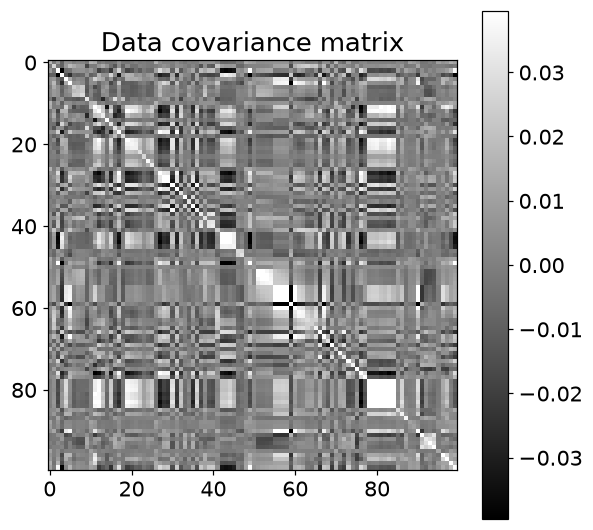

### 3. 선형변환

```python
th = np.pi/5

T = np.array([ 
              [ np.cos(th),np.sin(th)],
              [-np.sin(th),np.cos(th)]
            ])

x = np.linspace(-1,1,20)
origPoints = np.vstack( (np.zeros(x.shape),x) )

transformedPoints = T @ origPoints

plt.figure(figsize=(6,6))
plt.plot(origPoints[0,:],origPoints[1,:],'ko',label='Original')
plt.plot(transformedPoints[0,:],transformedPoints[1,:],'s',color=[.7,.7,.7],label='Transformed')

plt.axis('square')
plt.xlim([-1.2,1.2])
plt.ylim([-1.2,1.2])
plt.legend()
plt.title(f'Rotation by {np.rad2deg(th):.0f} degrees.')
plt.savefig(ASSET / 'Figure_06_02.png',dpi=140)
plt.show()
```

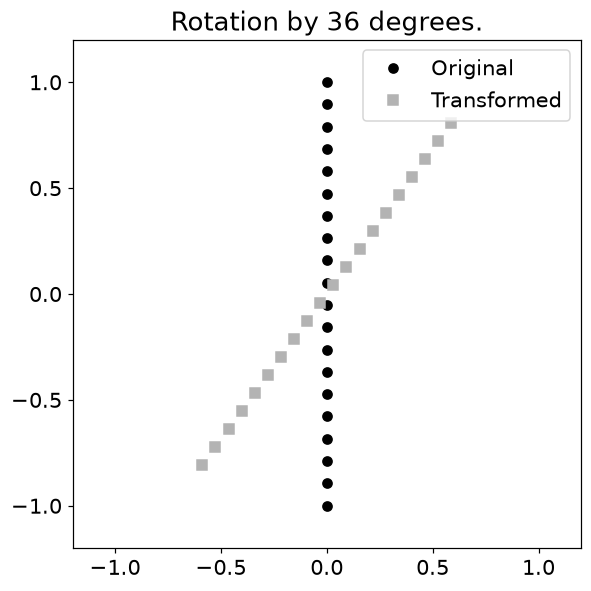

### 4. 변환 애니메이션

```python
def aframe(ph):

  T = np.array([
                 [  1, 1-ph ],
                 [  0, 1    ]
                ])

  P = T@points

  plth.set_xdata(P[0,:])
  plth.set_ydata(P[1,:])

  return plth

theta  = np.linspace(0,2*np.pi,100)
points = np.vstack((np.sin(theta),np.cos(theta)))

fig,ax = plt.subplots(1,figsize=(12,6))
plth,  = ax.plot(np.cos(x),np.sin(x),'ko')
ax.set_aspect('equal')
ax.set_xlim([-2,2])
ax.set_ylim([-2,2])

phi = np.linspace(-1,1-1/40,40)**2

anim = animation.FuncAnimation(fig, aframe, phi, interval=100, repeat=True)
anim.save(str(ASSET / 'animation_13.gif'), writer='pillow', fps=10)
from IPython.display import Image, display
display(Image(filename=str(ASSET / 'animation_13.gif')))
plt.close(fig)
```

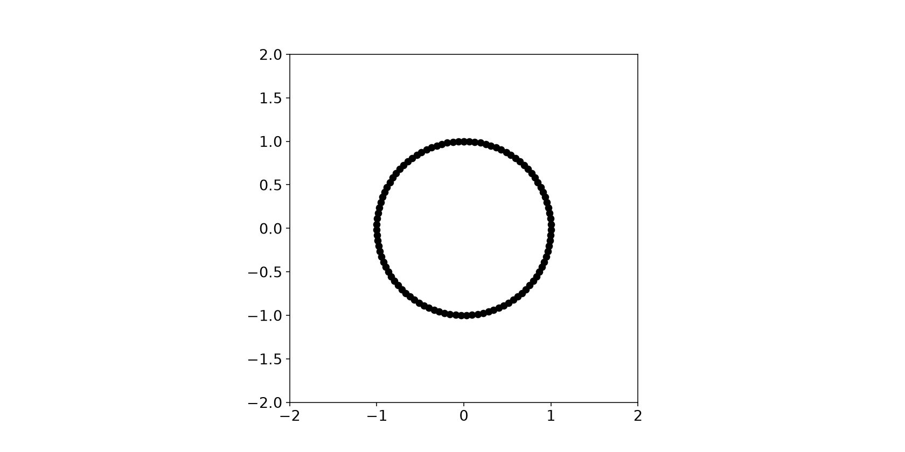

### 5. 이미지 합성곱

```python
imgN  = 20
image = np.random.randn(imgN,imgN)

kernelN = 7
Y,X     = np.meshgrid(np.linspace(-3,3,kernelN),np.linspace(-3,3,kernelN))
kernel  = np.exp( -(X**2+Y**2)/7 )
kernel  = kernel / np.sum(kernel)

halfKr = kernelN//2
convoutput = np.zeros((imgN+kernelN-1,imgN+kernelN-1))

imagePad = np.zeros(convoutput.shape)
imagePad[halfKr:-halfKr:1,halfKr:-halfKr:1] = image

for rowi in range(halfKr,imgN+halfKr):
  for coli in range(halfKr,imgN+halfKr):

    pieceOfImg = imagePad[rowi-halfKr:rowi+halfKr+1:1,coli-halfKr:coli+halfKr+1:1]

    dotprod = np.sum( pieceOfImg*kernel )

    convoutput[rowi,coli] = dotprod

convoutput = convoutput[halfKr:-halfKr:1,halfKr:-halfKr:1]

convoutput2 = convolve2d(image,kernel,mode='same')

fig,ax = plt.subplots(2,2,figsize=(8,8))

ax[0,0].imshow(image)
ax[0,0].set_title('Image')

ax[0,1].imshow(kernel)
ax[0,1].set_title('Convolution kernel')

ax[1,0].imshow(convoutput)
ax[1,0].set_title('Manual convolution')

ax[1,1].imshow(convoutput2)
ax[1,1].set_title("Scipy's convolution")

plt.savefig(ASSET / 'Figure_06_04b.png',dpi=140)
plt.show()
```

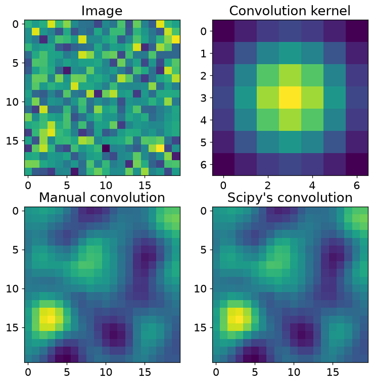

```python
bathtub = io.imread(DATA / 'generated_scene.png')

print(bathtub.shape)

fig = plt.figure(figsize=(10,6))
plt.imshow(bathtub)
plt.savefig(ASSET / 'Figure_06_05a.png',dpi=140)
plt.show()

bathtub2d = color.rgb2gray(bathtub)

print(bathtub2d.shape)
```

```text
(240, 320, 3)
(240, 320)
```

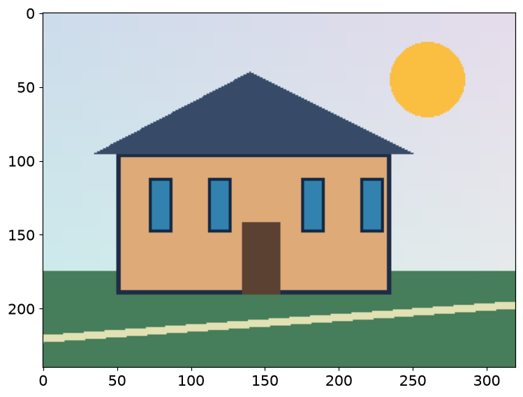

```python
kernelN = 29
Y,X     = np.meshgrid(np.linspace(-3,3,kernelN),np.linspace(-3,3,kernelN))
kernel  = np.exp( -(X**2+Y**2)/20 )
kernel  = kernel / np.sum(kernel)

smooth_bathtub = convolve2d(bathtub2d,kernel,mode='same')

fig = plt.figure(figsize=(10,6))
plt.imshow(smooth_bathtub,cmap='gray')
plt.savefig(ASSET / 'Figure_06_05b.png',dpi=140)
plt.show()
```

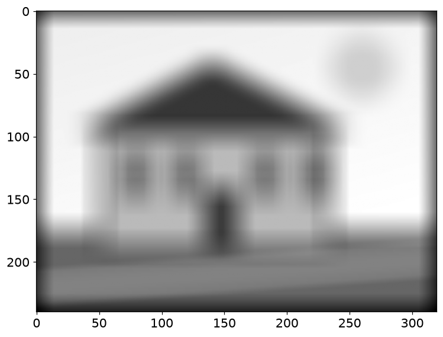

## 6.6 연습문제

### 연습문제 1. 공분산을 상관으로 변환

- 단위가 다른 변수의 크기 효과를 제거합니다.
- 공분산 대각선에서 표준편차를 구하고 역수 대각행렬 S로 SCS를 계산합니다.
- 공분산과 상관 열지도를 비교합니다.

```python
variances = np.diag(covMat)
standard_devs = np.sqrt( variances )
S = np.diag( 1/standard_devs )

#S = np.diag( 1/np.sqrt(np.diag(covMat)) )

corrMat = S @ covMat @ S

fig,axs = plt.subplots(1,2,figsize=(13,6))
h1 = axs[0].imshow(covMat,vmin=-clim,vmax=clim,cmap='gray')
axs[0].set_title('Data covariance matrix',fontweight='bold')

h2 = axs[1].imshow(corrMat,vmin=-.5,vmax=.5,cmap='gray')
axs[1].set_title('Data correlation matrix',fontweight='bold')

fig.colorbar(h1,ax=axs[0],fraction=.045)
fig.colorbar(h2,ax=axs[1],fraction=.045)

plt.tight_layout()
plt.savefig(ASSET / 'Figure_06_06.png',dpi=140)
plt.show()
```

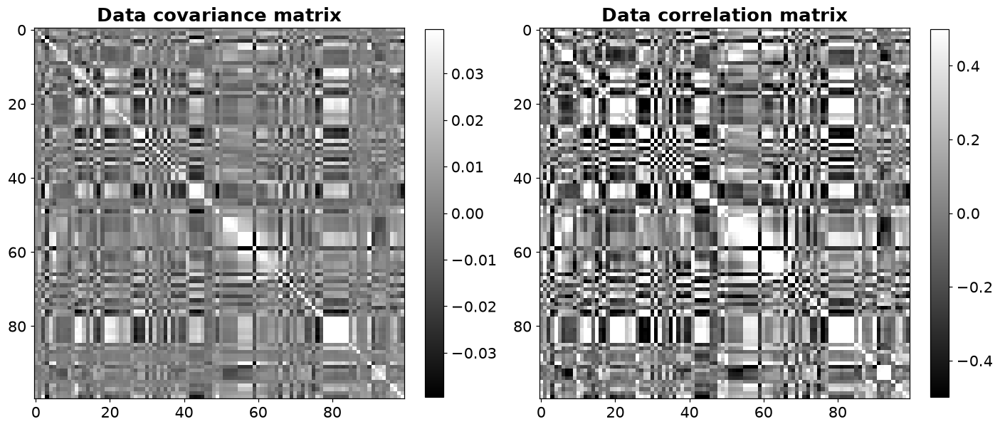

```python
i,j = 43,17

corrMat[i,j], numberDataset.drop(['state','fold'],axis=1).columns[i], numberDataset.drop(['state','fold'],axis=1).columns[j]
```

```text
(np.float64(-0.7603179079300488), 'PctKids2Par', 'pctWPubAsst')
```

- **결과 해석**: 상관의 대각선은 1입니다. 두 변수 이름을 읽을 때는 숫자형 열 선택과 추가 열 제거 후의 목록을 써야 합니다.

### 연습문제 2. NumPy와 상관행렬 비교

- 직접 구현한 상관행렬이 라이브러리와 같은지 확인합니다.
- 관측치×변수 행렬을 전치해 corrcoef에 넣거나 rowvar=False를 사용합니다.
- 두 행렬과 차이를 그립니다.

```python
corrMat_np = np.corrcoef(dataMat.T)

fig,axs = plt.subplots(1,3,figsize=(13,6))
h1 = axs[0].imshow(corrMat,vmin=-.5,vmax=.5,cmap='gray')
axs[0].set_title('My correlation matrix',fontweight='bold')

h2 = axs[1].imshow(corrMat_np,vmin=-.5,vmax=.5,cmap='gray')
axs[1].set_title("Numpy's correlation matrix",fontweight='bold')

h3 = axs[2].imshow(corrMat_np-corrMat,vmin=-.0005,vmax=.0005,cmap='gray')
axs[2].set_title('Difference matrix',fontweight='bold')

fig.colorbar(h1,ax=axs[0],fraction=.045)
fig.colorbar(h2,ax=axs[1],fraction=.045)
fig.colorbar(h3,ax=axs[2],fraction=.045)

plt.tight_layout()
plt.savefig(ASSET / 'Figure_06_07.png',dpi=140)
plt.show()
```

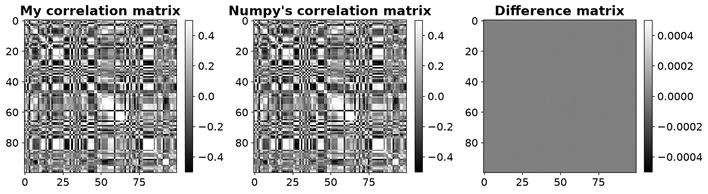

```python
import inspect
print(inspect.signature(np.corrcoef))
print(inspect.getdoc(np.corrcoef).split("\n\n")[0])
```

```text
(x, y=None, rowvar=True, *, dtype=None)
Return Pearson product-moment correlation coefficients.
```

```python
import inspect
print(inspect.signature(np.cov))
print(inspect.getdoc(np.cov).split("\n\n")[0])
```

```text
(m, y=None, rowvar=True, bias=False, ddof=None, fweights=None, aweights=None, *, dtype=None)
Estimate a covariance matrix, given data and weights.
```

- **결과 해석**: 차이는 0 근처입니다. 전치하지 않으면 변수 대신 관측치끼리의 상관을 구하게 됩니다. 함수 문서에서 기본 축 규칙을 확인합니다.

### 연습문제 3. 원에 선형변환 적용

- 비등방 확대·축소와 전단을 관찰합니다.
- 단위원의 점을 2×N으로 쌓고 $T=\begin{bmatrix}1&0.5\\0&0.5\end{bmatrix}$를 왼쪽에 곱합니다.

```python
T = np.array([ 
              [1,.5],
              [0,.5]
            ])

theta = np.linspace(0,2*np.pi-2*np.pi/20,20)
origPoints = np.vstack( (np.cos(theta),np.sin(theta)) )

transformedPoints = T @ origPoints

plt.figure(figsize=(6,6))
plt.plot(origPoints[0,:],origPoints[1,:],'ko',label='Original')
plt.plot(transformedPoints[0,:],transformedPoints[1,:],'s',
         color=[.7,.7,.7],label='Transformed')

plt.axis('square')
plt.xlim([-2,2])
plt.ylim([-2,2])
plt.legend()
plt.savefig(ASSET / 'Figure_06_08.png',dpi=140)
plt.show()
```

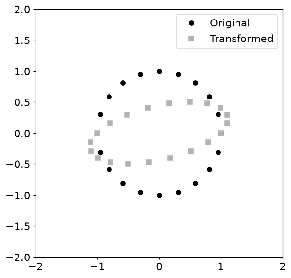

- **결과 해석**: 원은 타원으로 변합니다. 모든 점에 같은 행렬을 적용하므로 직선성·원점은 보존되지만 길이와 각도는 일반적으로 바뀝니다.

### 연습문제 4. 변환 애니메이션

- 행렬 원소가 변하면 전체 곡선이 함께 변하는지 관찰합니다.
- 사인·코사인 곡선 좌표에 diag(1-ph/3,ph)를 적용하고 ph에 따른 프레임을 GIF로 저장합니다.

```python
def aframe(ph):

  T = np.array([ [  1-ph/3,0 ],
                 [  0,ph   ] ])

  P1 = T@Y1
  P2 = T@Y2

  plth1.set_xdata(P1[0,:])
  plth1.set_ydata(P1[1,:])

  plth2.set_xdata(P2[0,:])
  plth2.set_ydata(P2[1,:])

  return (plth1,plth2)

th = np.linspace(0,2*np.pi,100) # th = theta (angles)
Y1 = np.vstack((th,np.cos(th)))
Y2 = np.vstack((th,np.sin(th)))

fig,ax = plt.subplots(1,figsize=(12,6))

plth1, = ax.plot(Y1[0,:],Y1[1,:],'ko')
plth2, = ax.plot(Y2[0,:],Y2[1,:],'s',color=[.7,.7,.7])
ax.set_ylim([-2,2])

phi = 1-np.linspace(-1,1-1/40,40)**2
anim = animation.FuncAnimation(fig, aframe, phi, interval=50, repeat=True)
anim.save(str(ASSET / 'animation_38.gif'), writer='pillow', fps=10)
from IPython.display import Image, display
display(Image(filename=str(ASSET / 'animation_38.gif')))
plt.close(fig)
```

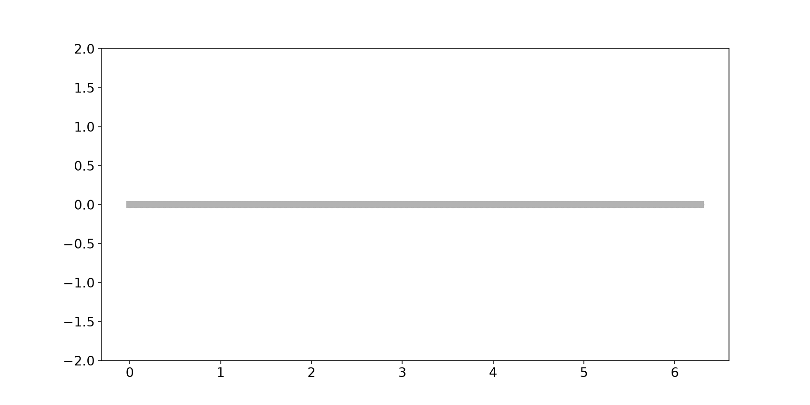

- **결과 해석**: 가로와 세로 배율이 독립적으로 달라집니다. ph=0에서는 세로 방향이 사라져 역변환이 불가능합니다.

### 연습문제 5. RGB 채널별 평활화

- 컬러 이미지도 채널별 행렬로 처리할 수 있음을 확인합니다.
- 각 RGB 채널에 같은 커널로 2차원 합성곱을 적용하고 다시 세 채널을 모읍니다.
- 실수와 uint8 dtype을 비교합니다.

```python
smooth_bathtub = np.zeros(bathtub.shape)

for i in range(smooth_bathtub.shape[2]):
  smooth_bathtub[:,:,i] = convolve2d(bathtub[:,:,i],kernel,mode='same')

fig = plt.figure(figsize=(10,6))
plt.imshow(smooth_bathtub.astype(np.uint8))
plt.show()
```

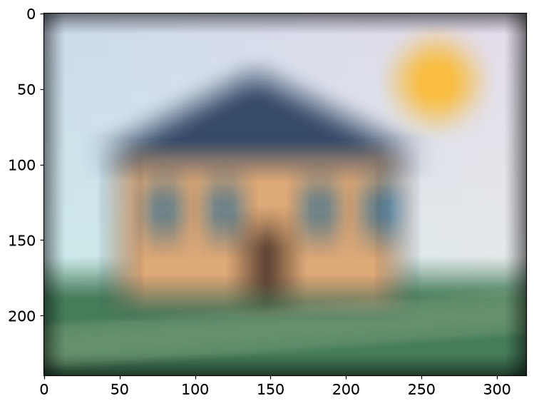

```python
print( smooth_bathtub.dtype )
print( smooth_bathtub.astype(np.uint8).dtype )
```

```text
float64
uint8
```

- **결과 해석**: 색을 섞는 것이 아니라 각 채널 내부에서 공간적으로 평균냅니다. 표시를 위한 형변환은 계산의 정밀도를 낮추므로 중간 계산은 실수로 유지합니다.

### 연습문제 6. 채널마다 다른 커널

- RGB에 서로 다른 평활화 강도를 적용합니다.
- 각 채널에 폭 0.5,5,50을 넣은 가우시안 커널을 만들고 정규화해 적용합니다.

```python
kernelN = 31
kernelWidths = [.5,5,50]

smooth_bathtub = np.zeros(bathtub.shape)

_,axs = plt.subplots(1,3,figsize=(12,6))

for i in range(smooth_bathtub.shape[2]):

  Y,X     = np.meshgrid(np.linspace(-3,3,kernelN),np.linspace(-3,3,kernelN))
  kernel  = np.exp( -(X**2+Y**2) / kernelWidths[i] )
  kernel  = kernel / np.sum(kernel)

  axs[i].imshow(kernel,cmap='gray')
  axs[i].set_title(f'Width: {kernelWidths[i]} ({"RGB"[i]} channel)')

  smooth_bathtub[:,:,i] = convolve2d(bathtub[:,:,i],kernel,mode='same')

plt.savefig(ASSET / 'Figure_06_10.png',dpi=140)
plt.show()

fig = plt.figure(figsize=(10,6))
plt.imshow(smooth_bathtub.astype(np.uint8))
plt.show()
```

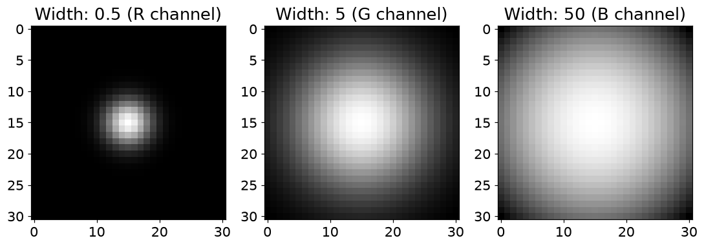

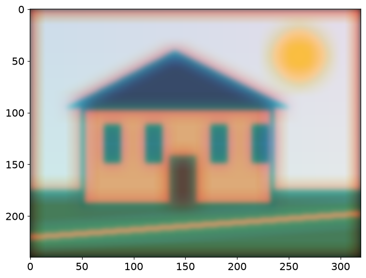

- **결과 해석**: 폭이 큰 커널은 주변 픽셀을 더 넓게 섞습니다. 채널마다 다르게 흐려지므로 색 가장자리도 달라집니다. 원본의 두 번째 Exercise 5 표기를 여기서는 6으로 정리했습니다.

### 연습문제 7. 방향별 경계 검출

- 수직·수평 변화에 반응하는 커널을 비교합니다.
- 3×3 부호 교대 커널 두 개를 만들고 회색조 이미지에 convolve2d를 적용합니다.

```python
VK = np.array([ [1,0,-1],
                [1,0,-1],
                [1,0,-1] ])

HK = np.array([ [ 1, 1, 1],
                [ 0, 0, 0],
                [-1,-1,-1] ])

fig,ax = plt.subplots(2,2,figsize=(16,8))

ax[0,0].imshow(VK,cmap='gray')
ax[0,0].set_title('Vertical kernel')
ax[0,0].set_yticks(range(3))

ax[0,1].imshow(HK,cmap='gray')
ax[0,1].set_title('Horizontal kernel')
ax[0,1].set_yticks(range(3))

convres = convolve2d(bathtub2d,VK,mode='same')
ax[1,0].imshow(convres,cmap='gray',vmin=0,vmax=.01)
ax[1,0].axis('off')

convres = convolve2d(bathtub2d,HK,mode='same')
ax[1,1].imshow(convres,cmap='gray',vmin=0,vmax=.01)
ax[1,1].axis('off')

plt.savefig(ASSET / 'Figure_06_11.png',dpi=140)
plt.show()
```

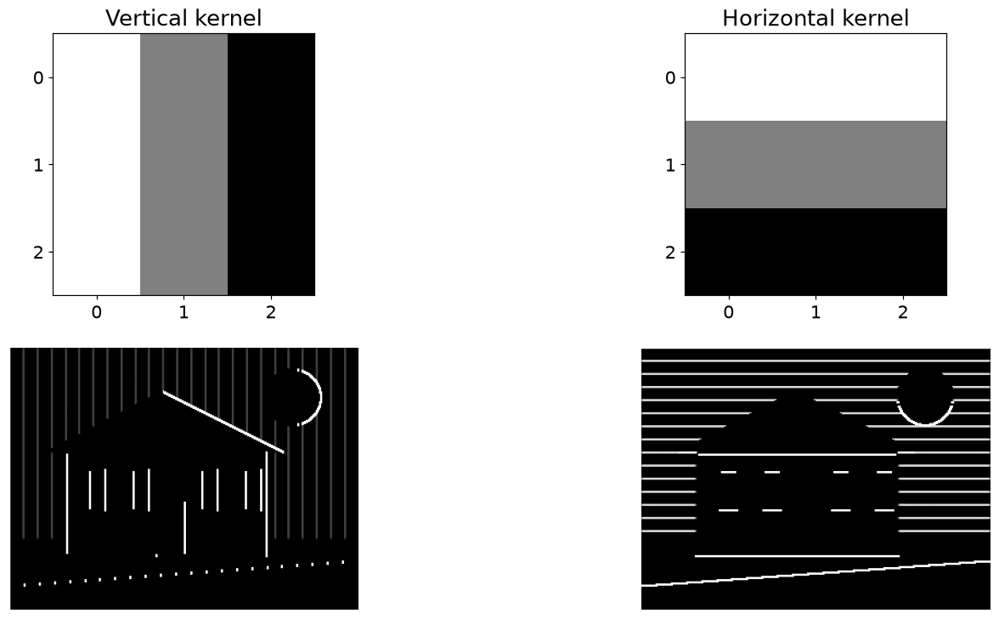

- **결과 해석**: 수직 커널은 좌우 밝기 차이, 수평 커널은 상하 밝기 차이에 민감합니다. 응답의 부호는 변화 방향과 커널 뒤집힘에 좌우됩니다.

## 6.7 핵심 관계 확인

- 작은 입력으로 핵심 공식을 다시 확인한다. `assert`가 통과하면 지정한 허용오차 안에서 관계가 성립한다.

```python
_X=np.array([[1.,2.],[2.,4.],[3.,6.]])
_Xc=_X-_X.mean(axis=0); _C=_Xc.T@_Xc/(len(_X)-1)
print('공분산:\n',_C)
assert np.allclose(_C,np.cov(_X,rowvar=False))
assert np.allclose(corrMat,corrMat_np)
print('원자료의 직접 계산 상관과 NumPy 최대 차이:',np.max(np.abs(corrMat-corrMat_np)))
assert np.allclose(convoutput,convoutput2)
print('대칭 커널의 수동 계산과 SciPy 합성곱 일치: 통과')
```

```text
공분산:
 [[1. 2.]
 [2. 4.]]
원자료의 직접 계산 상관과 NumPy 최대 차이: 4.440892098500626e-16
대칭 커널의 수동 계산과 SciPy 합성곱 일치: 통과
```

## 실습에서 확인할 점

| 항목 | 확인할 점 |
| --- | --- |
| 작은 잔차 | `1e-14` 수준의 값은 부동소수점 오차일 수 있음 |
| 셀 실행 순서 | 앞에서 준비한 변수·데이터를 다음 코드에서 사용 |
| 문제 범위 | 제공된 코드의 학습 목표를 재구성한 풀이이며 책의 문제 원문은 아님 |
| 이미지 입력 | 직접 생성한 도형 이미지 사용. 원본 사진과 수치·시각적 결과가 다름 |
| 문제 번호 | 중복된 Exercise 5 중 뒤쪽을 6번으로 정리 |

## 참고 자료

- 제공된 `선형대수학.zip`의 `LA4DS_ch06.py`
- Mike X Cohen, *Practical Linear Algebra for Data Science* / 한국어판 *개발자를 위한 실전 선형대수학*
- 한국어 개념 설명과 연습문제 해설은 선형대수학 코드에 맞춰 작성했다. 코드 보완 내역은 기존 자료의 `CHANGES.md`에서 확인할 수 있다.
