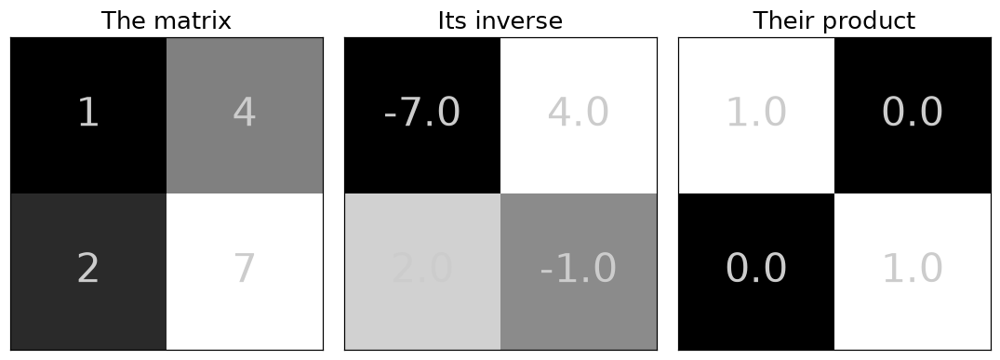
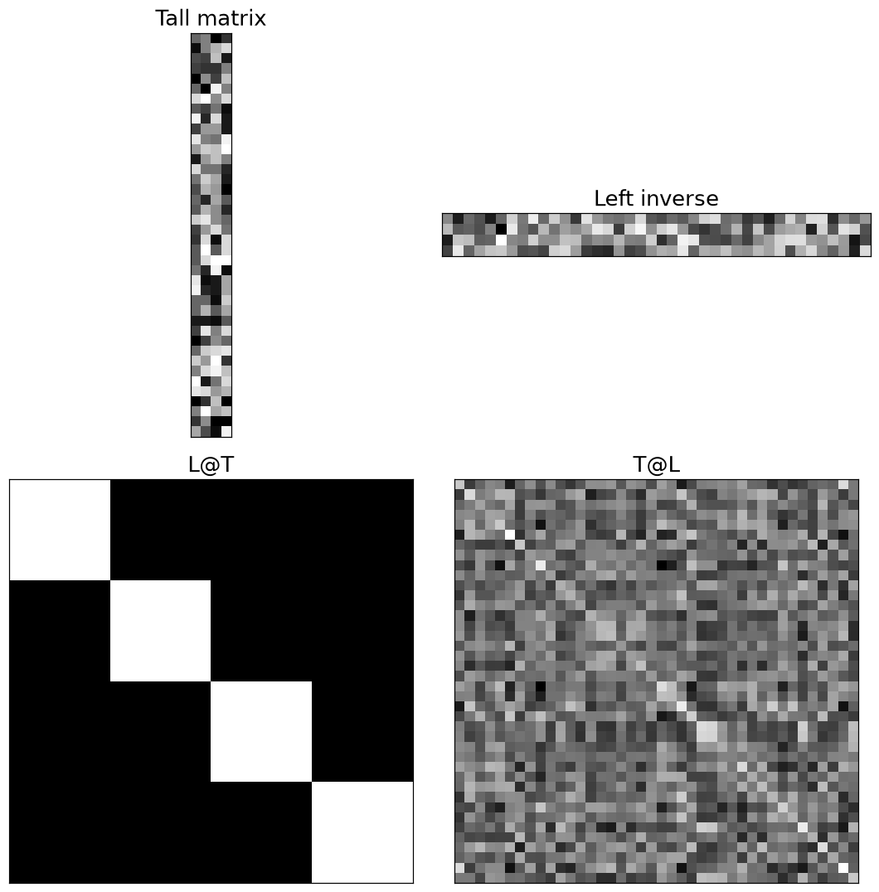
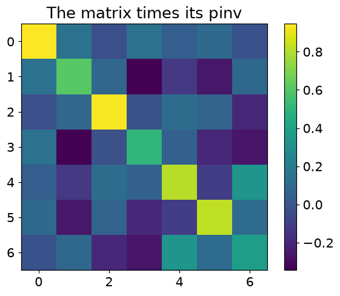
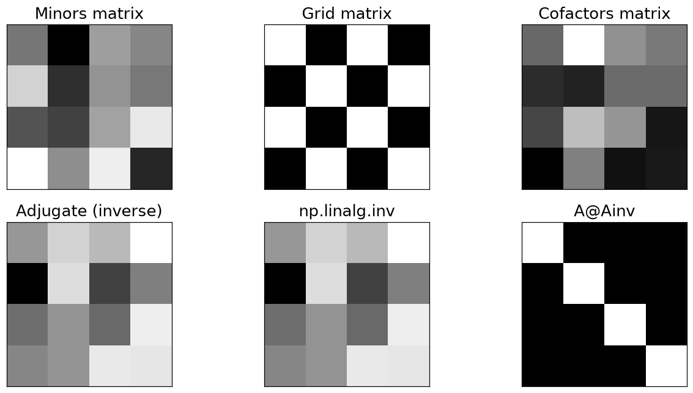
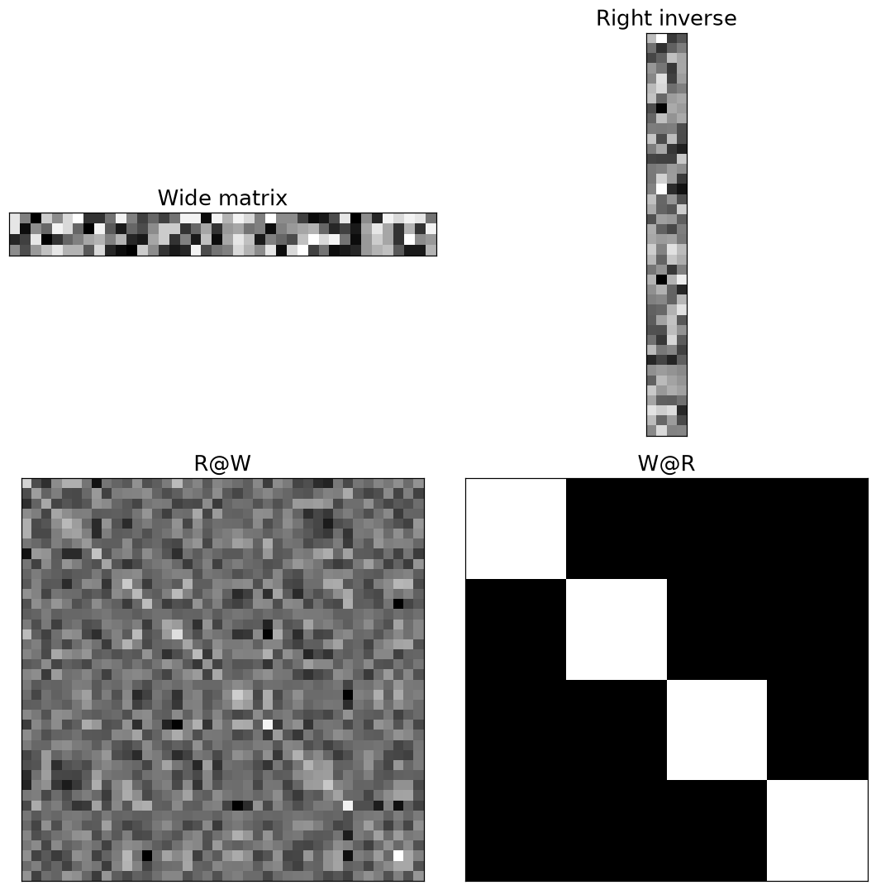
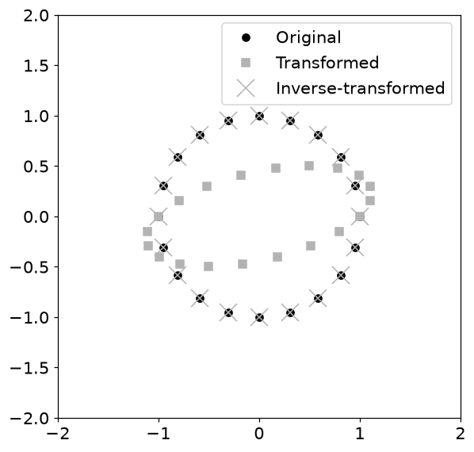
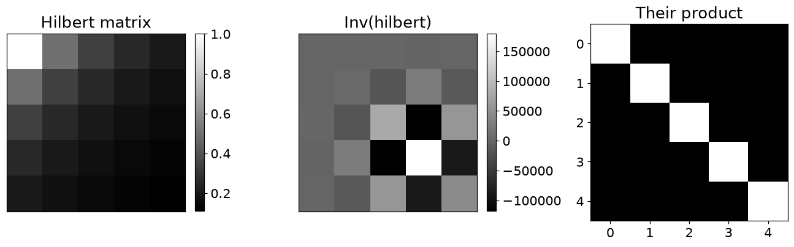
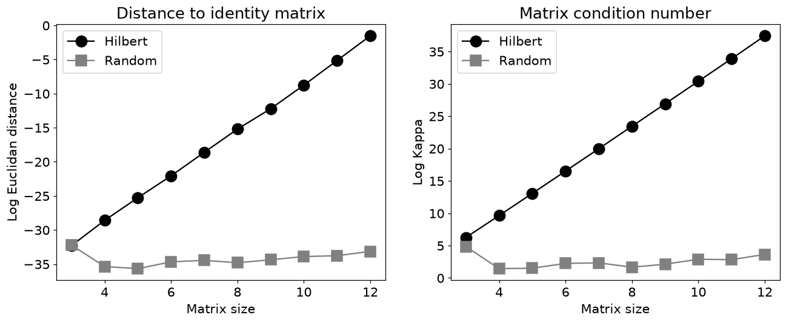
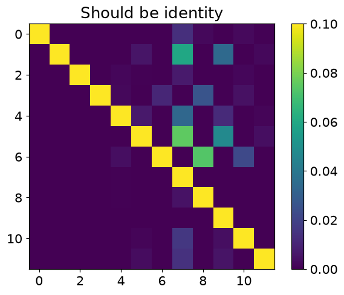

# 7. 역행렬

## 7.1 역행렬은 변환을 되돌리는 도구

$$
A^{-1}A=AA^{-1}=I,\qquad \det(A)\ne0
$$

- 보통의 역행렬은 정사각 완전랭크 행렬에 존재합니다. 압축 과정에서 방향 하나가 사라졌다면 모든 입력을 복구할 수 없습니다.
- $A=\begin{bmatrix}1&4\\2&7\end{bmatrix}$의 행렬식은 $-1$이고 역행렬은 $\begin{bmatrix}-7&4\\2&-1\end{bmatrix}$입니다.
- `A*Ainv`는 원소별 곱입니다. 역행렬 검증에는 `A@Ainv`를 사용합니다.

| 종류 | 성립 조건 | 확인할 곱 |
| --- | --- | --- |
| 일반 역행렬 | 정사각 완전랭크 | $A^{-1}A=AA^{-1}=I$ |
| 왼쪽 역행렬 | 완전열랭크 | $LA=I$ |
| 오른쪽 역행렬 | 완전행랭크 | $AR=I$ |
| 의사역행렬 | 모든 행렬에 정의 | $AA^+A=A$ |

## 7.2 직사각형 행렬은 한쪽에서만 되돌릴 수 있다

$$
L=(A^TA)^{-1}A^T,\quad LA=I_n\quad(m\ge n,\ \operatorname{rank}A=n)
$$
$$
R=A^T(AA^T)^{-1},\quad AR=I_m\quad(m\le n,\ \operatorname{rank}A=m)
$$

- 키 큰 완전열랭크 행렬은 왼쪽 역행렬을 가집니다. 반대 곱 $AL$은 전체 공간의 항등행렬이 아니라 열공간으로의 투영입니다.
- 가로로 긴 완전행랭크 행렬은 오른쪽 역행렬을 가집니다. 역시 곱하는 방향을 확인해야 합니다.
- 의사역행렬 $A^+$는 모든 행렬에 정의됩니다. 일반적으로 $AA^+=I$는 아니지만 $AA^+A=A$를 만족합니다.

## 7.3 계산이 성공해도 정확하다고 단정할 수 없다

$$
\kappa_2(A)=\frac{\sigma_{\max}}{\sigma_{\min}},\qquad
H_{ij}=\frac{1}{i+j-1}\quad(i,j\text{는 1부터})
$$

- 조건수가 크면 작은 입력 오차가 해에서 크게 확대될 수 있습니다. Hilbert 행렬은 크기가 커질수록 이런 현상을 잘 보여 줍니다.
- `inv`가 결과를 반환하는지와 재구성 오차가 작은지는 별개의 문제입니다. `norm(A@inv(A)-I)`와 조건수를 함께 확인합니다.
- $Ax=b$를 풀 때는 역행렬을 직접 만들기보다 `np.linalg.solve(A,b)`, 최소제곱에서는 `np.linalg.lstsq`를 사용합니다.
- **주의**: $(AB)^{-1}=B^{-1}A^{-1}$에서 순서가 바뀝니다. 직사각형 A에는 이 공식을 형식적으로 적용할 수 없습니다.

## 7.4 파이썬으로 확인하기

- 코드는 위에서부터 순서대로 실행한다. 앞에서 만든 변수와 함수를 다음 예제에서도 사용한다.
- 아래 숫자와 그림은 고정된 난수 시드로 실행한 결과다. 환경에 따라 마지막 소수 자릿수와 실행 시간은 달라질 수 있다.

### 1. 준비

```python
from pathlib import Path
import numpy as np
import matplotlib
import matplotlib.pyplot as plt
from IPython.display import display
ROOT = Path.cwd()
if not (ROOT / 'data').exists():
    ROOT = ROOT / 'blog_linear_algebra'
DATA = ROOT / 'data'
ASSET = ROOT / 'assets' / 'ch07'
ASSET.mkdir(parents=True, exist_ok=True)
np.random.seed(20260932)
np.set_printoptions(precision=6, suppress=True, threshold=120)
plt.rcParams.update({'figure.dpi': 100, 'savefig.dpi': 140, 'font.size': 12})
print('재현용 난수 시드:', 20260932)

import numpy as np
import matplotlib.pyplot as plt

import matplotlib_inline.backend_inline
matplotlib_inline.backend_inline.set_matplotlib_formats('png')
plt.rcParams.update({'font.size':14})
```

```text
재현용 난수 시드: 20260932
```

### 2. 역행렬

```python
A = np.array([ [1,4],[2,7] ])

Ainv = np.linalg.inv(A)

A@Ainv
```

```text
array([[1., 0.],
       [0., 1.]])
```

```python
fig,axs = plt.subplots(1,3,figsize=(10,6))

axs[0].imshow(A,cmap='gray')
axs[0].set_title('The matrix')
for (j,i),num in np.ndenumerate(A):
  axs[0].text(i,j,num,color=[.8,.8,.8],ha='center',va='center',fontsize=28)

axs[1].imshow(Ainv,cmap='gray')
axs[1].set_title('Its inverse')
for (j,i),num in np.ndenumerate(Ainv):
  axs[1].text(i,j,num,color=[.8,.8,.8],ha='center',va='center',fontsize=28)

AAi = A@Ainv
axs[2].imshow(AAi,cmap='gray')
axs[2].set_title('Their product')
for (j,i),num in np.ndenumerate(AAi):
  axs[2].text(i,j,num,color=[.8,.8,.8],ha='center',va='center',fontsize=28)

for i in range(3):
  axs[i].set_xticks([])
  axs[i].set_yticks([])

plt.tight_layout()
plt.savefig(ASSET / 'Figure_07_01.png',dpi=140)
plt.show()
```



```python
print( A@Ainv ), print(' ')
print( Ainv@A )
```

```text
[[1. 0.]
 [0. 1.]]
 
[[1. 0.]
 [0. 1.]]
```

```python
A*Ainv
```

```text
array([[-7., 16.],
       [ 4., -7.]])
```

```python
try:

    A = np.array([ [1,4],[2,8] ])

    Ainv = np.linalg.inv(A)

    A@Ainv
except np.linalg.LinAlgError as exc:
    print("학습용 예상 오류:", type(exc).__name__, str(exc))
```

```text
학습용 예상 오류: LinAlgError Singular matrix
```

### 3. 대각행렬의 역행렬

```python
D = np.diag( np.arange(1,6) )
Dinv = np.linalg.inv(D)

print('The diagonal matrix:')
print(D), print(' ')

print('Its inverse:')
print(Dinv), print(' ')

print('Their product:')
print(D@Dinv)
```

```text
The diagonal matrix:
[[1 0 0 0 0]
 [0 2 0 0 0]
 [0 0 3 0 0]
 [0 0 0 4 0]
 [0 0 0 0 5]]
 
Its inverse:
[[1.       0.       0.       0.       0.      ]
 [0.       0.5      0.       0.       0.      ]
 [0.       0.       0.333333 0.       0.      ]
 [0.       0.       0.       0.25     0.      ]
 [0.       0.       0.       0.       0.2     ]]
 
Their product:
[[1. 0. 0. 0. 0.]
 [0. 1. 0. 0. 0.]
 [0. 0. 1. 0. 0.]
 [0. 0. 0. 1. 0.]
 [0. 0. 0. 0. 1.]]
```

### 4. 왼쪽 역행렬

```python
T = np.random.randint(-10,11,size=(40,4))

print( f'This matrix has rank={np.linalg.matrix_rank(T)}\n\n' )

TtT = T.T@T

TtT_inv = np.linalg.inv(TtT)
print( np.round(TtT_inv@TtT,4) )
```

```text
This matrix has rank=4

[[ 1.  0.  0.  0.]
 [ 0.  1.  0.  0.]
 [-0. -0.  1. -0.]
 [-0. -0. -0.  1.]]
```

```python
L = TtT_inv @ T.T

print( np.round( L@T,6 ) ), print(' ')

print( np.round( T@L,6 ) )
```

```text
[[ 1.  0.  0.  0.]
 [ 0.  1.  0.  0.]
 [ 0. -0.  1. -0.]
 [-0. -0.  0.  1.]]
 
[[ 0.110061 -0.065033 -0.013763 ... -0.016837  0.134744  0.011334]
 [-0.065033  0.133329  0.016134 ...  0.010693 -0.06368   0.013231]
 [-0.013763  0.016134  0.064827 ... -0.033614  0.004032 -0.052193]
 ...
 [-0.016837  0.010693 -0.033614 ...  0.070633 -0.014594 -0.026166]
 [ 0.134744 -0.06368   0.004032 ... -0.014594  0.179899 -0.018839]
 [ 0.011334  0.013231 -0.052193 ... -0.026166 -0.018839  0.112252]]
```

```python
fig,axs = plt.subplots(2,2,figsize=(10,10))

axs[0,0].imshow(T,cmap='gray')
axs[0,0].set_title('Tall matrix')

axs[0,1].imshow(L,cmap='gray')
axs[0,1].set_title('Left inverse')

axs[1,0].imshow(L@T,cmap='gray')
axs[1,0].set_title('L@T')

axs[1,1].imshow(T@L,cmap='gray')
axs[1,1].set_title('T@L')

for a in axs.flatten():
  a.set_xticks([])
  a.set_yticks([])
  
plt.tight_layout()
plt.savefig(ASSET / 'Figure_07_04.png',dpi=140)
plt.show()
```



### 5. 무어–펜로즈 의사역행렬

```python
A = np.array([ [1,4],[2,8] ])

Apinv = np.linalg.pinv(A)
print(Apinv*85), print(' ')

A@Apinv
```

```text
[[1. 2.]
 [4. 8.]]
 
array([[0.2, 0.4],
       [0.4, 0.8]])
```

```python
A = np.random.randn(7,5) @ np.random.randn(5,7)
print(f'The rank of this matrix is {np.linalg.matrix_rank(A)}.\n')

Apinv = np.linalg.pinv(A)
plt.imshow(A@Apinv)
plt.title('The matrix times its pinv')
plt.colorbar()
plt.show()
```

```text
The rank of this matrix is 5.
```



## 7.5 연습문제

### 연습문제 1. 역행렬의 역행렬

- $(A^{-1})^{-1}=A$를 확인합니다.
- 임의 가역행렬의 역행렬을 두 번 구한 뒤 원본과 차이를 출력합니다.

```python
n = 5

A = np.random.randn(n,n)

Ai  = np.linalg.inv(A)
Aii = np.linalg.inv(Ai)

np.round( A-Aii ,10)
```

```text
array([[ 0., -0.,  0.,  0., -0.],
       [ 0., -0.,  0., -0., -0.],
       [-0.,  0.,  0.,  0.,  0.],
       [ 0.,  0., -0.,  0., -0.],
       [ 0.,  0.,  0.,  0., -0.]])
```

- **결과 해석**: 0 근처 행렬입니다. 계산을 두 번 하므로 부동소수점 오차가 남을 수 있습니다.

### 연습문제 2. 여인수로 역행렬 구현

- 소행렬식·여인수·수반행렬 공식을 코드로 옮깁니다.
- 행과 열 하나씩 제외한 소행렬식을 구하고 $(-1)^{i+j}$를 곱합니다.
- 여인수 행렬을 전치한 뒤 det(A)로 나눕니다.

```python
m = 4
A = np.random.randn(m,m)

M = np.zeros((m,m))
G = np.zeros((m,m))

for i in range(m):
  for j in range(m):

    rows = [True]*m
    rows[i] = False
    
    cols = [True]*m
    cols[j] = False

    M[i,j]=np.linalg.det(A[rows,:][:,cols])

    G[i,j] = (-1)**(i+j)

C = M * G

Ainv = C.T / np.linalg.det(A)

AinvI = np.linalg.inv(A)

np.round( AinvI-Ainv ,8)
```

```text
array([[-0., -0., -0., -0.],
       [ 0.,  0.,  0., -0.],
       [ 0., -0.,  0., -0.],
       [ 0., -0., -0., -0.]])
```

```python
fig,axs = plt.subplots(2,3,figsize=(14,7))

axs[0,0].imshow(M,cmap='gray')
axs[0,0].set_title('Minors matrix')

axs[0,1].imshow(G,cmap='gray')
axs[0,1].set_title('Grid matrix')

axs[0,2].imshow(C,cmap='gray')
axs[0,2].set_title('Cofactors matrix')

axs[1,0].imshow(Ainv,cmap='gray')
axs[1,0].set_title('Adjugate (inverse)')

axs[1,1].imshow(AinvI,cmap='gray')
axs[1,1].set_title('np.linalg.inv')

axs[1,2].imshow(A@Ainv,cmap='gray')
axs[1,2].set_title('A@Ainv')

for a in axs.flatten():
  a.set_xticks([])
  a.set_yticks([])

plt.savefig(ASSET / 'Figure_07_03.png',dpi=140)
plt.show()
```



- **결과 해석**: NumPy 역행렬과 일치합니다. 교육적으로 유용하지만 많은 행렬식을 계산해 큰 행렬에는 비효율적입니다. det가 0이면 사용할 수 없습니다.

### 연습문제 4. 오른쪽 역행렬

- 가로로 긴 행렬에서 역행렬 곱의 방향을 확인합니다.
- 4×40 완전행랭크 W에 $R=W^T(WW^T)^{-1}$을 만듭니다.
- WR와 RW를 비교합니다.

```python
W = np.random.randint(-10,11,size=(4,40))

print( f'This matrix has rank={np.linalg.matrix_rank(W)}\n\n' )

WWt = W@W.T

WWt_inv = np.linalg.inv(WWt)
print( np.round(WWt_inv@WWt,4) )
```

```text
This matrix has rank=4

[[ 1.  0. -0. -0.]
 [-0.  1.  0. -0.]
 [-0. -0.  1.  0.]
 [-0. -0. -0.  1.]]
```

```python
R = W.T @ WWt_inv

print( np.round( W@R,6 ) ), print(' ')

print( np.round( R@W,6 ) )
```

```text
[[ 1.  0. -0.  0.]
 [ 0.  1.  0. -0.]
 [ 0.  0.  1. -0.]
 [-0. -0. -0.  1.]]
 
[[ 0.162073 -0.048797 -0.095123 ...  0.054961  0.000356  0.062116]
 [-0.048797  0.076872 -0.013738 ... -0.06426   0.029783 -0.067264]
 [-0.095123 -0.013738  0.095237 ... -0.029004 -0.043447  0.003286]
 ...
 [ 0.054961 -0.06426  -0.029004 ...  0.232134  0.093595  0.033887]
 [ 0.000356  0.029783 -0.043447 ...  0.093595  0.093269 -0.040943]
 [ 0.062116 -0.067264  0.003286 ...  0.033887 -0.040943  0.066301]]
```

```python
fig,axs = plt.subplots(2,2,figsize=(10,10))

axs[0,0].imshow(W,cmap='gray')
axs[0,0].set_title('Wide matrix')

axs[0,1].imshow(R,cmap='gray')
axs[0,1].set_title('Right inverse')

axs[1,0].imshow(R@W,cmap='gray')
axs[1,0].set_title('R@W')

axs[1,1].imshow(W@R,cmap='gray')
axs[1,1].set_title('W@R')

for a in axs.flatten():
  a.set_xticks([])
  a.set_yticks([])
  
plt.tight_layout()
plt.show()
```



- **결과 해석**: WR는 4×4 항등행렬, RW는 40×40 투영행렬입니다. 제공 노트북에는 연습문제 3 제목이 없으므로 없는 문제를 만들어 번호를 채우지 않았습니다.

### 연습문제 5. 의사역행렬과 기존 역행렬

- pinv가 가역·완전열랭크·완전행랭크 경우를 통합함을 확인합니다.
- 정사각·키 큰·가로 긴 행렬에서 각 명시적 역행렬 공식과 pinv의 차이를 구합니다.

```python
M = 4

A = np.random.randn(M,M)

Ainv  = np.linalg.inv(A)
Apinv = np.linalg.pinv(A)

np.round( Ainv-Apinv,10 )
```

```text
array([[ 0.,  0., -0., -0.],
       [ 0., -0.,  0., -0.],
       [-0.,  0., -0.,  0.],
       [ 0., -0., -0., -0.]])
```

```python
M,N = 14,4

A = np.random.randn(M,N)

ALeft = np.linalg.inv(A.T@A) @ A.T
Apinv = np.linalg.pinv(A)

np.round( ALeft-Apinv,10 )
```

```text
array([[-0., -0.,  0.,  0.,  0.,  0., -0., -0.,  0., -0., -0.,  0.,  0.,
         0.],
       [ 0., -0.,  0., -0.,  0.,  0., -0.,  0.,  0.,  0.,  0.,  0., -0.,
         0.],
       [ 0., -0., -0., -0.,  0.,  0.,  0.,  0., -0.,  0.,  0.,  0., -0.,
        -0.],
       [ 0., -0.,  0., -0.,  0.,  0., -0.,  0.,  0.,  0., -0.,  0., -0.,
         0.]])
```

```python
M,N = 4,14

A = np.random.randn(M,N)

ARight = A.T @ np.linalg.inv(A@A.T)
Apinv  = np.linalg.pinv(A)

np.round( ARight-Apinv,10 )
```

```text
array([[-0., -0., -0.,  0.],
       [ 0.,  0.,  0.,  0.],
       [-0.,  0.,  0.,  0.],
       [ 0.,  0.,  0.,  0.],
       [ 0.,  0., -0.,  0.],
       [ 0., -0.,  0.,  0.],
       [ 0.,  0.,  0.,  0.],
       [ 0.,  0.,  0.,  0.],
       [-0.,  0., -0.,  0.],
       [ 0.,  0., -0., -0.],
       [ 0.,  0., -0., -0.],
       [-0., -0., -0., -0.],
       [-0.,  0.,  0.,  0.],
       [ 0., -0.,  0.,  0.]])
```

- **결과 해석**: 성립 조건을 만족하면 차이는 0 근처입니다. 랭크가 부족하면 일반 공식은 실패해도 pinv는 정의됩니다.

### 연습문제 6. 곱의 역행렬 순서

- $(AB)^{-1}$의 올바른 순서를 찾습니다.
- inv(AB)를 inv(A)inv(B), inv(B)inv(A)와 각각 비교해 거리를 출력합니다.

```python
N = 4
A = np.random.randn(N,N)
B = np.random.randn(N,N)

op1 = np.linalg.inv(A@B)
op2 = np.linalg.inv(A) @ np.linalg.inv(B)
op3 = np.linalg.inv(B) @ np.linalg.inv(A)

dist12 = np.sqrt(np.sum( (op1-op2)**2 ))
dist13 = np.sqrt(np.sum( (op1-op3)**2 ))

print(f'Distance between (AB)^-1 and (A^-1)(B^-1) is {dist12:.8f}')
print(f'Distance between (AB)^-1 and (B^-1)(A^-1) is {dist13:.8f}')
```

```text
Distance between (AB)^-1 and (A^-1)(B^-1) is 63.05969005
Distance between (AB)^-1 and (B^-1)(A^-1) is 0.00000000
```

- **결과 해석**: 역순 곱과의 거리만 0 근처입니다. 일반 행렬은 교환법칙이 없으므로 순서가 핵심입니다.

### 연습문제 7. 직사각형에 역행렬 규칙 오용

- $(T^TT)^{-1}$를 존재하지 않는 역행렬들의 곱으로 나눌 수 없음을 확인합니다.
- 키 큰 T에서 Gram 행렬 역행렬은 구한 뒤 inv(T)를 시도합니다.

```python
try:

    M,N = 14,4
    T = np.random.randn(M,N)

    op1 = np.linalg.inv(T.T@T)
    op2 = np.linalg.inv(T) @ np.linalg.inv(T.T)

except np.linalg.LinAlgError as exc:
    print("학습용 예상 오류:", type(exc).__name__, str(exc))
```

```text
학습용 예상 오류: LinAlgError Last 2 dimensions of the array must be square
```

- **결과 해석**: 정사각형이 아니라는 LinAlgError가 예상 결과입니다. T 자체의 역행렬이 없으므로 해당 분해는 유효하지 않습니다.

### 연습문제 8. 변환을 역행렬로 되돌리기

- 원→타원→원 복원을 시각화합니다.
- 단위원 점에 T를 적용한 후 Ti를 다시 곱합니다.
- 세 점 집합을 함께 그립니다.

```python
T = np.array([ 
              [1,.5],
              [0,.5]
            ])

Ti = np.linalg.inv(T)

theta = np.linspace(0,2*np.pi-2*np.pi/20,20)
origPoints = np.vstack( (np.cos(theta),np.sin(theta)) )

transformedPoints = T @ origPoints

backTransformed   = Ti @ transformedPoints

plt.figure(figsize=(6,6))
plt.plot(origPoints[0,:],origPoints[1,:],'ko',label='Original')
plt.plot(transformedPoints[0,:],transformedPoints[1,:],'s',
         color=[.7,.7,.7],label='Transformed')
plt.plot(backTransformed[0,:],backTransformed[1,:],'rx',markersize=15,
         color=[.7,.7,.7],label='Inverse-transformed')

plt.axis('square')
plt.xlim([-2,2])
plt.ylim([-2,2])
plt.legend()
plt.savefig(ASSET / 'Figure_07_06.png',dpi=140)
plt.show()
```

```text
<ipython-input-25-ec0ef39cda19>:27: UserWarning: color is redundantly defined by the 'color' keyword argument and the fmt string "rx" (-> color='r'). The keyword argument will take precedence.
  plt.plot(backTransformed[0,:],backTransformed[1,:],'rx',markersize=15,
```



- **결과 해석**: 원본 점과 복원 점이 겹칩니다. 정확한 확인은 `allclose(Ti@T@points,points)`로 할 수 있습니다.

### 연습문제 9. Hilbert 행렬 만들기

- 수학식의 1기반 인덱스를 Python으로 변환합니다.
- 0기반 i,j에서는 $1/(i+j+1)$을 사용합니다.
- 이중 루프·브로드캐스팅·SciPy 함수를 비교합니다.

```python
def hilbmat(k):
  H = np.zeros((k,k))
  for i in range(k):
    for j in range(k):

      H[i,j] = 1 / (i+j+1)
  return H

def hilbmat(k):
  k = np.arange(1,k+1).reshape(1,-1)
  return 1 / (k.T+k-1)

print( hilbmat(5) ), print(' ')

from scipy.linalg import hilbert
print( hilbert(5) )
```

```text
[[1.       0.5      0.333333 0.25     0.2     ]
 [0.5      0.333333 0.25     0.2      0.166667]
 [0.333333 0.25     0.2      0.166667 0.142857]
 [0.25     0.2      0.166667 0.142857 0.125   ]
 [0.2      0.166667 0.142857 0.125    0.111111]]
 
[[1.       0.5      0.333333 0.25     0.2     ]
 [0.5      0.333333 0.25     0.2      0.166667]
 [0.333333 0.25     0.2      0.166667 0.142857]
 [0.25     0.2      0.166667 0.142857 0.125   ]
 [0.2      0.166667 0.142857 0.125    0.111111]]
```

```python
H = hilbmat(5)
Hi = np.linalg.inv(H)

fig,axs = plt.subplots(1,3,figsize=(12,6))
h = [0,0,0]

h[0] = axs[0].imshow(H,cmap='gray')
axs[0].set_title('Hilbert matrix')

h[1] = axs[1].imshow(Hi,cmap='gray')
axs[1].set_title('Inv(hilbert)')

h[2] = axs[2].imshow(H@Hi,cmap='gray')
axs[2].set_title('Their product')

for i in range(2):
  fig.colorbar(h[i],ax=axs[i],fraction=.045)
  axs[i].set_xticks([])
  axs[i].set_yticks([])

plt.tight_layout()
plt.savefig(ASSET / 'Figure_07_05.png',dpi=140)
plt.show()
```



- **결과 해석**: 세 방법이 같은 행렬을 만듭니다. 역행렬 원소는 매우 커질 수 있어 입력이 매끄럽다고 역행렬도 안정적인 것은 아닙니다.

### 연습문제 10. 조건수와 역행렬 오차

- Hilbert 행렬과 난수행렬의 민감도를 비교합니다.
- 크기 3~12에서 조건수와 $\|HH^{-1}-I\|_F$를 구해 로그로 그립니다.

```python
matSizes = np.arange(3,13)

identityError = np.zeros((len(matSizes),2))
condNumbers   = np.zeros((len(matSizes),2))

for i,k in enumerate(matSizes):

    H   = hilbmat(k)
    Hi  = np.linalg.inv(H)
    HHi = H@Hi
    err = HHi - np.eye(k)
    identityError[i,0] = np.sqrt(np.sum(err**2))
    condNumbers[i,0] = np.linalg.cond(H)

    H = np.random.randn(k,k)
    Hi  = np.linalg.inv(H)
    HHi = H@Hi
    err = HHi - np.eye(k)
    identityError[i,1] = np.sqrt(np.sum(err**2))
    condNumbers[i,1] = np.linalg.cond(H)

fig,axs = plt.subplots(1,2,figsize=(14,5))

h = axs[0].plot(matSizes,np.log(identityError),'s-',markersize=12)
h[0].set_color('k')
h[0].set_marker('o')
h[1].set_color('gray')

axs[0].legend(['Hilbert','Random'])
axs[0].set_xlabel('Matrix size')
axs[0].set_ylabel('Log Euclidan distance')
axs[0].set_title('Distance to identity matrix')

h = axs[1].plot(matSizes,np.log(condNumbers),'s-',markersize=12)
h[0].set_color('k')
h[0].set_marker('o')
h[1].set_color('gray')

axs[1].legend(['Hilbert','Random'])
axs[1].set_xlabel('Matrix size')
axs[1].set_ylabel('Log Kappa')
axs[1].set_title('Matrix condition number')

plt.savefig(ASSET / 'Figure_07_07.png',dpi=140)
plt.show()
```



```python
H   = hilbmat(k)
Hi  = np.linalg.inv(H)
HHi = H@Hi 

plt.imshow(HHi,vmin=0,vmax=.1)
plt.title('Should be identity')
plt.colorbar();
```



- **결과 해석**: Hilbert의 조건수와 오차가 대체로 훨씬 큽니다. 조건수는 최악의 증폭 가능성이므로 모든 표본에서 오차가 정확히 비례할 필요는 없습니다.

## 7.6 핵심 관계 확인

- 작은 입력으로 핵심 공식을 다시 확인한다. `assert`가 통과하면 지정한 허용오차 안에서 관계가 성립한다.

```python
_A=np.array([[1.,4.],[2.,7.]])
_Ai=np.linalg.inv(_A)
print('역행렬:\n',_Ai)
assert np.allclose(_A@_Ai,np.eye(2))
_S=np.array([[1.,4.],[2.,8.]]); _P=np.linalg.pinv(_S)
print('AA+ (항등행렬이 아닌 투영):\n',_S@_P)
assert np.allclose(_S@_P@_S,_S)
assert np.allclose((_S@_P).T,_S@_P)
```

```text
역행렬:
 [[-7.  4.]
 [ 2. -1.]]
AA+ (항등행렬이 아닌 투영):
 [[0.2 0.4]
 [0.4 0.8]]
```

## 실습에서 확인할 점

| 항목 | 확인할 점 |
| --- | --- |
| 작은 잔차 | `1e-14` 수준의 값은 부동소수점 오차일 수 있음 |
| 셀 실행 순서 | 앞에서 준비한 변수·데이터를 다음 코드에서 사용 |
| 문제 범위 | 제공된 코드의 학습 목표를 재구성한 풀이이며 책의 문제 원문은 아님 |
| 예상 오류 | 차원·인덱스·역행렬 조건을 어기는 예제는 오류 메시지로 원인을 확인 |
| 문제 번호 | 제공 자료에 없는 3번 문제를 새로 만들어 넣지 않음 |

## 참고 자료

- 제공된 `선형대수학.zip`의 `LA4DS_ch07.py`
- Mike X Cohen, *Practical Linear Algebra for Data Science* / 한국어판 *개발자를 위한 실전 선형대수학*
- 한국어 개념 설명과 연습문제 해설은 선형대수학 코드에 맞춰 작성했다. 코드 보완 내역은 기존 자료의 `CHANGES.md`에서 확인할 수 있다.
