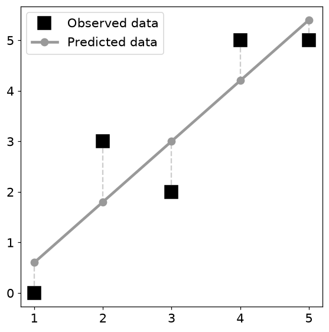
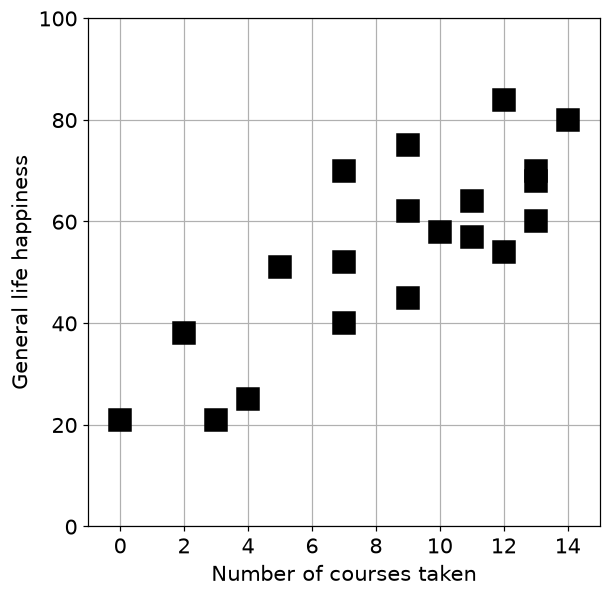
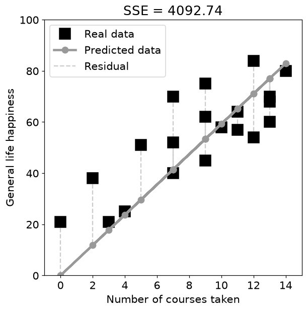
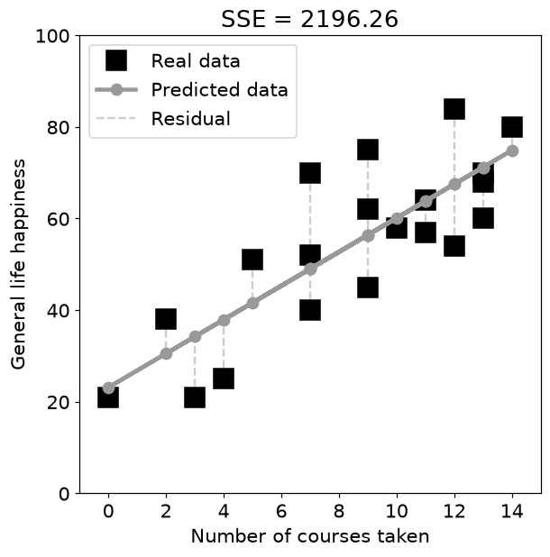
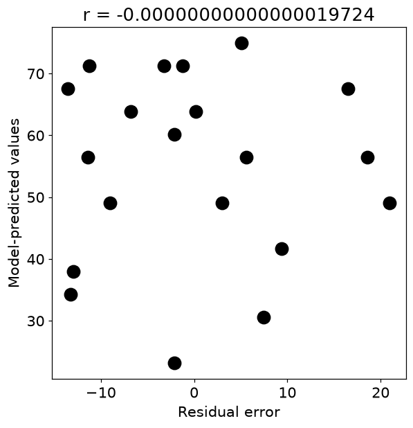
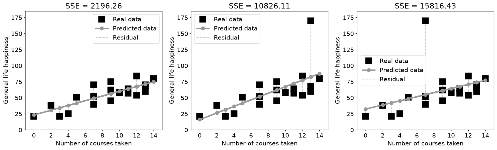
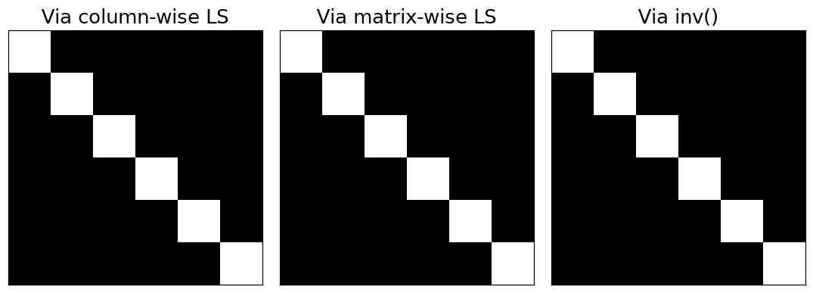

# 10. 일반 선형 모델 및 최소제곱법

## 10.1 모든 점을 지나지 못할 때 가장 가까운 선 찾기

- 관측값 $y$를 여러 설명변수의 선형결합으로 근사합니다. 여기서 일반 선형 모델은 계수에 대해 선형인 모델을 말합니다.

$$
y=X\beta+\varepsilon,\qquad
\hat\beta=\arg\min_\beta\|y-X\beta\|_2^2
$$

- 직선 $y\approx\beta_0+\beta_1x$의 설계행렬은 `np.column_stack([np.ones(N), x])`입니다.
- 1로 된 열을 생략하면 절편이 0으로 고정됩니다. 이때 적합선은 반드시 원점을 지나야 합니다.
- 예시 $x=(1,2,3,4,5)$, $y=(0,3,2,5,5)$의 최소제곱 직선은 $\hat y=-0.6+1.2x$입니다. 예측은 $(0.6,1.8,3,4.2,5.4)$, SSE는 3.6입니다.

| 기호 | 의미 | 코드 표현 |
| --- | --- | --- |
| $X$ | 설명변수를 모은 설계행렬 | `np.column_stack([ones, x])` |
| $\hat\beta$ | 적합한 계수 | `np.linalg.lstsq(X, y, rcond=None)[0]` |
| $\hat y$ | 모델 예측값 | `X @ beta` |
| $e$ | 설명하지 못한 잔차 | `y - X @ beta` |

## 10.2 최소제곱은 직교 투영이다

$$
X^T(y-X\hat\beta)=0,\qquad
\hat\beta=(X^TX)^{-1}X^Ty
$$

- 두 번째 식은 X가 완전열랭크일 때의 공식입니다. 첫 식은 잔차가 설계행렬의 모든 열에 수직이라는 뜻입니다.
- 예측값은 $\mathcal C(X)$ 안에 있고 잔차는 $\mathcal N(X^T)$ 안에 있습니다.
- 절편이 포함되면 잔차의 합도 0입니다. 관측 벡터를 ‘설명한 부분’과 ‘설명하지 못한 부분’으로 직교 분해한 셈입니다.

$$
X=QR\Rightarrow R\hat\beta=Q^Ty
$$

- 원본은 역행렬 공식과 QR을 비교합니다. 일반적인 구현에는 `np.linalg.lstsq(X,y,rcond=None)`가 간편합니다.
- 큰 잔차를 제곱하므로 이상치 하나가 계수를 크게 바꿀 수 있습니다. 이상치의 x위치에 따라서도 영향이 다릅니다.
- **주의**: 적합은 인과를 증명하지 않습니다. 원본의 수강 과목 수·행복도 예제는 계산을 이해하기 위한 학습용 데이터입니다.

## 10.3 파이썬으로 확인하기

- 코드는 위에서부터 순서대로 실행한다. 앞에서 만든 변수와 함수를 다음 예제에서도 사용한다.
- 아래 숫자와 그림은 고정된 난수 시드로 실행한 결과다. 환경에 따라 마지막 소수 자릿수와 실행 시간은 달라질 수 있다.

### 1. 준비

```python
from pathlib import Path
import numpy as np
import matplotlib
import matplotlib.pyplot as plt
from IPython.display import display
ROOT = Path.cwd()
if not (ROOT / 'data').exists():
    ROOT = ROOT / 'blog_linear_algebra'
DATA = ROOT / 'data'
ASSET = ROOT / 'assets' / 'ch10'
ASSET.mkdir(parents=True, exist_ok=True)
np.random.seed(20260935)
np.set_printoptions(precision=6, suppress=True, threshold=120)
plt.rcParams.update({'figure.dpi': 100, 'savefig.dpi': 140, 'font.size': 12})
print('재현용 난수 시드:', 20260935)

import numpy as np
import matplotlib.pyplot as plt

from scipy.linalg import null_space

import sympy as sym

import matplotlib_inline.backend_inline
matplotlib_inline.backend_inline.set_matplotlib_formats('png')
plt.rcParams.update({'font.size':14})
```

```text
재현용 난수 시드: 20260935
```

### 2. 기본 연산 살펴보기

```python
x = [ 1,2,3,4,5 ]
y = [ 0,3,2,5,5 ]

X = np.hstack((np.ones((5,1)),np.array(x,ndmin=2).T))
yHat = X @ np.linalg.inv(X.T@X) @ X.T @ y

plt.figure(figsize=(6,6))
plt.plot(x,y,'ks',markersize=15,label='Observed data')
plt.plot(x,yHat,'o-',color=[.6,.6,.6],linewidth=3,markersize=8,label='Predicted data')

for n,y,yHat in zip(x,y,yHat):
  plt.plot([n,n],[y,yHat],'--',color=[.8,.8,.8],zorder=-10)

plt.legend()
plt.savefig(ASSET / 'Figure_10_02.png',dpi=140)
plt.show()
```



### 3. 학습용 데이터로 회귀하기

```python
numcourses = [13,4,12,3,14,13,12,9,11,7,13,11,9,2,5,7,10,0,9,7]
happiness  = [70,25,54,21,80,68,84,62,57,40,60,64,45,38,51,52,58,21,75,70]

plt.figure(figsize=(6,6))

plt.plot(numcourses,happiness,'ks',markersize=15)
plt.xlabel('Number of courses taken')
plt.ylabel('General life happiness')
plt.xlim([-1,15])
plt.ylim([0,100])
plt.grid()
plt.xticks(range(0,15,2))
plt.savefig(ASSET / 'Figure_10_03.png',dpi=140)
plt.show()
```



```python
X = np.array(numcourses,ndmin=2).T
print(X.shape)

X_leftinv = np.linalg.inv(X.T@X) @ X.T

beta = X_leftinv @ happiness
beta
```

```text
(20, 1)
array([5.924029])
```

```python
pred_happiness = X@beta

plt.figure(figsize=(6,6))

plt.plot(numcourses,happiness,'ks',markersize=15)
plt.plot(numcourses,pred_happiness,'o-',color=[.6,.6,.6],linewidth=3,markersize=8)

for n,y,yHat in zip(numcourses,happiness,pred_happiness):
  plt.plot([n,n],[y,yHat],'--',color=[.8,.8,.8],zorder=-10)

plt.xlabel('Number of courses taken')
plt.ylabel('General life happiness')
plt.xlim([-1,15])
plt.ylim([0,100])
plt.xticks(range(0,15,2))
plt.legend(['Real data','Predicted data','Residual'])
plt.title(f'SSE = {np.sum((pred_happiness-happiness)**2):.2f}')
plt.savefig(ASSET / 'Figure_10_04.png',dpi=140)
plt.show()
```



```python
X = np.hstack((np.ones((20,1)),np.array(numcourses,ndmin=2).T))
print(X.shape)

X_leftinv = np.linalg.inv(X.T@X) @ X.T

beta = X_leftinv @ happiness
beta
```

```text
(20, 2)
array([23.130338,  3.698206])
```

```python
pred_happiness = X@beta

plt.figure(figsize=(6,6))

plt.plot(numcourses,happiness,'ks',markersize=15)
plt.plot(numcourses,pred_happiness,'o-',color=[.6,.6,.6],linewidth=3,markersize=8)

for n,y,yHat in zip(numcourses,happiness,pred_happiness):
  plt.plot([n,n],[y,yHat],'--',color=[.8,.8,.8],zorder=-10)

plt.xlabel('Number of courses taken')
plt.ylabel('General life happiness')
plt.xlim([-1,15])
plt.ylim([0,100])
plt.xticks(range(0,15,2))
plt.legend(['Real data','Predicted data','Residual'])
plt.title(f'SSE = {np.sum((pred_happiness-happiness)**2):.2f}')
plt.savefig(ASSET / 'Figure_10_05.png',dpi=140)
plt.show()
```



## 10.4 연습문제

### 연습문제 1. 예측과 잔차의 직교

- 최소제곱 잔차가 예측벡터에 수직임을 확인합니다.
- 절편 포함 모델의 잔차를 구하고 예측과의 내적·상관을 출력해 산점도로 봅니다.

```python
res = happiness-pred_happiness

print('Dot product: ' + str(np.dot(pred_happiness,res)) )
print('Correlation: ' + str(np.corrcoef(pred_happiness,res)[0,1]))
print(' ')

plt.figure(figsize=(6,6))
plt.plot(res,pred_happiness,'ko',markersize=12)
plt.xlabel('Residual error')
plt.ylabel('Model-predicted values')
plt.title(f'r = {np.corrcoef(pred_happiness,res)[0,1]:.20f}')
plt.savefig(ASSET / 'Figure_10_06.png',dpi=140)
plt.show()
```

```text
Dot product: -5.752553988713771e-11
Correlation: -1.9724313754422123e-16
```



```python
np.linalg.norm(res)
```

```text
np.float64(46.86431997187644)
```

- **결과 해석**: 둘 다 0 근처입니다. 상관은 중심화·노름 정규화를 포함하므로 내적과 단위가 다릅니다. 수치 크기를 곧바로 정확도 우열로 읽지 않습니다.

### 연습문제 2. 잔차의 왼쪽 영공간 소속

- 잔차가 X의 모든 열에 수직임을 확인합니다.
- `null_space(X.T)`의 기저에 잔차를 열로 붙여 랭크가 증가하는지 검사합니다.

```python
nullspace = null_space(X.T)

nullspaceAugment = np.hstack( (nullspace,res.reshape(-1,1)) )

print(f'dim(  N(X)    ) = {np.linalg.matrix_rank(nullspace)}')
print(f'dim( [N(X)|r] ) = {np.linalg.matrix_rank(nullspaceAugment)}')
```

```text
dim(  N(X)    ) = 18
dim( [N(X)|r] ) = 18
```

- **결과 해석**: 두 랭크가 같으면 잔차는 이미 그 공간 안에 있습니다. 원본 출력의 N(X)는 실제로 계산한 N(X.T)로 읽어야 합니다.

### 연습문제 3. 세 가지 최소제곱 계산

- 정규방정식, QR 역행렬, QR 확대행렬 풀이를 비교합니다.
- 동일한 X와 y로 계수를 각각 계산하고 소수 셋째 자리까지 출력합니다.

```python
# X = np.random.randn(M,N)
# happiness = np.random.randn(M,1)

X = np.hstack((np.ones((20,1)),np.array(numcourses,ndmin=2).T))
beta1 = np.linalg.inv(X.T@X) @ X.T @ happiness

Q,R = np.linalg.qr(X)

beta2 = np.linalg.inv(R) @ (Q.T@happiness)

tmp = (Q.T@happiness).reshape(-1,1)
Raug = np.hstack( (R,tmp) )
Raug_r = sym.Matrix(Raug).rref()[0]
beta3 = np.array(Raug_r[:,-1])

print('Betas from left-inverse: ')
print(np.round(beta1,3)), print(' ')

print('Betas from QR with inv(R): ')
print(np.round(beta2,3)), print(' ')

print('Betas from QR with back-substitution: ')
print(np.round(np.array(beta3.T).astype(float),3))
```

```text
Betas from left-inverse: 
[23.13   3.698]
 
Betas from QR with inv(R): 
[23.13   3.698]
 
Betas from QR with back-substitution: 
[[23.13   3.698]]
```

```python
print('Matrix R:')
print(np.round(R,3))

print(' ')
print("Matrix R|Q'y:")
print(np.round(Raug,3))

print(' ')
print("Matrix RREF(R|Q'y):")
print(np.round(np.array(Raug_r).astype(float),3))
```

```text
Matrix R:
[[ -4.472 -38.237]
 [  0.     17.747]]
 
Matrix R|Q'y:
[[  -4.472  -38.237 -244.849]
 [   0.      17.747   65.631]]
 
Matrix RREF(R|Q'y):
[[ 1.     0.    23.13 ]
 [ 0.     1.     3.698]]
```

- **결과 해석**: 계수들이 일치합니다. 실수 확대행렬의 RREF는 학습용이며 큰 수치 문제에는 전용 QR/SVD 솔버가 적합합니다.

### 연습문제 4. 이상치의 영향

- 같은 큰 오차라도 x위치에 따라 회귀선이 다르게 변함을 봅니다.
- 정상 데이터와 서로 다른 위치의 y를 170으로 바꾼 두 데이터를 같은 X로 적합합니다.
- 각 SSE를 계산합니다.

```python
happiness_oops1 = [170,25,54,21,80,68,84,62,57,40,60,64,45,38,51,52,58,21,75,70]
happiness_oops2 = [70,25,54,21,80,68,84,62,57,40,60,64,45,38,51,52,58,21,75,170]

X = np.hstack((np.ones((20,1)),np.array(numcourses,ndmin=2).T))
X_leftinv = np.linalg.inv(X.T@X) @ X.T

_,axs = plt.subplots(1,3,figsize=(16,5))

for axi,y in zip(axs,[happiness,happiness_oops1,happiness_oops2]):

  beta = X_leftinv @ y

  pred_happiness = X@beta

  axi.plot(numcourses,y,'ks',markersize=15)
  axi.plot(numcourses,pred_happiness,'o-',color=[.6,.6,.6],linewidth=3,markersize=8)

  for n,y_obs,yHat in zip(numcourses,y,pred_happiness):
    axi.plot([n,n],[y_obs,yHat],'--',color=[.8,.8,.8],zorder=-10)

  axi.set(xlabel='Number of courses taken',ylabel='General life happiness',
          xlim=[-1,15],ylim=[0,185],xticks=range(0,15,2))
  axi.legend(['Real data','Predicted data','Residual'])
  axi.set_title(f'SSE = {np.sum((pred_happiness-y)**2):.2f}')

plt.tight_layout()
plt.savefig(ASSET / 'Figure_10_07.png',dpi=140)
plt.show()
```



- **결과 해석**: 절편과 기울기가 다르게 변합니다. 원본 루프의 y 덮어쓰기 때문에 SSE 제목이 잘못 계산될 수 있어 변수명을 분리하고 축 범위도 확대했습니다.

### 연습문제 5. 최소제곱으로 역행렬 찾기

- $XX^{-1}=I$를 여러 우변에 대한 선형계로 봅니다.
- 항등행렬 각 열을 목표 y로 두고 해를 모읍니다.
- 행렬 전체를 한 번에 푼 결과와 inv(X)를 비교합니다.

```python
n = 6

X = np.random.randn(n,n)

Y = np.eye(n)

Xinv1 = np.zeros_like(X)

for coli in range(n):
  Xinv1[:,coli] = np.linalg.inv(X.T@X) @ X.T @ Y[:,coli]

Xinv2 = np.linalg.inv(X.T@X) @ X.T @ Y

Xinv3 = np.linalg.inv(X)

_,axs = plt.subplots(1,3,figsize=(10,6))

axs[0].imshow( Xinv1@X ,cmap='gray')
axs[0].set_title('Via column-wise LS')

axs[1].imshow( Xinv2@X ,cmap='gray' )
axs[1].set_title('Via matrix-wise LS')

axs[2].imshow( Xinv3@X ,cmap='gray' )
axs[2].set_title('Via inv()')

for a in axs: a.set(xticks=[],yticks=[])

plt.tight_layout()
plt.savefig(ASSET / 'Figure_10_08.png',dpi=140)
plt.show()
```



```python
print(Xinv1-Xinv2)
print(' ')

print(Xinv1-Xinv3)
print(' ')

print(Xinv2-Xinv3)
```

```text
[[0. 0. 0. 0. 0. 0.]
 [0. 0. 0. 0. 0. 0.]
 [0. 0. 0. 0. 0. 0.]
 [0. 0. 0. 0. 0. 0.]
 [0. 0. 0. 0. 0. 0.]
 [0. 0. 0. 0. 0. 0.]]
 
[[-0. -0. -0. -0.  0.  0.]
 [-0. -0.  0. -0.  0. -0.]
 [ 0. -0.  0. -0.  0.  0.]
 [ 0. -0.  0.  0. -0. -0.]
 [ 0. -0.  0. -0.  0.  0.]
 [-0. -0.  0. -0.  0.  0.]]
 
[[-0. -0. -0. -0.  0.  0.]
 [-0. -0.  0. -0.  0. -0.]
 [ 0. -0.  0. -0.  0.  0.]
 [ 0. -0.  0.  0. -0. -0.]
 [ 0. -0.  0. -0.  0.  0.]
 [-0. -0.  0. -0.  0.  0.]]
```

- **결과 해석**: 완전랭크 정사각형이면 같은 역행렬입니다. 정규방정식은 조건수를 악화시킬 수 있어 오차 크기가 다르게 나타납니다.

## 10.5 핵심 관계 확인

- 작은 입력으로 핵심 공식을 다시 확인한다. `assert`가 통과하면 지정한 허용오차 안에서 관계가 성립한다.

```python
_x=np.arange(1.,6.); _y=np.array([0.,3.,2.,5.,5.])
_X=np.column_stack([np.ones(5),_x]); _b=np.linalg.lstsq(_X,_y,rcond=None)[0]
_e=_y-_X@_b
print('절편, 기울기:',_b,'SSE:',round(_e@_e,6))
print('X.T @ 잔차:',_X.T@_e)
assert np.allclose(_b,[-.6,1.2]) and np.allclose(_e@_e,3.6)
assert np.allclose(_X.T@_e,0)
```

```text
절편, 기울기: [-0.6  1.2] SSE: 3.6
X.T @ 잔차: [-0.  0.]
```

## 실습에서 확인할 점

| 항목 | 확인할 점 |
| --- | --- |
| 작은 잔차 | `1e-14` 수준의 값은 부동소수점 오차일 수 있음 |
| 셀 실행 순서 | 앞에서 준비한 변수·데이터를 다음 코드에서 사용 |
| 문제 범위 | 제공된 코드의 학습 목표를 재구성한 풀이이며 책의 문제 원문은 아님 |

## 참고 자료

- 제공된 `선형대수학.zip`의 `LA4DS_ch10.py`
- Mike X Cohen, *Practical Linear Algebra for Data Science* / 한국어판 *개발자를 위한 실전 선형대수학*
- 한국어 개념 설명과 연습문제 해설은 선형대수학 코드에 맞춰 작성했다. 코드 보완 내역은 기존 자료의 `CHANGES.md`에서 확인할 수 있다.
